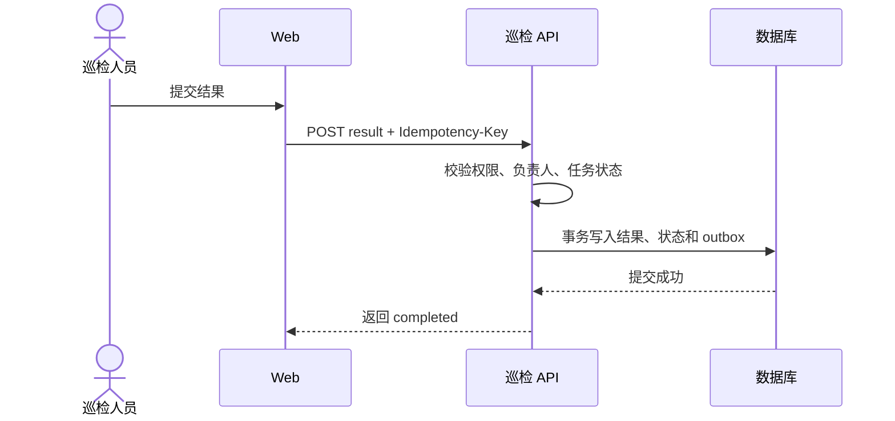

# 设备巡检模块｜详细设计（结构示例）

> 本文件展示 `03-详细设计.json` 经模板渲染后的阅读形态。设备巡检、表、接口和 ID 均为虚构示例；实际详设必须以当前 PRD、需求台账、项目代码和冻结验收基线为事实来源。

## 1 范围、约束与方案

本模块允许维护设备巡检计划，按计划生成任务并记录巡检结果。巡检任务归属于单一设备和组织；只有被授权的巡检人员可提交结果。设备主数据由资产服务提供，本模块不复制资产主档。

### 1.1 功能域

| 功能 ID | 功能域 | 职责 | 需求 | 来源 |
|---|---|---|---|---|
| FEAT-EXAMPLE | 巡检任务 | 计划生成、任务查询、结果提交 | REQ-EXAMPLE | SRC-EXAMPLE |

## 2 术语与概念

| 术语 | 定义 | 来源 |
|---|---|---|
| 巡检任务 | 在指定时间由指定人员检查单台设备的一次业务实例；任务状态与巡检计划状态相互独立。 | SRC-EXAMPLE |

## 3 表与数据设计

### 3.1 表索引

| 表 | 用途 | 字段数 | 需求 | 来源 |
|---|---|---:|---|---|
| inspection_task | 保存待执行和已完成的巡检实例 | 7 | REQ-EXAMPLE | SRC-EXAMPLE |

### 3.2 inspection_task · 巡检任务

主键：`id`，由服务端生成。唯一约束：`plan_id + device_id + scheduled_at` 防止同一计划重复派发。索引：`org_id, assignee_id, status, scheduled_at` 支撑待办列表和逾期查询。

| 字段 | 类型 | 可空/必填 | 默认值 | 约束 | 含义/来源 |
|---|---|---|---|---|---|
| id | UUID | 必填 | 服务端生成 | 主键 | 任务稳定标识 |
| plan_id | UUID | 必填 | 无 | 引用巡检计划 | 生成任务的计划 |
| device_id | UUID | 必填 | 无 | 资产服务设备 ID | 被检查设备，不在本表重复存储资产主档 |
| assignee_id | UUID | 必填 | 无 | 必须为有效用户 | 执行人 |
| status | VARCHAR(16) | 必填 | `pending` | `pending/completed/cancelled` | 当前任务状态 |
| scheduled_at | TIMESTAMP WITH TIME ZONE | 必填 | 无 | 按 UTC 存储 | 计划执行时间 |
| completed_at | TIMESTAMP WITH TIME ZONE | 可空 | `NULL` | `completed` 时必填 | 实际提交时间 |

## 4 接口设计

### 4.1 接口索引

| 接口 ID | 方法 | 路径 | 权限 | 请求/响应字段 |
|---|---|---|---|---:|
| API-EXAMPLE | POST | `/api/inspection-tasks/{id}/result` | `inspection.task.complete` | 2 / 3 |

### 4.2 API-EXAMPLE · 提交巡检结果

事务：结果、完成状态和审计记录在同一事务提交。幂等：要求 `Idempotency-Key`；同键同请求返回首次结果，同键不同请求返回冲突。并发：任务版本不匹配返回 `TASK_VERSION_CONFLICT`，不覆盖已提交结果。

**请求字段**

| 字段 | 类型 | 必填 | 校验 | 敏感信息 |
|---|---|---|---|---|
| result | enum | 是 | `passed/failed` | 否 |
| note | string | 否 | 最长 1000 字；HTML 转义 | 否 |

**响应字段**

| 字段 | 类型 | 出现条件 | 取值规则 |
|---|---|---|---|
| task_id | UUID | 始终 | 本次任务 ID |
| status | string | 始终 | 成功时为 `completed` |
| completed_at | ISO-8601 | 始终 | 服务端提交时间 |

**错误语义**：`TASK_NOT_FOUND` 不泄露无权访问对象是否存在；`TASK_ALREADY_COMPLETED` 不重复写结果；资产服务不可用时不接受提交，客户端可安全重试同一幂等键。

## 5 权限矩阵

| 主体/资源 | 操作 | 权限码 | 数据范围 | 关联接口/页面 |
|---|---|---|---|---|
| 巡检人员 / 分配给本人的任务 | 查看、提交结果 | `inspection.task.complete` | 仅当前用户负责的任务 | API-EXAMPLE、任务详情页 |
| 巡检主管 / 本组织任务 | 查看全部、重新分配 | `inspection.task.manage` | 当前组织及下级组织 | 任务管理页 |

后端每次读取或写入都重新检查权限和组织范围；前端隐藏按钮只改善体验，不作为安全边界。

## 6 关键流程与业务规则

### 6.1 规则索引

| 规则 ID | 条件 | 结果 | 错误语义 |
|---|---|---|---|
| RULE-EXAMPLE | 任务状态为 `pending` 且提交人是负责人 | 保存结果并转为 `completed` | 否则拒绝且不产生部分写入 |

### 6.2 FLOW-EXAMPLE · 提交巡检结果

1. 服务端验证身份、权限、任务负责人和 `pending` 状态。
2. 校验请求字段及版本号；任一条件失败时不写入。
3. 在事务内写入结果、完成时间、任务状态和审计记录。
4. 提交成功后发布 `InspectionCompleted` 事件；发布失败进入 outbox 重试，不回滚已提交的任务。

状态变化：`pending → completed`；`completed` 不允许重新提交。事务：任务更新使用版本号条件更新，影响行数为 0 时返回并发冲突。

## 7 架构图与时序图

## 8 前端页面与交互

### 8.1 巡检任务详情页

路由：`/inspection-tasks/:id`；加载状态区分无权限、任务不存在和服务暂不可用。

| 控件/操作 | 类型 | 校验/反馈 | 接口/权限 | 测试锚点 |
|---|---|---|---|---|
| 巡检结果 | 单选框 | 必须选择 passed 或 failed | API-EXAMPLE | `inspection-result` |
| 备注 | 多行输入 | 最长 1000 字 | API-EXAMPLE | `inspection-note` |
| 提交结果 | 按钮 | 提交中禁用；成功后只读；失败保留草稿 | `inspection.task.complete` | `submit-inspection` |

## 9 依赖与补偿

| 依赖 | 方向/契约 | 责任方 | 失败处理 |
|---|---|---|---|
| 资产服务 | 巡检服务 → `GET /assets/{id}`，超时 800ms | 资产平台 | 不创建孤儿任务；查询可短时缓存，提交结果不依赖实时资产调用 |
| 事件总线 | 巡检服务 → `InspectionCompleted` | 平台消息团队 | 事务 outbox 重试；超过重试上限进入告警队列 |

## 10 复用与质量决策

### 10.1 复用决策

| 决策 | 组件 | 用法 | 理由 |
|---|---|---|---|
| REUSE-EXAMPLE | 平台审计客户端 | 在任务结果事务内记录操作者、对象和结果摘要 | 沿用平台审计字段和脱敏规则 |

### 10.2 安全、性能与兼容

| 维度 | 决定 | 理由/验证 |
|---|---|---|
| 安全 | 组织范围在查询和写入两端校验 | 覆盖越权直调 API 的用例 |
| 性能 | 待办查询使用 `org_id + assignee_id + status + scheduled_at` 索引 | 用 10 万条任务数据验证 P95 |
| 兼容 | 新增事件字段均可缺省读取 | 保证旧消费者滚动升级期间可解析 |

## 11 领域扩展对象与集成

| 类型 | ID | 对象 | 关键属性 |
|---|---|---|---|
| inspection_policy | POLICY-EXAMPLE | 巡检策略 | 频率、适用设备类型、有效期、逾期处置 |

## 12 需求追溯与验证

| 验收点 | 需求 | 数据 | API | 权限 | 规则/流程 | 页面 | 验证方式 | 测试 ID |
|---|---|---|---|---|---|---|---|---|
| AC-EXAMPLE | REQ-EXAMPLE | inspection_task | API-EXAMPLE | inspection.task.complete | RULE-EXAMPLE / FLOW-EXAMPLE | 巡检任务详情页 | 负责人成功提交；非负责人提交被拒；重复请求不重复写入 | TEST-EXAMPLE |

> 实际生成文档会把这些对象引用渲染为稳定的页内锚点或跨分文档链接。此示例中的 ID 和业务事实不可直接复制到真实详设。
