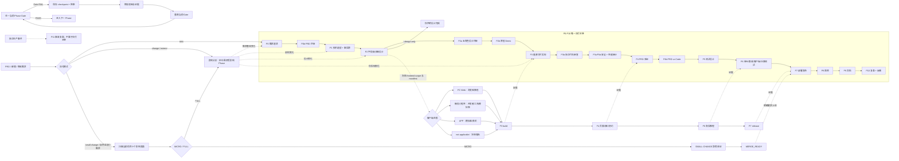

# devflow v3.25.0

`SKILL.md` 是唯一权威入口；本文件只用于人工导航，不重复流程、Gate 或执行规则。

## 30 秒上手

```text
用户：用 devflow 根据 docs/需求/refund-需求澄清.md 做存量功能改造，
      前端是 PC Web，先做到详细设计，不部署。

预期：P0 → P0b → P1 → P2 逐阶段 PASS（每阶段返回 Receipt），
      因 --design-only 在 P2 后停止；产物在 docs/详细设计/。
      任一 Gate FAIL → BLOCKED + checkpoint，修复后重跑同一 Gate。
```

安装：见仓库根 `README.md`。Claude Code 为 `~/.claude/skills/devflow`；Codex 当前用户级目录为 `$HOME/.agents/skills/devflow`（旧的 `~/.codex/skills` 已过时）；
也可用 `bash scripts/install.sh --platform <claude|codex|cursor|trae|trae-cn>`，再用 `bash scripts/doctor.sh` 体检依赖。

## 整体流程图



图中的客户端链是各阶段必须提交的并行证据，不是另一套 Phase；任何 Gate 失败都回到当前 Gate，不允许沿主链继续。

## 从哪里开始

- 全流程、增量需求、修改需求、断点恢复：读 [`SKILL.md`](SKILL.md)。
- “小需求/小改动、局部 UI、配置、修复、字段/默认值/校验”：读 [`commands/small-change.md`](commands/small-change.md)，由项目扫描自动决定 MICRO 或完整 change。
- 命令、Phase、Gate、产物映射：读 [`commands/ROUTING.md`](commands/ROUTING.md)。
- 不可违背的工程约束：读 [`concepts/core.md`](concepts/core.md)。
- 版本变化：读 [`references/CHANGELOG.md`](references/CHANGELOG.md)。
- 回归与发布校验：运行 `bash tests/run-tests.sh`。

## 支持范围

- 交付形态：从零构建、已有系统新增、已有需求修改。
- 客户端：PC Web、微信小程序、APP、无前端后端交付。
- 流程：P0-P10 主交付链；SMALL-CHANGE 是受控小改动入口；P11 仅用于独立事故复盘。

详细操作只保留在对应 command、phase、subagent、template 和 script 中，避免多份规则漂移。
