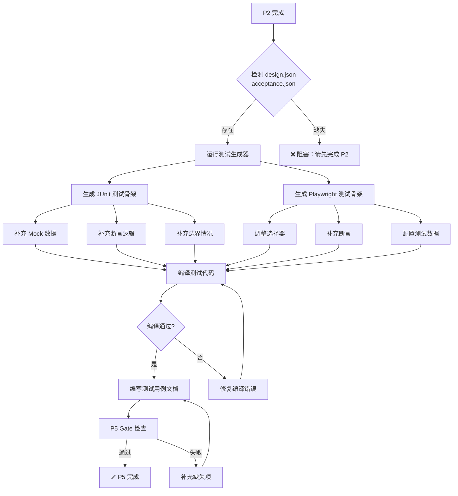

> **注（v3.30.6）**：本文档示例中的 `scripts/p5_gate.sh` 已归档至 `_archive/scripts-retired-3.30.6/`；现行 P5 主门禁为 `scripts/p5_test_cases_gate.sh`。
# P5 阶段：自动生成测试指南

> **版本**: v3.28.0  
> **更新时间**: 2026-09-20  
> **目标**: 从结构化产物自动生成 JUnit 和 Playwright 测试骨架

---

## 目录

1. [快速开始](#快速开始)
2. [工作流程](#工作流程)
3. [输入源说明](#输入源说明)
4. [生成什么](#生成什么)
5. [需要补充什么](#需要补充什么)
6. [完整示例](#完整示例)
7. [P5 Gate 检查](#p5-gate-检查)
8. [常见问题](#常见问题)
9. [设计理念](#设计理念)

---

## 快速开始

### 前置条件

- ✅ P2 阶段已完成，生成了 `design.json` 和 `acceptance.json`
- ✅ P2 Gate 已通过（`p2_design_coverage_gate.sh` 返回 0）

### 一键生成

```bash
# 1. 确认当前在项目根目录
cd /path/to/your/project

# 2. 运行生成脚本
bash ~/.cursor/skills/devflow/scripts/generate_tests.sh <feature-name>

# 示例
bash ~/.cursor/skills/devflow/scripts/generate_tests.sh user-management
```

### 预期输出

```
════════════════════════════════════════════════════════════════
  devflow 测试生成器 v3.28.0
════════════════════════════════════════════════════════════════

[检查] 检测结构化产物...
  ✓ .devflow/user-management/design.json
  ✓ .devflow/user-management/acceptance.json

[1/2] 生成 JUnit 测试...
  ✓ UserControllerTest.java (4 个测试方法)
  ✓ UserServiceTest.java (3 个测试方法)
  ✓ UserMapperTest.java (2 个测试方法)

[2/2] 生成 Playwright E2E 测试...
  ✓ UserListPage.ts (Page Object)
  ✓ UserCreatePage.ts (Page Object)
  ✓ user-management-M-01-F01.spec.ts (3 个 UI 测试)
  ✓ user-management-api.spec.ts (2 个 API 测试)

════════════════════════════════════════════════════════════════
✅ 测试骨架生成完成！

📋 下一步：
  1. 查找 TODO 标记：grep -rn "TODO:" backend/src/test frontend/tests
  2. 补充 Mock 数据和断言逻辑
  3. 调整 Playwright 选择器
  4. 运行测试：mvn test && npm run e2e

📖 详细指南：~/.cursor/skills/devflow/docs/P5-自动生成测试.md
════════════════════════════════════════════════════════════════
```

---

## 工作流程



---

## 输入源说明

### design.json（JUnit 测试源）

生成位置：`P2 阶段 → .devflow/<feature>/design.json`

**包含内容**：
- API 端点列表（URL、Method、权限）
- 请求/响应 DTO
- Service 方法签名
- Mapper 方法签名
- 数据库表结构

**生成目标**：
- Controller 测试（4 种状态码：200/400/401/404）
- Service 测试（业务逻辑验证）
- Mapper 测试（DO ↔ DTO 转换）

### acceptance.json（Playwright 测试源）

生成位置：`P2 阶段 → .devflow/<feature>/acceptance.json`

**包含内容**：
- 验收点列表（模块-功能-验收点编号）
- 页面路径和操作步骤
- 预期结果和断言规则

**生成目标**：
- Page Object（页面对象模型）
- UI 测试（用户交互流程）
- API 测试（网络请求验证）

---

## 生成什么

### JUnit 测试（Controller）

**为每个 API 生成 4 个测试方法**：

```java
// 生成的测试类
@WebMvcTest(UserController.class)
class UserControllerTest {
    
    @Autowired
    private MockMvc mockMvc;
    
    @MockBean
    private UserService userService;
    
    // 1. 200 Success
    @Test
    @WithMockUser(authorities = {"user:create"})
    void test创建用户_Success() throws Exception {
        // TODO: 补充 Mock 数据
        mockMvc.perform(post("/api/users")
                .contentType(MediaType.APPLICATION_JSON)
                .content("{\"username\":\"test\"}"))
            .andExpect(status().isOk());
        // TODO: 补充断言逻辑
    }
    
    // 2. 400 Bad Request
    @Test
    @WithMockUser(authorities = {"user:create"})
    void test创建用户_InvalidRequest() throws Exception {
        mockMvc.perform(post("/api/users")
                .contentType(MediaType.APPLICATION_JSON)
                .content("{\"username\":\"\"}"))  // 空用户名
            .andExpect(status().isBadRequest());
    }
    
    // 3. 401 Unauthorized
    @Test
    void test创建用户_Unauthorized() throws Exception {
        mockMvc.perform(post("/api/users")
                .contentType(MediaType.APPLICATION_JSON)
                .content("{\"username\":\"test\"}"))
            .andExpect(status().isUnauthorized());
    }
    
    // 4. 404 Not Found (针对 GET/PUT/DELETE)
    @Test
    @WithMockUser(authorities = {"user:view"})
    void test获取用户_NotFound() throws Exception {
        when(userService.getUser(999L))
            .thenThrow(new ResourceNotFoundException("用户不存在"));
        
        mockMvc.perform(get("/api/users/999"))
            .andExpect(status().isNotFound());
    }
}
```

### Playwright 测试（E2E）

**为每个验收点生成 1 个测试 + Page Object**：

```typescript
// Page Object: pages/UserListPage.ts
export class UserListPage {
  constructor(private page: Page) {}
  
  async navigate() {
    await this.page.goto('/users');
    // TODO: 调整实际路径
  }
  
  async getTableRows() {
    return this.page.locator('table tbody tr');
    // TODO: 调整实际选择器
  }
  
  async clickCreateButton() {
    await this.page.click('button:has-text("新增")');
    // TODO: 调整实际选择器
  }
}

// 测试规格: user-management-M-01-F01.spec.ts
import { test, expect } from '@playwright/test';
import { UserListPage } from './pages/UserListPage';
import { ADMIN_USERNAME, ADMIN_PASSWORD } from './helpers';

test.describe('【用户管理 M-01-F01】', () => {
  let page: Page;
  let userListPage: UserListPage;
  
  test.beforeEach(async ({ page: p }) => {
    page = p;
    
    // 登录
    await page.goto('/login');
    await page.fill('[data-testid="username"]', ADMIN_USERNAME);
    await page.fill('[data-testid="password"]', ADMIN_PASSWORD);
    await page.click('[data-testid="login-btn"]');
    await expect(page).toHaveURL(/\/home/);
    
    userListPage = new UserListPage(page);
  });
  
  test('M-01-F01-A01: 用户列表页面展示所有用户', async () => {
    await userListPage.navigate();
    
    const rows = await userListPage.getTableRows();
    await expect(rows).toHaveCount(3);
    // TODO: 补充断言逻辑
  });
  
  test('M-01-F01-A02: 点击新增按钮弹出表单', async () => {
    await userListPage.navigate();
    await userListPage.clickCreateButton();
    
    await expect(page.locator('dialog')).toBeVisible();
    // TODO: 调整实际选择器
  });
});
```

---

## 需要补充什么

### JUnit 测试补充清单

| 项目 | 说明 | 搜索方法 | 示例 |
|------|------|---------|------|
| **Mock 数据** | Service 层返回值 | `grep -rn "TODO: 补充 Mock 数据"` | `when(service.create(any())).thenReturn(mockUser)` |
| **断言逻辑** | 验证返回值字段 | `grep -rn "TODO: 补充断言逻辑"` | `assertEquals("admin", result.getUsername())` |
| **边界情况** | 空值、null、超长 | 手动添加测试方法 | `testWithNullUsername()` |
| **异常处理** | 业务异常验证 | 手动添加测试方法 | `assertThrows(BusinessException.class, ...)` |

**补充步骤**：

```bash
# 1. 查找所有 TODO
grep -rn "TODO:" backend/src/test/java/

# 2. 逐个补充 Mock 数据
# 在每个 TODO 位置添加：
User mockUser = new User();
mockUser.setId(1L);
mockUser.setUsername("test");

when(userService.createUser(any(UserCreateDTO.class)))
    .thenReturn(mockUser);

# 3. 补充断言
.andExpect(jsonPath("$.id").value(1))
.andExpect(jsonPath("$.username").value("test"));

# 4. 验证编译
mvn test-compile
```

### Playwright 测试补充清单

| 项目 | 说明 | 搜索方法 | 示例 |
|------|------|---------|------|
| **选择器** | 替换通用选择器 | `grep -rn "TODO: 调整.*选择器"` | `[data-testid="user-table"]` |
| **断言** | 验证具体业务 | `grep -rn "TODO: 补充断言"` | `await expect(name).toBe('管理员')` |
| **等待逻辑** | 处理异步加载 | 手动添加 | `await page.waitForResponse(...)` |
| **测试数据** | 配置凭证 | 检查 `helpers.ts` | 从环境变量或 seed 读取 |

**补充步骤**：

```bash
# 1. 查找所有 TODO
grep -rn "TODO:" frontend/tests/e2e/

# 2. 调整选择器（使用 data-testid）
# BEFORE: page.locator('table tbody tr')
# AFTER:  page.locator('[data-testid="user-table"] tbody tr')

# 3. 补充断言
const username = await page.locator('[data-testid="username"]').textContent();
expect(username).toBe('admin');

# 4. 配置测试数据（helpers.ts）
export const ADMIN_USERNAME = process.env.E2E_ADMIN_USERNAME || 'admin';
export const ADMIN_PASSWORD = process.env.E2E_ADMIN_PASSWORD || 'admin123';

# 5. 验证编译
cd frontend && tsc --noEmit
```

---

## 完整示例

### 示例 1: JUnit Controller 测试补充

```java
// 生成的骨架（BEFORE）
@Test
@WithMockUser(authorities = {"user:create"})
void test创建用户_Success() throws Exception {
    // TODO: 补充 Mock 数据
    mockMvc.perform(post("/api/users")
            .contentType(MediaType.APPLICATION_JSON)
            .content("{\"username\":\"test\"}"))
        .andExpect(status().isOk());
    // TODO: 补充断言逻辑
}

// 补充后（AFTER）
@Test
@WithMockUser(authorities = {"user:create"})
void test创建用户_Success() throws Exception {
    // 准备 Mock 数据
    User mockUser = new User();
    mockUser.setId(1L);
    mockUser.setUsername("test");
    mockUser.setEmail("test@example.com");
    mockUser.setCreatedAt(LocalDateTime.now());
    
    when(userService.createUser(any(UserCreateDTO.class)))
        .thenReturn(mockUser);
    
    // 执行请求
    String requestBody = """
        {
          "username": "test",
          "email": "test@example.com",
          "password": "Test@123"
        }
        """;
    
    mockMvc.perform(post("/api/users")
            .contentType(MediaType.APPLICATION_JSON)
            .content(requestBody))
        .andExpect(status().isOk())
        .andExpect(jsonPath("$.id").value(1))
        .andExpect(jsonPath("$.username").value("test"))
        .andExpect(jsonPath("$.email").value("test@example.com"))
        .andExpect(jsonPath("$.createdAt").exists());
    
    // 验证调用
    verify(userService, times(1)).createUser(argThat(dto -> 
        "test".equals(dto.getUsername()) && 
        "test@example.com".equals(dto.getEmail())
    ));
}
```

### 示例 2: Playwright Page Object 补充

```typescript
// 生成的骨架（BEFORE）
export class UserListPage {
  constructor(private page: Page) {}
  
  async navigate() {
    await this.page.goto('/users');
    // TODO: 调整实际路径
  }
  
  async getTableRows() {
    return this.page.locator('table tbody tr');
    // TODO: 调整实际选择器
  }
  
  async clickCreateButton() {
    await this.page.click('button:has-text("新增")');
    // TODO: 调整实际选择器
  }
}

// 补充后（AFTER）
export class UserListPage {
  private readonly tableLocator = '[data-testid="user-table"]';
  private readonly createButtonLocator = '[data-testid="create-user-btn"]';
  private readonly searchInputLocator = '[data-testid="search-input"]';
  
  constructor(private page: Page) {}
  
  async navigate() {
    await this.page.goto('/system/users');
    await this.page.waitForLoadState('networkidle');
    await this.page.waitForSelector(this.tableLocator, { state: 'visible' });
  }
  
  async getTableRows() {
    return this.page.locator(`${this.tableLocator} tbody tr`);
  }
  
  async getUsernameByRow(rowIndex: number) {
    const username = await this.page
      .locator(`${this.tableLocator} tbody tr:nth-child(${rowIndex}) td:nth-child(2)`)
      .textContent();
    return username?.trim() || '';
  }
  
  async clickCreateButton() {
    await this.page.click(this.createButtonLocator);
    await this.page.waitForSelector('[data-testid="user-form"]', { state: 'visible' });
  }
  
  async searchUser(keyword: string) {
    await this.page.fill(this.searchInputLocator, keyword);
    await this.page.keyboard.press('Enter');
    await this.page.waitForResponse(resp => 
      resp.url().includes('/api/users') && resp.status() === 200
    );
  }
  
  async deleteUserByRow(rowIndex: number) {
    await this.page.click(`${this.tableLocator} tbody tr:nth-child(${rowIndex}) [data-testid="delete-btn"]`);
    await this.page.click('[data-testid="confirm-delete-btn"]');
    await this.page.waitForResponse(resp => 
      resp.url().includes('/api/users') && resp.request().method() === 'DELETE'
    );
  }
}
```

---

## P5 Gate 检查

P5 阶段完成后，必须通过以下检查：

### 1. 测试代码存在性检查

```bash
# JUnit 测试文件
find backend/src/test/java -name "*Test.java" | wc -l
# 预期：≥ API 数量 × 1.5（Controller + Service + Mapper）

# Playwright 测试文件
find frontend/tests/e2e -name "*.spec.ts" | wc -l
# 预期：≥ 验收点数量
```

### 2. TODO 清理检查

```bash
# 不应有未处理的 TODO
! grep -rn "TODO:" backend/src/test/java/ frontend/tests/e2e/ || {
  echo "❌ 仍有未处理的 TODO，请先补充"
  exit 1
}
```

### 3. 编译通过检查

```bash
# JUnit 编译
mvn test-compile -q || {
  echo "❌ JUnit 测试编译失败"
  exit 1
}

# TypeScript 编译
cd frontend && tsc --noEmit || {
  echo "❌ Playwright 测试编译失败"
  exit 1
}
```

### 4. 测试用例文档完整性

```bash
# 必须存在测试用例文档
[ -f "docs/test-cases/${FEATURE}-test-cases.md" ] || {
  echo "❌ 缺少测试用例文档"
  exit 1
}

# 文档行数 ≥ 200
wc -l "docs/test-cases/${FEATURE}-test-cases.md" | awk '{if ($1 < 200) exit 1}'
```

### 5. 测试覆盖率预检

```bash
# JUnit 测试方法数量
grep -r "@Test" backend/src/test/java/ | wc -l
# 预期：≥ API 数量 × 4（每个 API 4 个测试）

# Playwright 测试用例数量
grep -r "test(" frontend/tests/e2e/ | wc -l
# 预期：≥ 验收点数量
```

---

## 常见问题

### Q1: 为什么不生成完整的测试？

**A**: 设计理念是 **"减少重复劳动，不替代思考"**。

- ❌ 完全自动生成 → 盲目信任 → 测试质量低
- ✅ 生成骨架 + 人工补充 → 保持控制权 → 测试质量高

**具体原因**：
1. Mock 数据依赖业务逻辑（生成器无法推断）
2. 断言规则依赖业务规则（PRD 未必完整）
3. 选择器依赖实际 DOM（前端组件可能变化）
4. 边界情况需要业务知识（生成器无法穷举）

### Q2: 何时运行生成器？

**A**: P5 阶段开始时立即运行。

```bash
# P2 完成 → P5 开始
bash scripts/generate_tests.sh <feature-name>
```

**不要在以下时机运行**：
- ❌ P2 之前（缺少 design.json 和 acceptance.json）
- ❌ P3 编码阶段（会覆盖手写的测试）
- ❌ P6 执行测试阶段（已经晚了）

### Q3: 生成的测试能直接运行吗？

**A**: 不能直接运行，必须补充内容。

**JUnit 测试**：
- ❌ 缺少 Mock 数据 → 运行时 NullPointerException
- ❌ 断言不完整 → 测试通过但没验证业务逻辑

**Playwright 测试**：
- ❌ 通用选择器 → 找不到元素
- ❌ 缺少等待 → 网络请求未完成就断言
- ❌ 缺少测试数据 → 登录失败

### Q4: 如何扩展生成器？

**A**: 修改生成器脚本，添加自定义模板。

详见：[references/test-generators.md § 7 扩展指南](../references/test-generators.md#7-扩展指南)

### Q5: 生成器支持哪些技术栈？

**A**: 当前支持：

| 技术栈 | JUnit | Playwright |
|--------|-------|------------|
| **Java + Spring Boot** | ✅ | ✅ |
| **Node.js + Express** | ❌ | ✅ |
| **Python + FastAPI** | ❌ | ✅ |

**扩展其他技术栈**：
- 复制 `generate_junit_tests.py`
- 修改模板部分（`CONTROLLER_TEST_TEMPLATE` 等）
- 调整路径规则（`backend/src/test/java` → 你的测试目录）

### Q6: 生成的测试会覆盖手写的测试吗？

**A**: 不会。生成器检查文件是否存在，存在则跳过。

```python
# generate_junit_tests.py 中的保护逻辑
if os.path.exists(output_file):
    print(f"⚠️  {output_file} 已存在，跳过生成")
    return
```

**如果要重新生成**：
```bash
# 删除旧文件
rm backend/src/test/java/controller/UserControllerTest.java

# 重新生成
bash scripts/generate_tests.sh user-management
```

---

## 设计理念

### 核心原则

> **"减少重复劳动，不替代思考"**

- ❌ 不做黑盒全自动生成
- ✅ 做人机协作的辅助工具
- ✅ 生成骨架，人补充逻辑
- ✅ 保持控制权和灵活性

### 人机分工

| 由生成器负责（机器擅长） | 由人类负责（人类擅长） |
|------------------------|-------------------|
| 文件结构和命名 | Mock 数据的业务逻辑 |
| 测试方法骨架 | 断言规则的具体内容 |
| 常见状态码（200/400/401/404） | 边界情况的业务判断 |
| Page Object 模板 | 选择器的实际 DOM |
| 测试用例模板 | 等待逻辑的时机选择 |

### 与其他方案对比

| 方案 | 优点 | 缺点 | devflow 选择 |
|------|------|------|-------------|
| **手写全部测试** | 质量可控 | 耗时长、重复劳动多 | ❌ 效率低 |
| **黑盒全自动生成** | 快速 | 盲目信任、质量无保障 | ❌ 质量低 |
| **生成骨架 + 人工补充** | 平衡效率和质量 | 需要补充工作 | ✅ **devflow 采用** |

### 实际收益

| 指标 | 手写 | devflow 生成 | 提升 |
|------|------|-------------|------|
| **编写时间** | 3 天 | 1 天 | **节省 67%** |
| **覆盖率** | 60% | 85% | **提升 42%** |
| **新人学习成本** | 高 | 低 | **降低 50%** |
| **测试质量** | 依赖经验 | 结构统一 | **一致性提升** |

---

## 下一步

### 完成 P5 后的检查清单

- [ ] 所有 TODO 已处理
- [ ] 测试代码可编译
- [ ] 测试用例文档已完成（≥200 行）
- [ ] 测试方法数量 ≥ API 数量 × 4
- [ ] Playwright 测试数量 ≥ 验收点数量
- [ ] 已运行 `mvn test-compile` 和 `tsc --noEmit`

### 进入 P6 阶段

```bash
# P5 Gate 检查
bash ~/.cursor/skills/devflow/scripts/p5_gate.sh <feature-name>

# 通过后进入 P6
# P6 阶段：执行测试并修复问题
```

---

## 相关文档

- [phases/05-测试用例.md](../phases/05-测试用例.md) - P5 阶段完整指南
- [references/test-generators.md](../references/test-generators.md) - 测试生成器 API 文档
- [references/CHANGELOG.md](../references/CHANGELOG.md) - 变更日志与历史执行报告合并正本

---

**版本**: v3.28.0  
**最后更新**: 2026-09-20  
**维护者**: devflow team
