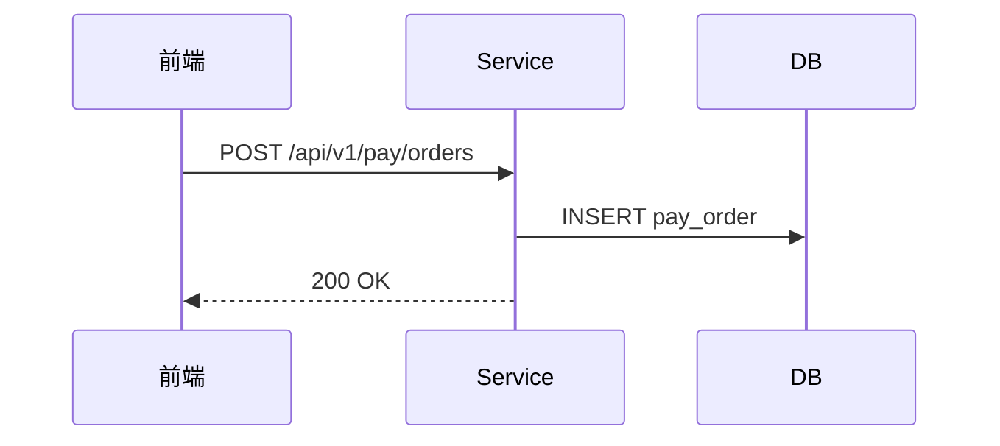
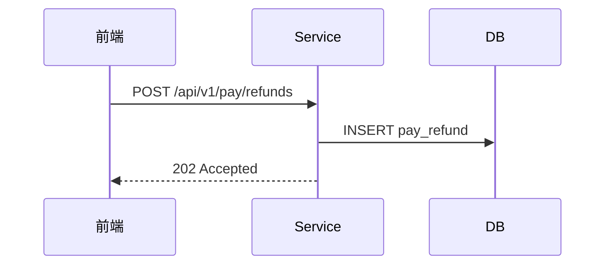

# demo-pay 详细设计

## §6 关键流程

<!-- anchor: business-operations -->

<!-- df:begin:biz-ops -->
（由 design.json 自动生成业务操作契约索引）
<!-- df:end:biz-ops -->

### 6.1 创建支付订单

```text
WHEN 创建支付订单 (command, operator):
  1. 校验字段约束
  2. 获取幂等锁（order_no 粒度）
  3. TX：生成 order_no → INSERT pay_order
  4. 返回 id、order_no
```



### 6.2 创建退款单

```text
WHEN 创建退款单 (orderId, operator):
  1. 校验订单存在与可退金额
  2. TX：INSERT pay_refund
  3. 异步受理返回 202
```



## §2 数据模型

### 2.1 支付订单表（pay_order）

字段与口径见下表索引。

### 2.2 退款单表（pay_refund）

字段与口径见下表索引。

## §3 接口设计

### 3.1 接口概览

接口索引见下表。

#### 3.2.1 创建支付订单

请求/响应六列字段表……

#### 3.2.2 创建退款单

请求/响应六列字段表……

## §1 功能概述
正文……

<!-- df:begin:summary -->
本设计共覆盖验收点 **3** 个（设计完成 3/3 = 100%），新建或修改数据表 **2** 张（共 2 个字段），接口 **2** 个（请求字段 2 个、响应字段 1 个，全部配有详细定义），页面 **2** 个，业务规则 **2** 条，设计决策 **3** 条，外部集成 **1** 个，配置键 **1** 个，受管资源 **1** 个（2 个操作、其中反向操作 1 个）。客户端只覆盖**PC 网页端**。

> 本节由设计数据自动汇总。
<!-- df:end:summary -->

## §8 外部集成与配置键

### 8.1 集成清单

外部调用与回调的规格见下表。

### 8.2 配置消费规格

配置键的消费点与失败路径见下表。

### 8.3 资源与补偿链

受管资源在各操作中的处置见补偿矩阵。

## §5 业务规则

### 5.1 重复提交幂等

WHEN 同一 order_no 在 60 秒内重复提交：返回原单，不重复扣款。

### 5.2 退款金额上限

WHEN 退款金额 > 剩余可退金额：拒绝并提示上限。

## §7 前端页面

### 7.1 下单页

表单与权限见权限矩阵。

### 7.2 退款页

表单与权限见权限矩阵。

## §11 需求追溯与覆盖率基线

<!-- anchor: acceptance-traceability -->
<!-- df:begin:trace-matrix -->
| ID | PRD 锚点 | 页面/任务 | 接口 | 数据 | 规则 | 测试用例 | 状态 |
|---|---|---|---|---|---|---|---|
| M01-F01-A01 | docs/requirements/demo-pay-acceptance-criteria.md#M01-F01-A01 | §7.1 | §3.1 | §2.1 | R1 | TC-PAY-001 | COMPLETE |
| M01-F01-A02 | docs/requirements/demo-pay-acceptance-criteria.md#M01-F01-A02 | §7.1 | §3.1 | §2.1 | R1 | TC-PAY-002 | COMPLETE |
| M01-F02-A01 | docs/requirements/demo-pay-acceptance-criteria.md#M01-F02-A01 | §7.2 | §3.1 | §2.2 | R2 | TC-PAY-003 | COMPLETE |

覆盖率：3/3 = 100%，全部验收点都完成了设计。
<!-- df:end:trace-matrix -->

<!-- df:begin:api-index -->
| 方法 | 路径 | 接口名称 | 权限 | 概览锚点 | 详细定义 | 请求字段 | 响应字段 |
|---|---|---|---|---|---|---|---|
| POST | /api/v1/pay/orders | 创建支付订单 | pay:order:create | §3.1 | §3.2.1 | 1 | 1 |
| POST | /api/v1/pay/refunds | 创建退款单 | pay:refund:create | §3.1 | §3.2.2 | 1 | 0 |
<!-- df:end:api-index -->

<!-- df:begin:table-index -->
| 锚点 | 表名 | 字段数 |
|---|---|---|
| §2.1 | pay_order | 1 |
| §2.2 | pay_refund | 1 |
<!-- df:end:table-index -->

<!-- df:begin:permission-matrix -->
| 对象 | §锚点 | 所需权限 |
|---|---|---|
| 下单页 | §7.1 | pay:order:create |
| 退款页 | §7.2 | pay:refund:create |
| POST /api/v1/pay/orders | §3.1 | pay:order:create |
| POST /api/v1/pay/refunds | §3.1 | pay:refund:create |

> 每个页面和接口都标注了所需的权限；完全公开的对象在该列标注 public。
<!-- df:end:permission-matrix -->

<!-- df:begin:rule-index -->
| 规则 | §锚点 | 摘要 |
|---|---|---|
| R1 | §5.1 | 重复提交幂等 |
| R2 | §5.2 | 退款金额上限 |
<!-- df:end:rule-index -->

<!-- df:begin:client-scope -->
客户端范围为**PC 网页端**，以下旅程必须在真实环境中走通：

| 旅程 | §页面锚点 | 证据形态 |
|---|---|---|
| 下单主流程 | §7.1 | 真实浏览器 |
<!-- df:end:client-scope -->

<!-- df:begin:zero-results -->
以下内容已确认为空，并非遗漏：

| 为空的内容 | 原因 |
|---|---|
| apis[1].response.fields | 退款接口异步受理模式，同步响应仅返回受理状态码，无业务字段 |
<!-- df:end:zero-results -->

<!-- df:begin:ddr-index -->
| 编号 | 决策点 | 备选方案 | 选定 | 理由 |
|---|---|---|---|---|
| DDR-1 | order_no 长度 | varchar(20) / varchar(32) | varchar(64) | 编码规则 18 位定长 + 2 位冗余，预留 3 倍兼容跨系统单号；参照 §13 规范 R-004 |
| DDR-2 | refund_no 类型 | varchar / text | varchar(64) | 须参与唯一索引；text 不能建普通索引（§13 规范 R-007） |
| DDR-3 | 金额精度 | DECIMAL(10,2) / DECIMAL(12,2) | DECIMAL(12,2) | 单笔上限 10^10 分级业务口径，2 位小数满足分账精度；量化：最大流水 9,999,999,999.99 |

> 每条设计决策回答了「为什么这么设计」，并与具体字段一一对应（见下表）。理由均来自业务口径、规范条目或量化数据，不只凭经验。
<!-- df:end:ddr-index -->

<!-- df:begin:ddr-matrix -->
| 表 | 字段 | 关联 DDR |
|---|---|---|
| pay_order | order_no | DDR-1 |
| pay_refund | refund_no | DDR-2、DDR-3 |

全部 2 个字段都能追溯到决定它的设计决策。
<!-- df:end:ddr-matrix -->

<!-- df:begin:resource-operations -->
| 资源 | 类别 | 超时取消（timeout） |
|---|---|---|
| 下单幂等锁 | lock | 立即释放 |

> 每个被正向占用的资源，在取消/回滚/超时/重试时都有明确处置；「永不释放」「不涉及」必须写明理由，沉默视为设计缺失。
<!-- df:end:resource-operations -->

<!-- df:begin:integrations-configs -->
| 集成 | 方向 | 端点 | 超时 | 幂等 | 失败路径 | 降级/兜底 |
|---|---|---|---|---|---|---|
| 支付网关预下单 | 出向 | POST https://gw.example.com/preorder | 3 秒 × 2 次重试 | Idempotency-Key: order_no（网关侧 24 小时去重） | 重试仍失败 → 订单置「待支付异常」并告警，不阻塞主流程 | 定时兜底查询任务与事件驱动复用同一执行方法 |

| 配置键 | 值格式 | 生效消费点 | 失败路径 | 置信级 |
|---|---|---|---|---|
| pay.timeout.seconds | 整数秒，缺省 3 | 1 | 缺失 → 取默认 3 秒并记 warn 日志；非法值（≤0）→ 启动期 fail-fast | high |
<!-- df:end:integrations-configs -->
