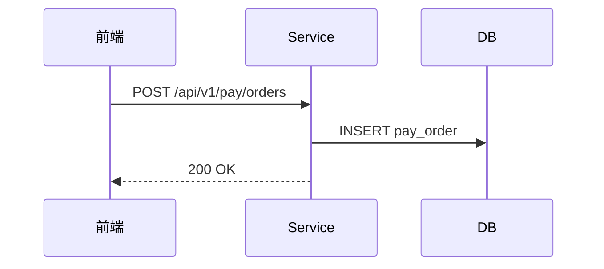
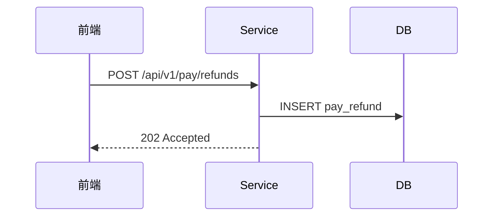

# demo-pay 详细设计

## §6 关键流程

<!-- anchor: business-operations -->

<!-- df:begin:biz-ops -->
（由 design.json 自动生成业务操作契约索引）
<!-- df:end:biz-ops -->

### 6.1 创建支付订单（BOP-1）

```text
WHEN 创建支付订单 (command, operator):
  1. 校验字段约束
  2. 获取幂等锁（order_no 粒度）
  3. TX：生成 order_no → INSERT pay_order
  4. 返回 id、order_no
```



### 6.2 创建退款单（BOP-2）

```text
WHEN 创建退款单 (orderId, operator):
  1. 校验订单存在与可退金额
  2. TX：INSERT pay_refund
  3. 异步受理返回 202
```



## §2 数据模型

## 2.2 表结构设计

### 2.2.1 支付订单表（pay_order）

字段与口径见下表索引。

### 2.2.2 退款单表（pay_refund）

字段与口径见下表索引。

## §3 接口设计

### 3.1 接口概览

接口索引见下表。

### 3.2 详细接口定义

#### 3.2.1 创建支付订单

> 说明：POST /api/v1/pay/orders ｜权限：pay:order:create

请求/响应六列字段表……

#### 3.2.2 创建退款单

> 说明：POST /api/v1/pay/refunds ｜权限：pay:refund:create

请求/响应六列字段表……

## §1 功能概述
正文……

<!-- df:begin:summary -->
本设计共覆盖验收点 **3** 个（设计完成 3/3 = 100%），新建或修改数据表 **2** 张（共 2 个字段），接口 **2** 个（请求字段 2 个、响应字段 1 个，全部配有详细定义），页面 **2** 个，业务规则 **2** 条，设计决策 **3** 条，外部集成 **1** 个，配置键 **1** 个，受管资源 **1** 个（2 个操作、其中反向操作 1 个）。客户端只覆盖**PC 网页端**。

> 本节由设计数据自动汇总。
<!-- df:end:summary -->

## §8 外部集成与配置键

### 8.1 集成清单

外部调用与回调的规格见下表。

### 8.2 配置消费规格

配置键的消费点与失败路径见下表。

### 8.3 资源与补偿链

受管资源在各操作中的处置见补偿矩阵。

## §5 业务规则

> 本示例规则均属页面交互，见 §7.2 各页组「业务规则」表；无页面场景规则（MQ/定时/纯后端）在此登记。

无非页面规则（页面规则见 §7.2 各页组）。

## §7 前端页面

<!-- df:begin:rule-index -->
| 规则 | §锚点 | 摘要 | 错误码 |
|---|---|---|---|
| R1 | §7.2.1 | 重复提交幂等 | — |
| R2 | §7.2.2 | 退款金额上限 | REFUND_AMOUNT_EXCEEDED |
<!-- df:end:rule-index -->

### 7.1 页面清单

| # | 子域/分组 | 页面 | 路径 | 组件（真实路径） | 类型 | 权限 |
|---|---|---|---|---|---|---|
| 1 | 支付 | 下单页 | /pay/order/create | views/pay/OrderCreate.vue | 表单页 | pay:order:create |
| 2 | 支付 | 退款页 | /pay/refund | views/pay/RefundCreate.vue | 表单页 | pay:refund:create |
| 3 | 支付 | 提交确认 | /pay/order/create | views/pay/SubmitConfirmDialog.vue | 弹窗（确认） | pay:order:create |
| 4 | 支付 | 退款确认 | /pay/refund | views/pay/RefundConfirmDialog.vue | 弹窗（确认） | pay:refund:create |

## 7.2 页面交互设计

### 7.2.1 下单页交互（覆盖：下单页）

- **查询区**：无
- **列表**：无
- **表单**：有（下单表单，见下方表单控件规格）

**业务规则：**

| 规则 | WHEN（触发） | 处理与错误码 |
|---|---|---|
| R1 | WHEN 同一 order_no 在 60 秒内重复提交：返回原单，不重复扣款。 | 幂等返回原单，不重复扣款 |

**调用接口：**

| 接口 | 用途/触发时机 | 涉及表（表.字段） | 业务操作（BOP-n） |
|---|---|---|---|
| §3.2.1 | 提交下单 | pay_order.order_no | BOP-1 |

**操作：**

| 操作 | 类型 | 权限点 | 关联（§3.2.x · BOP-n · Rn） | 触发弹窗/抽屉 |
|---|---|---|---|---|
| 提交 | 行操作 | pay:order:create | §3.2.1 · BOP-1 · R1 | → 弹窗/抽屉：提交确认 |

**弹窗/抽屉：**

| 交互 | 组件 | 接口 | 关键状态/确认流 |
|---|---|---|---|
| 提交确认 | views/pay/SubmitConfirmDialog.vue | §3.2.1 POST | 二次确认；重复提交返回原单不重复扣款；失败保留草稿 |

**表单控件规格：**

| 字段 | 标签 | 控件 | 校验与提示 | 候选来源 | 链路（§3.2.x → 表.字段） |
|---|---|---|---|---|---|
| amount | 金额 | el-input-number | 必填 · 0.01~99999.99 · R1 | 用户输入 | §3.2.1 → — |
| payMethod | 支付方式 | el-select | 必填 · 候选:静态枚举 | 静态枚举 | §3.2.1 → — |

### 7.2.2 退款页交互（覆盖：退款页）

- **查询区**：无
- **列表**：有（退款状态列，见下方表格列规格）
- **表单**：有（退款表单，见下方表单控件规格）

**业务规则：**

| 规则 | WHEN（触发） | 处理与错误码 |
|---|---|---|
| R2 | WHEN 退款金额 > 剩余可退金额：拒绝并返回 REFUND_AMOUNT_EXCEEDED。 | REFUND_AMOUNT_EXCEEDED（409），保留输入 |

**调用接口：**

| 接口 | 用途/触发时机 | 涉及表（表.字段） | 业务操作（BOP-n） |
|---|---|---|---|
| §3.2.2 | 提交退款 | pay_refund.refund_no | BOP-2 |

**操作：**

| 操作 | 类型 | 权限点 | 关联（§3.2.x · BOP-n · Rn） | 触发弹窗/抽屉 |
|---|---|---|---|---|
| 发起退款 | 行操作 | pay:refund:create | §3.2.2 · BOP-2 · R2 | → 弹窗/抽屉：退款确认 |

**弹窗/抽屉：**

| 交互 | 组件 | 接口 | 关键状态/确认流 |
|---|---|---|---|
| 退款确认 | views/pay/RefundConfirmDialog.vue | §3.2.2 POST | 二次确认；超限拦截并保留输入 |

**表格列规格：**

| 字段 | 列标题 | 渲染说明 | 链路（§3.2.x 字段 ← 表.字段） |
|---|---|---|---|
| orderNo | 订单号 | 文本；超长省略 | — ← — |
| refundStatus | 退款状态 | 状态 Tag（待退款/退款中/已退款） | — ← — |

**表单控件规格：**

| 字段 | 标签 | 控件 | 校验与提示 | 候选来源 | 链路（§3.2.x → 表.字段） |
|---|---|---|---|---|---|
| refundAmount | 退款金额 | el-input-number | 必填 · ≤剩余可退金额 · R2 | 用户输入 | §3.2.2 → — |

<!-- df:begin:api-index -->
| 方法 | 路径 | 接口名称 | 权限 | 概览锚点 | 详细定义 | 请求字段 | 响应字段 |
|---|---|---|---|---|---|---|---|
| POST | /api/v1/pay/orders | 创建支付订单 | pay:order:create | §3.1 | §3.2.1 | 1 | 1 |
| POST | /api/v1/pay/refunds | 创建退款单 | pay:refund:create | §3.1 | §3.2.2 | 1 | 0 |
<!-- df:end:api-index -->

<!-- df:begin:table-index -->
| 锚点 | 表名 | 字段数 |
|---|---|---|
| §2.1 | pay_order | 1 |
| §2.2 | pay_refund | 1 |
<!-- df:end:table-index -->

<!-- df:begin:permission-matrix -->
| 对象 | §锚点 | 所需权限 |
|---|---|---|
| 下单页 | §7.1.1 | pay:order:create |
| 退款页 | §7.1.2 | pay:refund:create |
| POST /api/v1/pay/orders | §3.2.1 | pay:order:create |
| POST /api/v1/pay/refunds | §3.2.2 | pay:refund:create |

> 每个页面和接口都标注了所需的权限；完全公开的对象在该列标注 public。
<!-- df:end:permission-matrix -->

<!-- df:begin:resource-operations -->
| 资源 | 类别 | 超时取消（timeout） |
|---|---|---|
| 下单幂等锁 | lock | 立即释放 |

> 每个被正向占用的资源，在取消/回滚/超时/重试时都有明确处置；「永不释放」「不涉及」必须写明理由，沉默视为设计缺失。
<!-- df:end:resource-operations -->

<!-- df:begin:integrations-configs -->
| 集成 | 方向 | 端点 | 超时 | 幂等 | 失败路径 | 降级/兜底 |
|---|---|---|---|---|---|---|
| 支付网关预下单 | 出向 | POST https://gw.example.com/preorder | 3 秒 × 2 次重试 | Idempotency-Key: order_no（网关侧 24 小时去重） | 重试仍失败 → 订单置「待支付异常」并告警，不阻塞主流程 | 定时兜底查询任务与事件驱动复用同一执行方法 |

| 配置键 | 值格式 | 生效消费点 | 失败路径 | 置信级 |
|---|---|---|---|---|
| pay.timeout.seconds | 整数秒，缺省 3 | 1 | 缺失 → 取默认 3 秒并记 warn 日志；非法值（≤0）→ 启动期 fail-fast | high |
<!-- df:end:integrations-configs -->
