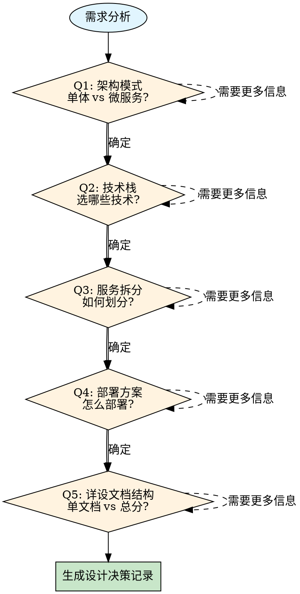

# Phase 1: 技术选型 (Tech Selection)

## 目标

通过**多轮交互决策**确定：
1. 技术栈组合
2. 架构模式（单体/微服务/混合）
3. 服务拆分策略
4. 部署方案
5. **P2 详设文档结构**（单文档 monolith / 总分文档 total）——v3.27.7 起从 P2 上移至 P1 一并决策，P2 只按冻结结果取模板

---

## 基线编译冒烟（v3.27.5，M-01 教训 L-M01-002）

> 存量脚手架/工作区（非绿地）在冻结选型前**必须**执行双冒烟并留存输出——防止"发行缺源码/既有类型错误"延迟到 P3 编译期才暴露：

```bash
mvn -B compile -DskipTests          # 后端：全模块编译（留存输出至选型报告附件）
pnpm --filter <web> typecheck       # 前端：类型检查
```

任一失败 → 先登记缺口（缺源码模块/既有错误清单）并单列修复任务，**不得**带病冻结选型。
绿地项目（无代码）显式声明跳过。

---

## 第零步：脚手架重合度审计（铁律 18；输入含脚手架时强制）

> **输入含脚手架/存量代码（`--scaffold` 传入或 PRD 指向存量仓库）时，必须先于选型评分完成本步**；
> 输出「裁剪/复用清单」登记为 `scaffold_audit`（tech-selection.json）并由管线渲染为报告《脚手架重合度审计》章节——s1 Gate 对账章节与判定清单表存在性。

**操作步骤**：

1. **盘点脚手架功能域**：扫描脚手架菜单 seed、Controller、Service、表结构与前端页面，形成"脚手架已有能力清单"。
2. **对照本次新功能**：以 PRD 功能域（F01…）为行，逐项判定与脚手架的关系。
3. **二分裁决并落清单**（不允许模糊态）：

| 功能域 | 脚手架现状（代码/菜单/页面/表） | 判定（裁剪/复用/新建） | 处置动作 | 新实现承载位置 |
|---|---|---|---|---|
| F0x | 例：`module-xxx` 已有 XxxController + 菜单 10x + 页面 xxx | 裁剪 | 删除控制器/服务/实体、下线菜单 10x、移除前端页面与路由、迁移清理引用 | 新模块 `module-<feature>` 重新实现 |

**硬性规则**：

- **重合 → 裁剪**：脚手架对应实现（控制器/服务/实体/Mapper/菜单 seed/前端页面路由/相关迁移引用）必须裁剪，
  由本次设计**重新实现**；重合域宜由**独立新模块**承载，不得在原实现上"顺带扩展"冒充新设计。
- **不重合 → 复用**：使用脚手架既有能力（REUSE），不得重复造轮子；进入 P2 baseline `REUSE` 条目。
- **禁止双实现并存**：同一功能域不允许新旧两套菜单、接口或写路径同时存活（红旗，立即停止）。
- 裁剪动作属外部副作用（部署/迁移/发布）时按原则 14 走授权收据；本项目内代码删除随交付提交。
- 清单中的每个「裁剪」项必须有 P2 baseline 承接（`DELETE`/`MODIFY`），「复用」项承接为 `REUSE`，
  「新建」项承接为 `ADD`——三向对账在 P2a 评审与 P4b 逐项核验。

---

## 多轮决策流程



---

## 第一轮：架构模式决策

### 决策问题

> **Q1: 这个系统应该采用什么架构模式？**

### 选项

| 架构模式 | 适用场景 | 优势 | 劣势 |
|----------|----------|------|------|
| **单体架构** | 小团队（<5人）、初创项目、需求不确定 | 简单、快速开发、部署简单 | 扩展性差、技术栈锁定 |
| **模块化单体** | 中小团队（5-15人）、中等复杂度 | 保留单体优点、模块可独立开发 | 边界可能模糊 |
| **微服务架构** | 大团队（>15人）、高并发、长期演进 | 高扩展、独立部署、技术异构 | 复杂度高、运维成本高 |
| **混合架构** | 核心模块单体+边缘模块微服务 | 平衡成本与扩展性 | 架构不一致 |

### 权衡要点（不是决策结论）

> 团队人数、并发量、工期只是**权衡输入**，禁止用阈值直接映射架构结论。
> 正确顺序：先读现有仓库与硬约束 → 淘汰不合规方案 → 补充缺失事实 → 只对剩余方案评分。

```
架构复杂度必须匹配问题复杂度，权衡输入包括但不限于：
- 现有仓库已有的技术栈与模块边界（最高权重：存量事实）
- P0 冻结的 MUST_USE / MUST_NOT_USE（一票否决）
- 部署与运维能力、可用性要求、演进预期
- 团队规模 / 并发量 / 工期（参考项，不单独定论）
```

### 交互问卷

```markdown
## Q1: 架构模式问卷

请回答以下问题以帮助确定架构模式：

### 1. 团队规模（事实收集，不决定结论）
- [ ] 1-5人
- [ ] 5-15人
- [ ] 15-50人
- [ ] 50人以上

### 2. 预期并发用户
- [ ] < 1000
- [ ] 1000-10000
- [ ] 10000-100000
- [ ] > 100000

### 3. 上线时间要求
- [ ] < 1个月（必须快速上线）
- [ ] 1-3个月
- [ ] 3-6个月
- [ ] > 6个月（可以规划微服务）

### 4. 需求稳定性
- [ ] 需求频繁变化
- [ ] 需求相对稳定
- [ ] 核心需求稳定，边缘需求变化

### 5. 运维能力
- [ ] 无专职运维（DevOps能力弱）
- [ ] 有兼职运维
- [ ] 有专职DevOps团队

### 6. 预算
- [ ] 有限（优先低成本）
- [ ] 中等
- [ ] 充足（可以投入基础设施）
```

---

## 第二轮：微服务拆分决策（如果选择微服务）

### 决策问题

> **Q2: 如果选择微服务，应该如何拆分？**

### 拆分原则

| 原则 | 说明 | 示例 |
|------|------|------|
| **单一职责** | 每个服务只负责一个业务领域 | 用户服务、订单服务、商品服务 |
| **高内聚低耦合** | 服务内部紧耦合，服务间松耦合 | 订单服务不直接访问用户数据库 |
| **独立部署** | 每个服务可以独立部署 | 通过API通信，不共享代码 |
| **团队所有权** | 每个服务有明确的团队负责 | BFF层对应前端团队 |

### 拆分策略

#### 1. 按业务能力拆分（推荐）

```
├── 用户中心服务 (user-service)
│   ├── 注册/登录
│   ├── 用户信息管理
│   └── 权限/角色
├── 订单服务 (order-service)
│   ├── 创建订单
│   ├── 订单查询
│   └── 订单状态流转
├── 商品服务 (product-service)
│   ├── 商品管理
│   ├── 库存管理
│   └── 价格管理
├── 支付服务 (payment-service)
│   ├── 支付下单
│   ├── 支付回调
│   └── 退款处理
└── 通知服务 (notification-service)
    ├── 短信通知
    ├── 邮件通知
    └── 站内信
```

#### 2. 按读写分离拆分

```
├── 订单写服务 (order-write-service)
│   └── 订单创建、更新、取消
├── 订单读服务 (order-read-service)
│   └── 订单查询、列表、统计
└── 订单聚合服务 (order-aggregate-service)
    └── 订单聚合查询（调用写服务和读服务）
```

#### 3. 避免的拆分方式

| ❌ 错误方式 | 问题 | ✅ 正确方式 |
|-------------|------|-------------|
| 按技术层拆分 | 数据层、逻辑层、控制层强耦合 | 按业务能力拆分 |
| 按数据库表拆分 | 服务间共享数据库 | 每个服务独立数据库 |
| 颗粒度太细 | 服务数量爆炸、运维复杂 | 粗颗粒度优先 |

### 交互问卷

```markdown
## Q2: 服务拆分问卷

### 1. 核心业务领域（多选）
- [ ] 用户/会员
- [ ] 商品/产品
- [ ] 订单/交易
- [ ] 支付/结算
- [ ] 库存
- [ ] 营销/活动
- [ ] 内容/社区
- [ ] 搜索/推荐
- [ ] 通知/消息
- [ ] 文件/媒体

### 2. 是否需要独立扩展的核心模块？
- [ ] 高并发下单（需要独立扩容）
- [ ] 复杂查询（需要独立优化）
- [ ] 第三方集成（需要独立维护）
- [ ] 暂时不需要

### 3. 服务间通信方式偏好
- [ ] 同步HTTP/gRPC
- [ ] 异步消息队列
- [ ] 两者结合

### 4. 数据共享需求
- [ ] 跨服务数据实时一致
- [ ] 最终一致即可
- [ ] 混合（有实时有最终）
```

---

## 第三轮：技术栈决策

### 决策问题

> **Q3: 各服务/模块应该采用什么技术栈？**

### 技术选项矩阵

| 技术领域 | 选项 | 评分维度 |
|----------|------|----------|
| **后端框架** | Spring Boot / Spring Cloud / Quarkus / Go / Node.js | 功能、学习、生态、性能、运维、成本 |
| **数据库** | PostgreSQL / MySQL / MongoDB / Redis / Elasticsearch | 功能、学习、生态、性能、运维、成本 |
| **缓存** | Redis / Memcached / Caffeine | 功能、学习、生态、性能、运维、成本 |
| **消息队列** | Kafka / RabbitMQ / RocketMQ / Pulsar | 功能、学习、生态、性能、运维、成本 |
| **前端框架** | React / Vue / Angular / Next.js / Nuxt | 功能、学习、生态、性能、运维、成本 |
| **容器** | Docker / Podman | 生态、运维、学习 |
| **编排** | K8s / Docker Compose / Swarm | 生态、运维、学习 |

### 决策矩阵模板（空白模板——禁止预填分数或推荐标记）

```
评分标准：1-5分，5分最优；每个分数必须附证据（POC 数据/官方基准/引用），
无证据的分数无效。本模板不提供任何示例分数，示例会被误当结论。

                        功能  学习  生态  性能  运维  成本  总分
候选 1                ___   ___   ___   ___   ___   ___   ___
候选 2                ___   ___   ___   ___   ___   ___   ___
```

---

## 第四轮：部署方案决策

### 决策问题

> **Q4: 如何部署和运维？**

### 部署选项

| 方案 | 适用场景 | 成本 | 复杂度 |
|------|----------|------|---------|
| **传统服务器** | 小规模、无容器经验 | 低 | 低 |
| **Docker Compose** | 单机部署、微服务初体验 | 低 | 中 |
| **Kubernetes** | 生产环境、多机器集群 | 高 | 高 |
| **云原生托管** | K8s能力不足、想快速交付 | 中高 | 低 |
| **混合部署** | 核心自建+边缘托管 | 中 | 中 |

### 部署权衡参考（非预设结论）

> 部署方案由可用性要求、运维能力、成本预算与团队经验共同决定，下表仅列常见组合。

| 架构 | 常见部署组合 | 主要权衡 |
|------|--------------|----------|
| 单体 | 云服务器 + Docker | 运维简单，扩展性有限 |
| 模块化单体 | Docker Compose | 单机为主，模块边界清晰 |
| 微服务 | K8s / 云原生托管 | 扩展性强，运维成本高 |

**依据**: 现有仓库与硬约束优先，团队规模/并发仅作参考

---

## 第五轮：详设文档结构决策（v3.27.7）

### 决策问题

> **Q5: P2 详细设计写单文档还是总分文档？**

该决策此前放在 P2，现上移到 P1：文档结构取决于模块划分与团队并行方式，而这些在技术选型/
服务拆分轮次已确定。P2 只按本决策取模板，不再重复决策。

| mode | 适用 | P2 模板 |
|------|------|---------|
| **monolith（单文档）** | 单模块/简单功能，一份详设可完整承载 | `详细设计-完整版-模板.md` |
| **total（总分文档）** | 模块数 ≥ 5 且跨服务、单模块复杂度高需独立演进、多团队并行 | `详细设计-总分总文档-模板.md` + 每模块一份 `详细设计-总分分文档-模板.md` |

> 模块数、跨服务依赖、并行团队为权衡输入而非阈值映射；结构必须与 Q1/Q2 的架构与拆分结论自洽。
> 选 total 时同步给出计划文档清单（总文档 TOTAL + 各分文档 M-NN 路径），P2 据此冻结 design-package.json。

---

## 输出

创建设计决策记录：`docs/详细设计/<feature>-技术选型.md`

P1 必须同时读取 P0 的 `docs/需求/<feature>-技术约束.md`。
报告先核对每个 `constraint_id`，再对满足硬约束的候选方案评分；不得把
`MUST_USE`/`MUST_NOT_USE` 当作普通评分维度。

```markdown
# [功能名称] 设计决策记录

## 1. 决策过程

### 1.1 架构模式决策
**决策**: [单体/模块化单体/微服务/混合]
**依据**: 团队规模X人、并发Y用户、时间要求Z
**备选**: [其他选项]

**硬约束核对**：`constraint_id`、选定方案、合规状态和证据必须逐条列出。

### 1.2 服务拆分决策（如果是微服务）
**服务列表**:
| 服务名 | 职责 | 团队归属 | 依赖服务 |
|--------|------|----------|----------|
|        |      |          |          |

**拆分边界**: [说明拆分原则的应用]

### 1.3 技术栈决策
| 技术领域 | 选择 | 备选 | 理由 |
|----------|------|------|------|
| 后端框架 |      |      |      |
| 数据库   |      |      |      |
| ...      |      |      |      |

### 1.4 部署方案决策
**方案**: [部署方案]
**理由**: [选择理由]

### 1.5 详设文档结构决策（v3.27.7）
**结构**: [monolith 单文档 / total 总分文档]
**依据**: [模块数量/跨服务依赖/团队并行等事实]
**计划文档**: [total 时列出总文档+分文档路径清单；monolith 写 NONE]

## 2. 技术选型矩阵

[决策矩阵详细数据]

## 3. 推荐方案

### 3.1 技术栈组合
- 后端: 
- 数据库: 
- 缓存: 
- 消息队列: 
- 前端: 
- 部署: 

### 3.2 架构图
[架构示意图]

### 3.3 服务依赖图
[服务间依赖关系]

## 4. 风险评估

| 风险 | 影响 | 概率 | 缓解措施 |
|------|------|------|----------|
|      |      |      |          |

## 5. 备选方案

### 备选1: [方案名]
- 适用场景: 
- 技术栈: 
- 切换条件: 

## 6. 团队能力要求

| 技术 | 要求等级 | 当前团队 | 差距 |
|------|----------|----------|------|
|      |          |          |      |

## 7. 下一步行动

- [ ] [ ] POC验证（如果需要）
- [ ] [ ] 技术预研（如果需要）
- [ ] [ ] 进入Phase 2
```

---

## 验收Checklist

> **必须全部完成才能进入Phase 2**

### 架构决策
- [ ] Q1架构模式已确定（4选1）
- [ ] Q2服务拆分已确定（如果微服务）
- [ ] Q3技术栈已确定
- [ ] Q4部署方案已确定
- [ ] Q5详设文档结构已确定（monolith/total；total 附计划文档清单）

### 文档
- [ ] 决策过程已记录
- [ ] 决策矩阵评分完整
- [ ] 架构图已绘制
- [ ] 服务依赖图已绘制（如果是微服务）
- [ ] 风险评估完整
- [ ] 备选方案已说明

### 确认
- [ ] 用户已确认决策结果
- [ ] 决策依据已记录
- [ ] P0 技术约束契约存在且状态为 FROZEN
- [ ] 每个 MUST_USE/MUST_NOT_USE 均有 P1 选型绑定和证据

---

## Red Flags 🚩

| 红旗 | 问题 | 正确做法 |
|------|------|----------|
| 小团队选微服务 | 复杂度超过团队能力 | 优先单体或模块化单体 |
| 无POC直接生产 | 技术风险未验证 | POC验证后再决定 |
| 追新技术 | 技术风险高 | 成熟技术优先 |
| 无备选方案 | 方案不可切换 | 必须有Plan B |
| 拆分过细 | 服务数量爆炸 | 控制服务数量 |

---

## 关键原则

1. **架构服务于业务** - 不是为了微服务而微服务
2. **演进式架构** - 可以从单体逐步演进到微服务
3. **团队能力匹配** - 选择团队能驾驭的技术
4. **数据驱动决策** - 用决策矩阵量化评估
5. **多轮交互确认** - 不确定就多问，确认后再推进

---

## 常见问题处理

| 问题 | 解决方案 |
|------|----------|
| 团队能力不足 | 选择团队熟悉的技术，或预留培训时间 |
| 需求不确定 | 选择灵活性高的架构，便于演进 |
| 预算有限 | 选择成本低的方案，或分阶段投入 |
| 多团队意见分歧 | 引入架构委员会决策 |
| 技术风险高 | 做POC验证，降低风险 |

---

## 应用经验教训

### L-TOOL-001: Skill Tree 漂移需原子恢复

**教训**：skill 目录被外部同步进程（iCloud/Dropbox/.cursor 自动更新）更新后，SKILL_TREE SHA256 校验会令全部历史 gate receipt 失配，需 migrate-tree + 全链重跑收据才能通过审计。

**本阶段应用**：
- P1 技术选型阶段如遇 SKILL_TREE 漂移，需原子恢复
- 在同步稳定窗口内原子完成"migrate→gate→complete→audit"四步骤

**预防措施**：
1. 执行 `scripts/gate-skill-tree.sh migrate` 并重跑 P0-P1 所有 gate
2. 将 `.cursor/skills/devflow` 加入 .gitignore，避免 Git 同步引发漂移
3. 使用 devflow 期间关闭 iCloud/Dropbox 自动同步

**参考**：详见 `concepts/lessons-learned.md` L-TOOL-001

---

### L-TOOL-002: macOS BSD awk 与 GNU awk 的 gsub 差异

**教训**：macOS BSD awk 对被 `gsub` 修改的字段会触发 `$0` 重建（分隔符替换为 OFS），导致依赖 markdown 表格逐列提取的 gate 脚本解析失败。

**本阶段应用**：
- P1 设计决策记录中的决策矩阵表格必须规范格式
- 避免表格 `|` 前后留空格（BSD awk 会破坏格式）

**预防措施**：
1. 设计决策记录的决策矩阵表格使用无空格格式：`|候选1|分数1|分数2|`
2. Gate 脚本在解析前先 `gsub(/[[:space:]]*\|[[:space:]]*/, "|")` 规范化
3. 或使用 Python/jq 代替 awk 解析复杂表格
4. 在 CI 环境安装 GNU awk (`brew install gawk`)

**参考**：详见 `concepts/lessons-learned.md` L-TOOL-002

---

### L-TOOL-003: `set -u` 脚本中 echo 调试语句需后置

**教训**：`set -u` 脚本中插入的 `echo $BASE` 会在 BASE 定义前触发 `unbound variable` 错误。

**本阶段应用**：
- P1 阶段如需调试 gate 脚本，注意变量引用位置
- 确保 echo/调试语句在变量定义之后

**预防措施**：
1. Gate 脚本模板在变量定义区域后增加 `# DEBUG LOG INJECTION POINT` 注释
2. 或使用 `${BASE:-}` 默认值语法规避
3. 日志注入工具检查插入位置是否在变量定义之后

**参考**：详见 `concepts/lessons-learned.md` L-TOOL-003

---

### L-STACK-001: Oracle LIMIT 1 兼容性

**教训**：10 处 `.last("LIMIT 1")` 在 Oracle 下不兼容，需改为 `FETCH FIRST 1 ROWS ONLY`。MyBatis-Plus `.last("LIMIT 1")` 直接拼接 SQL，不做方言转换。

**本阶段应用**：
- P1 技术选型如选择 Oracle/人大金仓等非 MySQL 方言数据库，必须考虑 SQL 兼容性
- 如需支持多方言（h2/postgresql/oracle/kingbase），必须在选型阶段明确方言适配策略

**预防措施**：
1. P1 设计决策记录必须包含"多方言支持"章节（如适用）
2. 决策使用 MyBatis-Plus 时，封装方言适配工具类（如 `SqlDialectUtils.limit1()`）
3. P2 详设增加"四方言一致性"检查清单
4. P3b 代码审查必须检查 `.last()` 使用是否跨方言兼容

**参考**：详见 `concepts/lessons-learned.md` L-STACK-001

---

## Gate 检查

```bash
bash "$SKILL_ROOT/scripts/s1_fact_sources_gate.sh" docs/详细设计
```

| 检查项 | 通过条件 |
|--------|----------|
| 决策矩阵 ≥ 3 维 | `grep -cE '| .*|' docs/详细设计/<f>-技术选型.md >= 3` |
| 设计决策记录 | 文件存在、含决策矩阵/决策结论/constraint_id/用户确认 |
| 详设文档结构决策 | 报告含《详设文档结构决策》小节与 `design_doc_structure_mode=monolith\|total` 机检行（v3.27.7；存量手写报告缺失先 WARN，重跑管线补登后转强制） |
| 硬约束绑定（机器契约） | 报告含 `DEVFLOW:CONSTRAINT-BINDINGS` 块，逐条绑定 constraint_id；`selected_product` 写实际选定产品（禁止"未引入 X"式描述） |
| 硬约束合规 | 所有 MUST_USE/MUST_NOT_USE 绑定 compliance=PASS；MUST_USE 含版本时 selected_version 必须一致；P1 通过后不可再改约束文件（state 已冻结 SHA） |
| 7 份事实源完整 | `s1_fact_sources_gate.sh` exit = 0 |
| 无占位符 | `grep -cE 'TODO\|TBD' docs/详细设计/<f>-技术选型.md = 0` |

---

## 结构化产物层（v3.25.2）

本阶段产物已结构化：AI 按 `schemas/tech-selection.schema.json`（样例 `examples/structured/tech-selection.sample.json`）填 `.devflow/<feature>/tech-selection.json`，再跑管线校验并确定性渲染 Markdown——**校验失败不渲染、不落盘、不进 Gate**；空集合必须 `zero_results` 显式声明。渲染格式与阶段 Gate 的机器解析契约逐字段兼容，模板保留为语义参考。

```bash
python3 scripts/df_pipeline.py tech-selection --input .devflow/<feature>/tech-selection.json --out docs/详细设计/<feature>-技术选型.md
```
