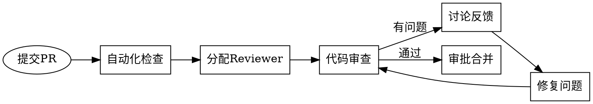

> **Java 评审基准（v3.18.3；v3.19.0 修订）**：Java 代码逐条核对 `concepts/Java开发手册_黄山版.md`；【强制】条款违反 = FAIL 并引用章节号；【推荐】条款违反须说明理由。手册 MySQL 章节与四方言铁律冲突时以四方言契约为准（不判 FAIL）。


# Phase 3b: Code Review (代码审查)

## 目标

- 保证代码质量
- 发现潜在Bug
- 分享知识，统一编码风格
- 确保代码符合设计规范

---

## Review流程



---

## Review检查清单

### 代码规范
- [ ] 命名规范统一（变量、函数、类命名）
- [ ] 代码格式一致（缩进、空格）
- [ ] 注释清晰必要
- [ ] 没有硬编码常量
- [ ] 没有重复代码

### 代码质量
- [ ] 方法长度合理（< 50行）
- [ ] 类职责单一
- [ ] 圈复杂度适中
- [ ] 没有过长参数列表

### 业务逻辑
- [ ] 逻辑正确，符合需求
- [ ] 边界条件处理
- [ ] 异常处理完善
- [ ] 事务边界正确

### 安全
- [ ] 输入校验
- [ ] SQL注入防护
- [ ] XSS防护
- [ ] 敏感信息加密
- [ ] 权限校验

### 性能
- [ ] 数据库查询优化（索引、N+1问题）
- [ ] 循环优化
- [ ] 缓存使用正确
- [ ] 没有内存泄漏

### 可测试性
- [ ] 代码可测试
- [ ] 依赖注入
- [ ] 是否有单元测试
- [ ] 测试覆盖率

### 可维护性
- [ ] 代码可读
- [ ] 依赖清晰
- [ ] API契约明确
- [ ] 向后兼容

---

## Review评论模板

```markdown
## Review评论规范

### 阻塞问题 (Must Fix)
```
[blocker] 这里有严重的Bug，会导致...
位置: xxx.java:23
建议: 应该...
```

### 重要问题 (Should Fix)
```
[important] 这里可能有问题，因为...
位置: xxx.java:45
建议: 建议使用...
```

### 代码风格 (Style)
```
[style] 建议使用xxx命名风格
位置: xxx.java:67
建议: 改为xxx
```

### 优化建议 (Optimization)
```
[optimize] 这里可以优化，因为...
位置: xxx.java:89
建议: 可以考虑...
```

### 疑问 (Question)
```
[question] 这里不太理解，为什么...
位置: xxx.java:101
```

### 称赞 (Praise)
```
[nice] 这个处理很优雅！
位置: xxx.java:123
```
```

---

## Review记录

```markdown
# PR Review 记录

## PR信息
- **PR编号**: #123
- **功能**: [功能名称]
- **作者**: [姓名]
- **Reviewer**: [姓名]
- **提交时间**: YYYY-MM-DD
- **合并时间**: YYYY-MM-DD

## Review结果

| 轮次 | Reviewer | 发现问题数 | 阻塞 | 通过 |
|------|----------|------------|------|------|
| 第1轮 |          |            |      |      |
| 第2轮 |          |            |      |      |

## 问题汇总

### 阻塞问题
| # | 问题 | 文件 | 行号 | 状态 |
|---|------|------|------|------|
|   |      |      |      | 已修复 |

### 建议问题
| # | 问题 | 文件 | 行号 | 状态 |
|---|------|------|------|------|
|   |      |      |      | 已修复/不修复 |

## 代码变更统计
- 新增代码: +xxx行
- 删除代码: -xxx行
- 修改文件: x个

## 最终结论
[通过/需要重新Review]
```

---

## Reviewer分配原则

| 规则 | 说明 |
|------|------|
| 至少1人 | 每个PR至少1个Reviewer |
| 模块Owner | 优先分配模块Owner |
| 交叉Review | 定期交叉Review分享知识 |
| 知识共享 | 新人PR由资深工程师Review |

---

## 验收Checklist

- [ ] PR已创建
- [ ] 自动化检查通过（CI绿）
- [ ] 至少1个Reviewer审批
- [ ] 所有阻塞问题已修复
- [ ] 代码已合并
