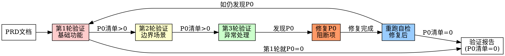

# Phase 4: PRD多轮验证

## 目标

对照PRD逐条验证功能实现，通过多轮迭代确保完全符合需求。

：上次跑完后产出"接口 95.7% / 页面 100% / 字段 100% / 后端权限 0%" 的失衡结论，6 项 P0 阻断被乐观标 ✅ 进入 P5。本版本强制：

> **铁律**：P0 阻断项清单长度 = 0 才能进入 Phase 5。
>
> 任何标为 P0 的问题（影响功能正确性 / 安全性 / 数据完整性 / 详设冻结口径），都必须修复 → 重跑自检 → 关闭，**禁止遗留至 Phase 5 测试用例阶段**。
>
> "有条件不通过" 不再是合法状态 —— 必须修复 → 重新验证 → 通过 → 才能签发 Phase 5 入场券。

#子阶段：PRD-实现对比（机器可验证，必跑）

> **入口命令**：`/prd-vs-code <feature>` → 按冻结验收ID逐项核验代码与测试证据。
>
> **完整流程**：见 `phases/04b-PRD-实现对比.md`。命令入口见 `commands/prd-vs-code.md`。

**对比维度（与原"逐条对照"互补，不可替代）**：

| 维度 | 旧 | v2.5 机器可验证 |
|------|--------------------|------------------|
| 原子验收点 vs 实现证据 | 人工抽查 | `scripts/p4_prd_vs_code.sh` 精确集合Gate |
| 表 vs Flyway 4 库 | 人工核对 | §3（h2/pg/oracle/kingbase 全检） |
| 字段 vs DDL 列 | 抽检 | §4 |
| 写操作 `@PreAuthorize` | 易漏 | §5（grep 全 Controller） |
| 前端页面 vs 详设 | 抽检 | §6/§7 |
| 详设关键字命中 | 无 | §9（采样前 20） |
| TODO/FIXME | 无 | §10 |

**严重度分级**：

| 级别 | 定义 | 阻塞？ |
|------|------|--------|
| **P0** | 影响功能正确性 / 安全性 / 数据完整性 / 详设冻结口径 | **是**，清单必须为空 |
| P1 | 影响业务完整性但不阻塞功能 | 否，但必须 owner + ETA |
| P2 | 优化项 / 文档对齐 | 否，仅记录 |

**执行命令**：

```bash
# P4：报告必须声明 P0_BLOCKERS=0、VALIDATION_EVIDENCE、P4_CMD 与 P4_RESULTS_PATH。
# Gate 亲自执行 P4_CMD；结果表须为 ID<TAB>STATUS、与冻结验收 ID 集合完全相等且全 PASS。
# Gate 会把报告、原始证据、结果表和非空执行捕获绑定为同一 P4 证据树。
bash "$SKILL_ROOT/scripts/p4_validation_gate.sh" <feature>

# P4b：冻结验收 ID 与代码/测试证据精确对比。
bash "$SKILL_ROOT/scripts/p4_prd_vs_code.sh" <feature> --prd <PRD-path> --design docs/详细设计/<feature>-详细设计.md --criteria docs/需求/<feature>-验收点.md --evidence docs/测试/<feature>-implementation-evidence.tsv --service <service>
echo "退出码: $?"  # 0=PASS, 1=FAIL（P0>0）
```

**输出报告**：`docs/测试/<feature>-PRD实现对比.md`（含 11 项逐项结果 + P0 阻断清单）。

**关系链**：

```
P3 完成度（p3_completion_gate.sh）
   ↓ 编码自检 PASS
P3b Code Review
   ↓ Review 报告 P0=0
P4 PRD vs Code（本子阶段 /prd-vs-code）   ← 冻结验收ID精确证据Gate
   ↓ P0=0
P5 测试用例 → P6 测试执行
```

## 验证流程



---

## 验证维度

### 1. 功能完整性

| 检查项 | 验证方法 |
|--------|----------|
| 功能点覆盖 | 逐一对照PRD中的功能列表 |
| 用户故事完成度 | 验证每个User Story的AC |
| 业务流程正确性 | 走通主流程和分支流程 |

### 2. 数据正确性

| 检查项 | 验证方法 |
|--------|----------|
| 数据持久化 | 验证数据是否正确保存 |
| 数据查询 | 验证各种查询条件正确 |
| 数据计算 | 验证业务计算逻辑正确 |
| 数据边界 | 验证最大/最小值处理 |

### 3. 交互体验

| 检查项 | 验证方法 |
|--------|----------|
| 响应时间 | 测试各操作响应时间 |
| 错误提示 | 验证错误提示友好且准确 |
| 加载状态 | 验证长时间操作的反馈 |
| 页面跳转 | 验证页面流转正确 |

### 4. 异常处理

| 检查项 | 验证方法 |
|--------|----------|
| 参数校验 | 验证各种非法输入 |
| 网络异常 | 验证网络断开、超时等 |
| 服务异常 | 验证后端异常处理 |
| 并发问题 | 验证并发场景处理 |

---

> **P4b 是本 Phase 的核心 Gate**：P4 PRD 验证的机器可验证入口统一为 `/prd-vs-code <feature>`，其输出即为 P4 的唯一 Gate 证据。

## 多轮验证策略

### 第1轮: 基础功能验证
- 验证核心功能是否实现
- 验证主流程是否走通
- 记录重大问题

### 第2轮: 边界场景验证
- 验证边界值处理
- 验证异常场景
- 修复第1轮发现的问题

### 第3轮: 回归验证
- 验证修复是否引入新问题
- 验证边缘情况
- 确认所有问题已修复

---

## 验证报告模板

```markdown
# [功能名称] PRD验证报告

## 验证概述
- 验证时间: 
- 验证人:
- PRD版本:
- 验证轮次: 第N轮

## 验证结果汇总

| 类别 | 总数 | 通过 | 未通过 | 通过率 |
|------|------|------|--------|--------|
| 功能点 | 20 | 18 | 2 | 90% |
| 边界场景 | 15 | 14 | 1 | 93% |
| 异常处理 | 10 | 8 | 2 | 80% |

## 详细验证结果

### 通过项 ✓
| 功能点 | 验证方法 | 验证结果 |
|--------|----------|----------|
| ...    | ...      | 通过     |

### 未通过项 ✗

#### 问题1: [问题描述]
- **模块**: 
- **严重程度**: 严重/一般/轻微
- **问题描述**: 
- **预期行为**: 
- **实际行为**: 
- **修复建议**: 
- **状态**: 待修复/已修复

## 下一步行动

- [ ] 修复问题列表
- [ ] 重新验证
- [ ] 准备上线
```

---

## 验收Checklist

> **必须全部完成才能进入Phase 5**

- [ ] **** `/prd-vs-code <feature>` 执行成功（`scripts/p4_prd_vs_code.sh` 退出码 0，P0=0）
- [ ] 完成≥3轮验证
- [ ] **P0 阻断项清单长度 = 0**
- [ ] **P0 修复证据清单**：每条 P0 含修复 PR/提交 hash + 重跑自检命令输出
- [ ] 功能点覆盖率 ≥ 95%
- [ ] 所有严重问题已修复
- [ ] 验证报告已生成（含 `docs/测试/<feature>-PRD实现对比.md`）
- [ ] **遗留问题已记录且有处理计划**（P1/P2 可遗留，但必须有 owner + ETA）
- [ ] **P0 阻断项 Gate**（自动检查）：
  ```bash
  # 命令 1：检查 PRD-实现对比报告中的 P0 阻断项数
  bash "$SKILL_ROOT/scripts/p4_prd_vs_code.sh" <feature> --prd <PRD-path> --design docs/详细设计/<feature>-详细设计.md --criteria docs/需求/<feature>-验收点.md --evidence docs/测试/<feature>-implementation-evidence.tsv --service <service>

  # 命令 2：检查验证报告中的 P0 阻断项数量
  grep -c "| P0-" docs/测试/<feature>-PRD验证报告.md
  # 输出必须 = 0
  ```

---

## Red Flags 🚩

以下情况必须停止并汇报：

| 红旗 | 问题 | 正确做法 |
|------|------|----------|
| 只验证一遍 | "第一遍就差不多了" | 必须多轮验证 |
| 跳过边界场景 | "正常流程能用就行" | 必须测试边界 |
| 忽略错误提示 | 不检查错误文案 | 必须验证错误场景 |
| **遗留 P0 阻断项** | "这个以后再说" 或 "有条件不通过" | **P0 必须全部修复才能进 P5** |
| **"全部跳过"代替"全部通过"** | 凭据失效就全 SKIP | 必须修复凭据或显式 BLOCKED |
| 验证无记录 | 只在脑子里想 | 必须记录报告 |

---

## 前后对比示例

### 不好 ❌
```
验证结果：
✓ 用户注册功能正常
✗ 有一个边界场景有问题
总体：通过
```

### 好 ✅
```
## 第1轮验证结果

### 功能点 (20个)
| 功能点 | 验证方法 | 结果 | 问题 |
|--------|----------|------|------|
| 用户注册 | POST请求 | ✓ | - |
| 用户登录 | POST请求 | ✓ | - |
| ... | ... | ... | ... |

### 边界场景 (15个)
| 场景 | 输入 | 预期 | 实际 | 结果 |
|------|------|------|------|------|
| 用户名最小 | "a" | 拒绝 | 拒绝 | ✓ |
| 用户名最大 | 50字符 | 接受 | 拒绝 | ✗ |
| 邮箱格式错 | "abc" | 拒绝 | 拒绝 | ✓ |

### 未通过项
| ID | 描述 | 严重程度 | 修复计划 |
|----|------|----------|----------|
| BUG-001 | 用户名50字符时拒绝 | 严重 | 已修复，待回归 |
| BUG-002 | 密码强度提示不友好 | 一般 | 下版本优化 |
```

---

## 常见问题处理

| 问题 | 解决方案 |
|------|----------|
| 发现设计问题 | 返回Phase 2修正设计 |
| 发现实现问题 | 返回Phase 3修复代码 |
| 验收不通过 | 继续迭代直到通过 |
| 时间紧迫 | 优先修复严重问题，轻微问题延后 |

---

## 关键原则

1. **逐条对照** - 每个PRD条目都要验证
2. **记录证据** - 保存测试截图、日志等
3. **及时修复** - 发现问题立即修复
4. **回归测试** - 修复后必须重新验证

---

## 结构化产物层（v3.25.2）

本阶段产物已结构化：AI 按 `schemas/prd-validation.schema.json`（样例 `examples/structured/prd-validation.sample.json`）填 `.devflow/<feature>/prd-validation.json`，再跑管线校验并确定性渲染 Markdown——**校验失败不渲染、不落盘、不进 Gate**；空集合必须 `zero_results` 显式声明。渲染格式与阶段 Gate 的机器解析契约逐字段兼容，模板保留为语义参考。

```bash
python3 scripts/df_pipeline.py prd-validation --input .devflow/<feature>/prd-validation.json --out docs/测试/<feature>-PRD验证报告.md
```
