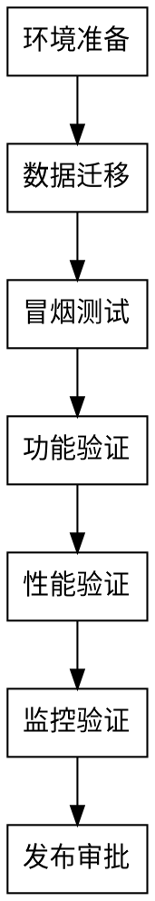

> **阶段定位（P1-8 收编口径）**：本文件是 P6 测试执行的**执行指南**，无独立 Gate、无独立收据；文件间"进入下一文件"仅是执行顺序建议，**阶段推进以状态机 P6 为准**（P6 由 `s6_final_verification_gate.sh` + `p6_credential_gate.sh` 把关）。


# Phase 6f: 预发布验证 (Staging Validation)

> 报告产物：`docs/测试/<feature>-预发布验证报告.md`（`test-evidence.env` 的 `STAGING_REPORT_PATH` 指向该文件；历史英文名 `*-staging-report.md` 继续可被 Gate 解析）。

## 目标

- 在生产环境部署前进行最后验证
- 验证数据迁移的正确性
- 验证与周边系统的集成
- 验证监控告警是否正常

---

## 验证流程



---

## 验证清单

### 环境准备
- [ ] 预发布环境与生产环境配置一致
- [ ] 测试数据准备完成
- [ ] 数据库迁移脚本准备完成
- [ ] 备份已创建

### 数据迁移
- [ ] 数据迁移脚本已测试
- [ ] 数据量预估正确
- [ ] 迁移时间预估合理
- [ ] 回滚方案已准备

### 冒烟测试
- [ ] 服务启动正常
- [ ] 健康检查通过
- [ ] 核心接口可访问

### 功能验证
- [ ] 核心功能测试通过
- [ ] 边界条件测试通过
- [ ] 异常场景测试通过
- [ ] 与周边系统集成正常

### 性能验证
- [ ] 响应时间在预期范围
- [ ] 资源使用正常
- [ ] 无内存泄漏

### 监控验证
- [ ] 日志正常输出
- [ ] 监控指标正常采集
- [ ] 告警规则已配置
- [ ] 告警通知正常

---

## 验证报告模板

```markdown
# [功能名称] 预发布验证报告

## 验证信息
- **功能版本**: v1.0
- **验证环境**: staging
- **验证日期**: YYYY-MM-DD
- **验证人**: 

## 验证结果

| 验证项 | 结果 | 说明 |
|--------|------|------|
| 环境准备 | 通过/不通过 |      |
| 数据迁移 | 通过/不通过 |      |
| 冒烟测试 | 通过/不通过 |      |
| 功能验证 | 通过/不通过 |      |
| 性能验证 | 通过/不通过 |      |
| 监控验证 | 通过/不通过 |      |

## 问题记录

| # | 问题 | 严重程度 | 状态 |
|---|------|----------|------|
|   |      |          |      |

## 风险评估

| 风险 | 影响 | 概率 | 缓解措施 |
|------|------|------|----------|

## 最终结论

- [ ] **可以发布**: 所有验证项通过
- [ ] **有条件发布**: 以下风险已评估
- [ ] **暂缓发布**: 以下问题需要修复

## 发布审批

| 角色 | 姓名 | 签字 | 日期 |
|------|------|------|------|
| 开发 |      |      |      |
| 测试 |      |      |      |
| 运维 |      |      |      |
| 产品 |      |      |      |
```

---

## 验收Checklist

- [ ] 预发布环境验证完成
- [ ] 所有问题已关闭或延期确认
- [ ] 数据迁移验证通过
- [ ] 监控告警配置验证通过
- [ ] 发布审批已完成
