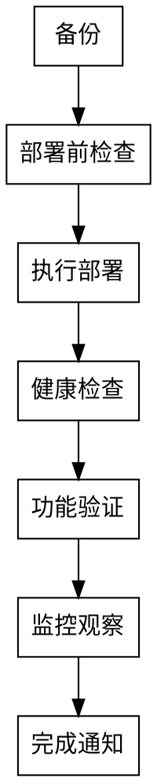

# Phase 7: 发布部署 (Deployment)

## 目标

- 安全部署到生产环境
- 最小化部署风险
- 确保服务可用性
- 记录部署过程

## 发布授权（前置硬门禁）

进入本阶段前必须存在显式人工授权收据 `.devflow/<feature>/authorizations/release.json`（字段与规则见 `commands/devflow.md` §Release Authorization）。无有效收据时：不得执行任何外部副作用命令，最高只能声明 `READY_TO_RELEASE`，不得声明 `RELEASED`。

---

## 部署策略

| 策略 | 说明 | 适用场景 |
|------|------|----------|
| **蓝绿部署** | 两套环境，切换流量 | 无状态服务 |
| **金丝雀发布** | 小部分流量先上新版本 | 高风险变更 |
| **滚动更新** | 逐个实例更新 | K8s环境 |
| **直接部署** | 直接更新 | 低风险、紧急修复 |

---

## 部署流程



---

## 部署Checklist

### 部署前
- [ ] 发布授权收据已存在且 `scope` 覆盖本次操作
- [ ] 代码已合并到主分支
- [ ] 所有测试通过
- [ ] 预发布验证通过
- [ ] 备份已创建
- [ ] 回滚方案已准备
- [ ] 部署时间窗口已确认
- [ ] 值班人员已通知

### 部署中
- [ ] 按步骤执行部署
- [ ] 每步结果已确认
- [ ] 异常情况已记录
- [ ] 健康检查通过

### 部署后
- [ ] 服务正常运行
- [ ] 核心功能正常
- [ ] 监控指标正常
- [ ] 日志正常
- [ ] 告警正常
- [ ] 团队已通知

---

## 回滚流程

```
发现问题
    ↓
确认是否回滚（影响范围评估）
    ↓
执行回滚
    ↓
验证回滚结果
    ↓
通知相关方
```

### 回滚Checklist

- [ ] 问题已确认
- [ ] 影响范围已评估
- [ ] 回滚方案已确定
- [ ] 回滚执行完成
- [ ] 回滚后验证通过
- [ ] 相关方已通知

---

## 部署记录模板

```markdown
# [功能名称] 部署记录

## 部署信息
- **功能版本**: v1.0
- **部署环境**: production
- **部署时间**: YYYY-MM-DD HH:MM
- **部署人**: 
- **部署方式**: [蓝绿/金丝雀/滚动/直接]

## 部署步骤

| # | 步骤 | 执行人 | 执行时间 | 结果 |
|---|------|--------|----------|------|
| 1 |      |        |          |      |

## 部署结果
- **成功/失败**: 
- **回滚**: [是/否]
- **影响时长**: 分钟

## 问题记录

| # | 问题 | 影响 | 处理 |
|---|------|------|------|
|   |      |      |      |

## 监控数据
- 错误率: x%
- 响应时间: xxxms
- 流量: xxx QPS

## 相关通知
- [ ] 团队通知
- [ ] 用户通知（如需要）
```

---

## 紧急部署

紧急通道**不免除门禁，只改变时序**（P1-10 诚实化：原"直接部署、跳过部分检查"是授权体系最大后门）。

| 场景 | 处理方式 |
|------|----------|
| 严重Bug修复 / 安全漏洞修复 | ① 先取得 P7 发布授权收据（`.devflow/<f>/authorizations/release.json`，scope 含 deploy）；② skip-log 留痕：`SKIP_EMERGENCY_REVIEW=理由\|authorized-by=授权人\|at=日期\|approval=审批证据`；③ 部署后 **24h 内补齐** P3b 代码审查与 P6 测试收据并重跑对应 Gate |
| 非紧急变更 | 完整流程 |

---

## 验收Checklist

- [ ] 部署成功
- [ ] 健康检查通过
- [ ] 功能验证通过
- [ ] 监控正常
- [ ] 部署记录已保存
- [ ] 相关方已通知

---

## 架构陷阱自检

> **P7 部署前必跑**：`check-arch-pitfalls.sh --category deploy`

```bash
bash "$SKILL_ROOT/checks/check-arch-pitfalls.sh" --category deploy
```

**部署阶段必查的 4 类陷阱**：

| 类别 | 部署阶段必读章节 |
|------|------------------|
| §5 依赖/版本 | `:latest` 镜像、SBOM 缺失、镜像 digest 锁定 |
| §10 运维/部署 | 备份缺失、资源约束、供应链、空壳服务路由 |

**禁止带病部署**：
- ❌ 镜像 tag 是 `:latest`
- ❌ 部署脚本含 `:-` 形式密钥默认值
- ❌ docker-compose 缺 `deploy.resources` 资源约束

## Gate 检查

```bash
curl -s -o /dev/null -w '%{http_code}' https://prod/api/health
# 预期: 200
```

| 检查项 | 通过条件 |
|--------|----------|
| health = 200 | `curl` 返回 200 |
| 覆盖率 ≥ 80% | 报告可查 |
| E2E ≥ 95% | 报告可查 |
| P0 = 0 | 上线前缺陷清零 |

---

## 结构化产物层（v3.25.2）

本阶段产物已结构化：AI 按 `schemas/deployment.schema.json`（样例 `examples/structured/deployment.sample.json`）填 `.devflow/<feature>/deployment.json`，再跑管线校验并确定性渲染 Markdown——**校验失败不渲染、不落盘、不进 Gate**；空集合必须 `zero_results` 显式声明。渲染格式与阶段 Gate 的机器解析契约逐字段兼容，模板保留为语义参考。

```bash
python3 scripts/df_pipeline.py deployment --input .devflow/<feature>/deployment.json --out docs/发布/<feature>-部署记录.md
```
