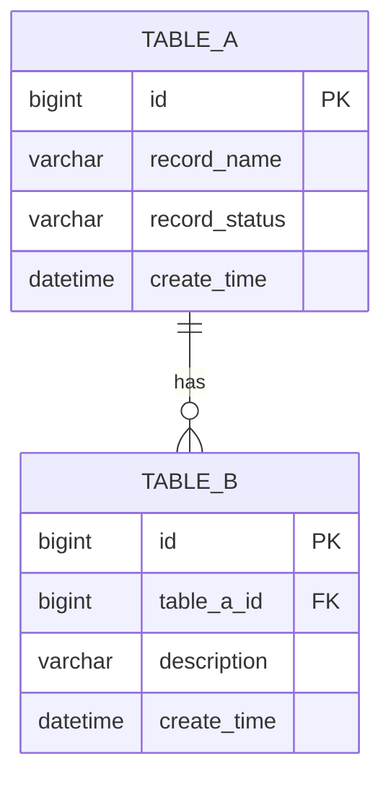
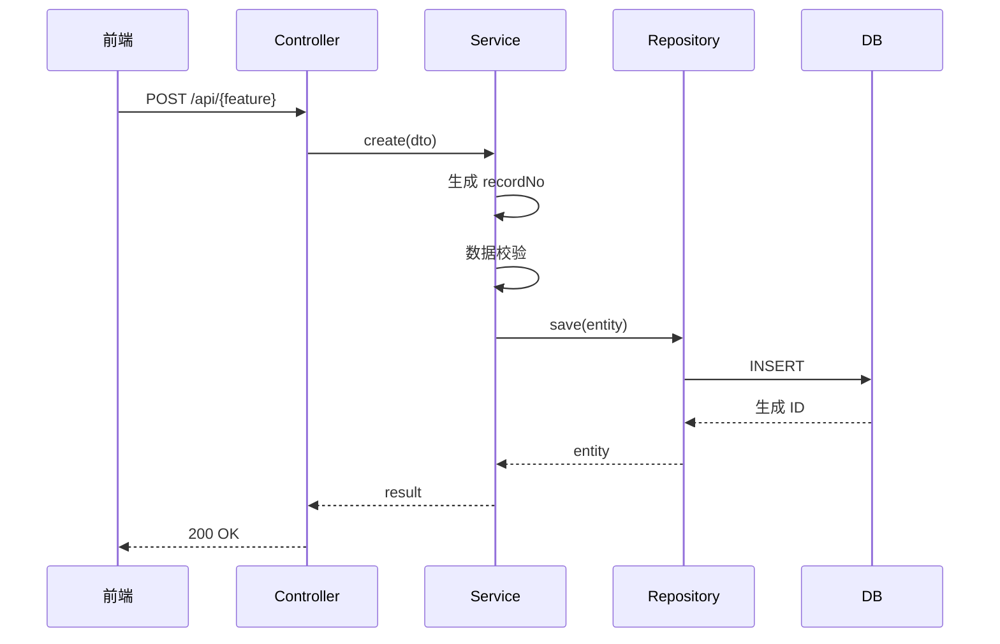
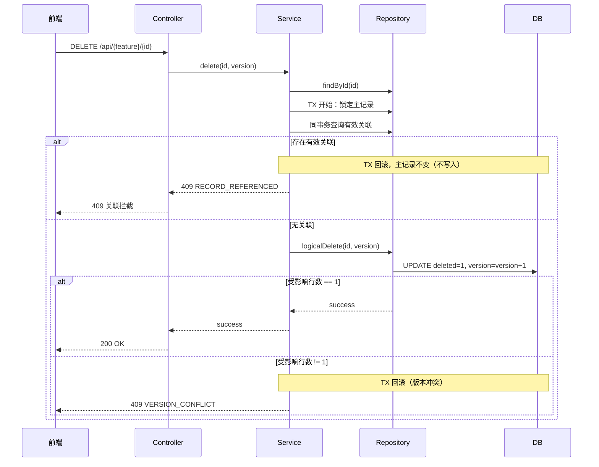

# {FeatureName} 详细设计 - v1.0 完整版

<!--
═════════════════════════════════════════════════════════════════
 写作铁律（P2 实战沉淀·生成时必读；交付产物前必须整块删除本注释——块内含占位符检查关键词，保留会被 Gate 命中）
═════════════════════════════════════════════════════════════════
【产物契约——机器校验，违者 Gate FAIL】
 1. 文档头「模板版本」必须把 `{{template_version}}` 替换为本模板 frontmatter 的 version（见本文件第 3 行 version 字段），与模板逐字相等后 Gate 才放行；skill 升版会更新 frontmatter，写前与跑 Gate 前各核对一次。
 2. 验收点追溯矩阵（正本锚点 `<!-- anchor: acceptance-traceability -->`）在独立文档 `docs/详细设计/<feature>-需求追溯.md`（v3.28.1 移出详设，管线 `--trace-doc` 渲染）8 列按管道列位校验：页面列落具体页面锚点（§7.1.N）、数据列落具体表锚点（§2.2.N）——纯后端行为/无本地表写裸 —；接口列落接口详细定义小节（§3.2.x）、规则 R{n}、测试 TC-*、状态 COMPLETE；与 criteria 冻结分母集合全等。章节编号仅用于展示与 design.json 定位，语义锚点是评审与 /plan、/build 的定位正本；实现交接（`anchor: implementation-handoff`）在 `<feature>-实现交接.md`。
  3. design.json 引用闭环：acceptance.page/api/rule 必须**精确等于** pages/apis/rules 注册的 anchor（data 必须精确等于 tables[].anchor，如 "§2.2"——带表名的长串会断链；精确表名写在文档矩阵，json 只存定位锚点）；孤儿条目加 unreferenced_reason；空集合必须 zero_results 声明（"不涉及也是证据"）；表字段 ddr ↔ decisions 双向闭环；pages[] 必填 route/component/page_type（路由/组件/类型——§7.1 三列正本），表格列/表单控件/弹窗映射（table_columns/form_controls/dialogs）与 §7.2 正文对账（表格列/表单控件/弹窗表）（dialogs.api 锚点闭环到 apis[]）。
 4. 结构化产物失败关闭：先 df_validate 过了再过 Gate；总分模式 design.json 为 feature 级（多模块共用 .devflow/<feature>/）。
【写作规则——评审真正在意的】
 5. 按模块职责组织，不按 PRD 功能编号；PRD↔模块映射只在总文档登记一笔。
 6. 终态叙事：不写"原为/迁出/不再包含"，直接写最终设计结论。
 7. 依赖明细单一正本：同服务模块在依赖图里同框（框=服务）；依赖明细表只写一处——单体文档在 §9.1 内部依赖，总分模式分文档在 §0.3。
 8. 表结构全字段五列，禁止"关键字段"式省略（§2.2）；每个关键流程 WHEN 伪代码+时序图成对（§6）；每个接口"请求+响应"两张六列表（§3.2），禁止"契约同 §x.x"式省略。
 9. §7 页面与 §2 数据模型的子域用同一套字母命名并**进真实标题**；编号错位的小节标题尾加【子域 X】标注，不重排编号（保护 design.json 编号锚点）。
 9a. **表与接口禁止合并/省略**：§2.2 每张表必须独立 `#### 表名（中文名）` 标题 + 五列全字段——禁止把多张表合进一个标题（如 "A / B（某某）"）、禁止"配套表：A、B、C——结构同构"式一句话带过、禁止"字段全集以 INDEX-表.md 为准"替代正文展开（INDEX 是对账索引不是设计文档）；§3.2 每个接口必须独立 `#### 3.2.x` 小节 + 请求/响应双六列表——禁止"契约同 §x.x"式省略。在 INDEX-表.md 或实体代码有登记 ≠ 在详设中有设计，两者不互替。
10. 错误码三层引用不重定义：平台通用码 → 业务码（本文接口设计 §3）→ 前端行为（§7.4）。写契约不写实现快照。
【Gate 环境实操】
11. Gate 以 LC_ALL=C 运行：若 PATH 上的 python3 属于含非 ASCII site 配置的 venv 会崩——用系统解释器（如 PATH 前置 /usr/bin）。
12. 占位符检查是子串匹配
12. 占位符检查是子串匹配
13. **锚点具体化（v3.26.10 · L-P2-004，七问题复盘）**：① §2.2 每张表独立编号 `#### 2.2.N 表名`，table-index 锚点列=具体表锚点；② §3.1 概览表首列=详细定义（§3.2.N），无概览锚点列；③ §3.2 每节标题只写 `#### 3.2.N 名称`，方法/路径/权限与功能说明合并写标题下首行 `> 说明：METHOD 路径｜权限：…｜功能：…`（③⑥⑨ 均已硬校验）；④ §6 业务操作表首列=§锚点，操作小节编号 `#### 6.2.N` 且必须挂在 `### 6.2 业务操作契约（BOP-1～BOP-N）` 父级标题下（N.M.K 缺 N.M 父级即层级断裂，df_validate L-HIER-1 拦截）；⑤ §7.1 每个页面独立编号小节（§7.1.N）；⑥ §7.2 页组必须覆盖 §7.1 全部页面（§7.2.N 小节数 ≥ 页面数，硬校验），且每组以**表格**列出调用的 §3.2.x 接口（页面与接口映射不再单列小节）；⑦ 需求追溯矩阵（在 `<feature>-需求追溯.md`）页面/接口/数据三列必须写具体锚点（§7.1.N/§3.2.N/§2.2.N），禁止写 §7.1/§3.1/§2.2 通用锚点——df_validate 按 L-P2-004 拦截共用锚点与 anchor≠detail_anchor；⑧ §4 权限矩阵拆页面/接口两块，接口块必含"接口说明"列（=§3.2 详细定义名称）；⑨ 规则表锚点列前置且每条规则锚点落到所属小节（页面规则=§7.2.N 页组、无页面规则=§5；WHEN 行逐字注入锚点小节，规则锚点单一化即 FAIL）（TODO/TBD/待补充/REPLACE_WITH/占位/暂定，大小写不敏感）：领域词撞车改英文（占位符→placeholder、待办计数→backlog）；`{{...}}` 模板变量未替换同样视为未完成。
【总分设计包（v3.24.0/A05）】总分模式必须登记 design-package.json（docs[].path/mode/acceptance_ids）——分文档按自己的验收子集对账，子集并集=冻结分母，缺文档或并集不全等即 Gate FAIL；总文档追溯矩阵由渲染块按 feature 级 JSON 生成，逐点明细仍在分文档。
═════════════════════════════════════════════════════════════════
-->


> 模板 ID：`详细设计-完整版-模板`
> 模板版本：`{{template_version}}`（必须替换为本模板 frontmatter 的 version 后再过 Gate）

> **文档状态**：⏳ DRAFT（初始态；P2a 评审通过后更新为 ✅）
> **生成时间**：{YYYY-MM-DD HH:mm:ss}
> **基于版本**：v0.2 摘要版（评审通过日期：{YYYY-MM-DD}）
> **评审结论**：待评审 UNREVIEWED（P2a 通过后填写 DF OPEN=0）

> permission-matrix/rule-index/biz-ops/client-scope/
> 复制本模板后直接走管线，不得手工删块。
> DDR/迁移、需求追溯矩阵、实现交接已移出本文：分别在 `数据库设计决策-模板`、`需求追溯-模板`、
> `实现交接-模板` 文档；渲染命令：

---

## §0 文档结构

> **结构决策在 P1，不在本文档**：单文档（monolith）/总分文档（total）的选择已记录于
> `design_doc_structure_mode=`）。本模板对应 **monolith 单文档**，s2 Gate 以 `--mode=monolith`
> 对账，必须与 P1 冻结 mode 一致；不要在本文档重写总分/单体决策表或决策矩阵。
> 若实际应为总分结构，回 P1 走变更后改用总分总/总分分模板，不得在本模板内自行拆分。

---

## §1 功能概述

<!-- df:begin:summary -->
（由 design.json 自动汇总：验收点覆盖、表/接口/页面/规则/决策/操作计数）
<!-- df:end:summary -->

### 1.1 功能名称与范围

| 项 | 内容 |
|---|------|
| 功能名称 | {FeatureName} |
| 模块归属 | {ModuleName} |
| 优先级 | P0/P1/P2 |
| 复杂度 | 低/中/高/极高 |

### 1.2 功能描述

```
{简要描述功能做什么}
```

### 1.3 业务背景

```
{为什么要做这个功能，解决什么问题}
```

### 1.4 假设、约束与 Non-Goals

**假设**（假定为真但未验证的前提，假定为假时设计需重审）：

| # | 假设内容 | 影响范围 | 若为假的后果 |
|---|----------|----------|--------------|
| A1 | {如：目标库为项目冻结 DB，版本约束见《技术选型》} | {索引/分页方案} | {需改用 offset 分页} |

**约束**（外部强制、本项目不可协商的硬限制）：

| # | 约束内容 | 来源 |
|---|----------|------|
| C1 | {如：必须支持人大金仓} | {甲方合同} |

**Non-Goals**（明确不在本期范围，防止范围蔓延；"不做也是决策"）：

| # | 不做什么 | 原因 | 后续计划 |
|---|----------|------|----------|
| NG1 | {如：不做多语言} | {全站中文硬编码} | {暂无} |

---


### 1.5 术语表（可选；跨团队评审或有业务专有名词时建议提供）

| 术语 | 定义 | 备注 |
|------|------|------|
| {术语} | {一句话定义} | {缩写/来源/关联章节} |

---

## §2 数据模型

<!-- anchor: data-model -->

### 2.1 ER 图



### 2.2 表结构设计

<!-- df:begin:table-index -->
（由 design.json 自动生成表索引：锚点|表名|字段数）
<!-- df:end:table-index -->

> 老系统来源与迁移转换规则不在本表——迁移场景 B/C 的字段级映射统一在
> `docs/数据映射/<feature>-映射.md`（八列映射表，P2 迁移阶段检查），
> 详设与映射文档职责分离，避免同一信息两处维护。
> **字段设计理由（为什么 varchar(64)、为什么这个索引）见 `<feature>-数据库设计决策.md`**——每个非平凡
> 字段都能回指到某条 DDR；DDR 与表字段双向闭环。

#### 关键字规避规则 ⚠️


**fail 层（真保留字，命中即校验 FAIL，必须改名）**：

```
user, group, order, desc, key, index, table, column, primary, foreign,
references, unique, default, check, select, from, where, insert, update,
delete, create, drop, alter, level, condition
```

**warn 层（高风险软关键字，命中输出 ⚠ 警告，建议改名或写明理由）**：

```
username, status, name, type, comment, date, time, timestamp, boolean,
integer, text, varchar, char, file, limit, by, sequence, rowid, varchar2,
clob, blob, value
```

**规避策略**：

| 策略 | 示例 | 适用场景 |
|------|------|----------|
| **前缀法** | `order` → `biz_order` | 表名 |
| **后缀法** | `status` → `status_cd`，`type` → `record_type` | 枚举类字段 |
| **下划线法** | `name` → `record_name`，`date` → `create_date` | 通用场景 |
| **完整词法** | `level` → `priority_level`，`comment` → `remark` | 语义明确 |

**检查要求**：设计阶段逐表、逐字段对照清单；多数据库目标逐库检查；命中 fail 层必须改完再继续。

#### 2.2.1 sys_{feature}_config（配置表）

| 字段名 | 类型 | 约束 | 默认值 | 口径说明 |
|--------|------|------|--------|----------|
| id | bigint | PK, AUTO_INCREMENT | — | 主键 |
| config_key | varchar(64) | NOT NULL, UNIQUE | — | 配置键 |
| config_value | text | NULL | NULL | 配置值 |
| config_type | varchar(32) | NOT NULL | — | 配置类型 |
| description | varchar(256) | NULL | NULL | 描述 |
| sort_order | int | NOT NULL | 0 | 排序 |
| config_status | tinyint | NOT NULL | 1 | 1=启用，0=停用（规避 `status`） |
| version | int | NOT NULL | 0 | 乐观锁版本 |
| deleted | tinyint | NOT NULL | 0 | 逻辑删除标志 |
| create_time | datetime | NOT NULL | CURRENT_TIMESTAMP | 创建时间 |
| create_by | bigint | NULL | NULL | 创建人 |
| update_time | datetime | NULL | NULL | 更新时间 |
| update_by | bigint | NULL | NULL | 更新人 |

**索引：**
- `idx_config_type` (config_type)
- `idx_config_status` (config_status)

#### 2.2.2 sys_{feature}_record（业务表）

| 字段名 | 类型 | 约束 | 默认值 | 口径说明 |
|--------|------|------|--------|----------|
| id | bigint | PK, AUTO_INCREMENT | — | 主键 |
| record_no | varchar(32) | NOT NULL, UNIQUE | — | 业务记录编号 |
| record_name | varchar(128) | NOT NULL | — | 名称（规避 `name`） |
| record_status | varchar(32) | NOT NULL | 'ACTIVE' | 状态枚举（规避 `status`） |
| version | int | NOT NULL | 0 | 乐观锁 |
| deleted | tinyint | NOT NULL | 0 | 逻辑删除 |
| create_time | datetime | NOT NULL | CURRENT_TIMESTAMP | 创建时间 |
| create_by | bigint | NULL | NULL | 创建人 |
| update_time | datetime | NULL | NULL | 更新时间 |
| update_by | bigint | NULL | NULL | 更新人 |

**索引：**
- `uk_record_no` (record_no) UNIQUE
- `idx_record_status` (record_status)
- `idx_create_time` (create_time)

---

## §3 接口设计

<!-- anchor: api-contracts -->

> `> 说明：METHOD 路径｜权限：xxx｜功能：一句话说明`——方法/路径/权限与功能说明不再分开两处。

### 3.1 接口概览

<!-- df:begin:api-index -->
（由 design.json 自动生成接口概览：详细定义|方法|路径|接口名称|权限|请求字段|响应字段）
<!-- df:end:api-index -->

> 表头约定：手工概览表须 HTTP 方法在首列（行首）；自动渲染块列序为 `详细定义 | 方法 | 路径 | …`

| 方法 | 路径 | 接口名称 | 权限 |
|------|------|----------|------|
| GET | /api/{feature}/page | 分页查询 | {feature}:view |
| GET | /api/{feature}/{id} | 详情查询 | {feature}:view |
| POST | /api/{feature} | 新增 | {feature}:add |
| PUT | /api/{feature}/{id} | 更新 | {feature}:edit |
| DELETE | /api/{feature}/{id} | 删除 | {feature}:delete |
| GET | /api/{feature}/export | 导出 | {feature}:export |
| GET | /api/{feature}/template | 导入模板 | {feature}:import |

### 3.2 详细接口定义

#### 3.2.1 分页查询

> 说明：GET /api/{feature}/page ｜权限：{feature}:view ｜功能：分页查询 {feature} 记录（支持按名称/状态过滤）。

**请求字段：**

| 字段 | 类型 | 必填 | 校验规则 | 数据来源 | 脱敏 |
|------|------|------|----------|----------|------|
| pageNum | integer | 是 | >=1 | 请求参数 | 否 |
| pageSize | integer | 是 | 1~100 | 请求参数 | 否 |
| name | string | 否 | trim 后 <=128 | 请求参数→record_name 查询条件 | 否 |
| status | string | 否 | 必须属于状态枚举 | 请求参数→record_status 查询条件 | 否 |

**响应字段：**

| 字段 | 类型 | 恒出性 | 取值规则 | 数据来源 | 脱敏 |
|------|------|--------|----------|----------|------|
| total | long | 是 | 满足过滤条件的总数 | count 查询 | 否 |
| records[].id | long | 是 | 记录主键 | sys_{feature}_record.id | 否 |
| records[].recordNo | string | 是 | 业务编号 | sys_{feature}_record.record_no | 否 |
| records[].name | string | 是 | 名称 | sys_{feature}_record.record_name | 否 |
| records[].status | string | 是 | 状态枚举 | sys_{feature}_record.record_status | 否 |

**请求：**
```http
GET /api/{feature}/page
Content-Type: application/json

{
  "pageNum": 1,
  "pageSize": 10,
  "name": "xxx",
  "status": "ACTIVE"
}
```

**响应：**
```json
{
  "code": 200,
  "message": "success",
  "data": {
    "total": 100,
    "records": [
      {
        "id": 1,
        "recordNo": "RF202401010001",
        "name": "xxx",
        "status": "ACTIVE",
        "createTime": "2024-01-01 10:00:00"
      }
    ]
  }
}
```

#### 3.2.2 新增

> 说明：POST /api/{feature} ｜权限：{feature}:add ｜功能：新增 {feature} 记录并生成业务编号。

**请求字段：**

| 字段 | 类型 | 必填 | 校验规则 | 数据来源 | 脱敏 |
|------|------|------|----------|----------|------|
| name | string | 是 | trim 后 1~128；唯一范围须在模块中明确 | 请求体 | 否 |
| description | string | 否 | 0~256 | 请求体 | 否 |

**响应字段：**

| 字段 | 类型 | 恒出性 | 取值规则 | 数据来源 | 脱敏 |
|------|------|--------|----------|----------|------|
| id | long | 是 | 新增记录主键 | INSERT 返回主键 | 否 |
| recordNo | string | 是 | 按 R1 生成 | sys_{feature}_record.record_no | 否 |

**请求：**
```http
POST /api/{feature}
Content-Type: application/json

{
  "name": "xxx",
  "description": "xxx"
}
```

**响应：**
```json
{
  "code": 200,
  "message": "success",
  "data": {
    "id": 1,
    "recordNo": "RF202401010001"
  }
}
```

---

## §4 权限矩阵

<!-- df:begin:permission-matrix -->
（由 design.json 自动生成两块：①页面/菜单矩阵 §锚点|页面/菜单|所需权限；②接口矩阵 §锚点|方法|路径|接口说明|所需权限——接口说明=接口详细定义名称）
<!-- df:end:permission-matrix -->

| 角色 | 列表 | 详情 | 新增 | 编辑 | 删除 | 导出 |
|------|------|------|------|------|------|------|
| 管理员 | ✅ | ✅ | ✅ | ✅ | ✅ | ✅ |
| 普通用户 | ✅ | ✅ | ❌ | ❌ | ❌ | ❌ |

---

## §5 业务规则

<!-- anchor: business-rules -->

> 本节只登记**无页面场景**规则（MQ 消费者 / 定时任务 / 纯后端批处理等）。全量规则索引（含页面规则）在 §7 开头。

| 规则编号 | 分类 | 规则描述 | WHEN（触发） | 约束/错误处理 |
|----------|------|----------|--------------|--------------|
| R{n} | {定时/MQ/后端} | {规则描述} | WHEN {条件}：{结果} | {错误码或处理动作} |

> **填写要求**：每条规则一行，编号连续；WHEN 行为逐字契约（design.json `rules[].when_line` 必须与该行原文一致）。
> ****：规则涉及的稳定错误码写入「约束/错误处理」列，并在 design.json `rules[].error_codes[]` 登记（code+meaning，可选 http_status）——错误码全局唯一，前端 §7.4 行为表按 code 引用。
> 本模块无无页面规则时，写"无非页面规则（页面规则见 §7.2 各页组）"。

---

## §6 关键流程

<!-- anchor: business-operations -->

> **强制要求**：每一个关键流程必须同时包含 WHEN 准伪代码和 Mermaid 时序图，二者缺一即视为详设不完整。不允许以"流程简单""与已有流程类似"等理由跳过时序图。
>
> 小节标题须带 BOP 编号且挂在 §6.2 父级下（`### 6.2 业务操作契约（BOP-1～BOP-N）` → `#### 6.2.N 操作名（BOP-n）`，如 `#### 6.2.1 新增流程（BOP-1）`），操作表关联列的 BOP-n 按此定位；
> 缺父级标题即层级断裂，df_validate 标题层级校验拦截（v3.28.3 L-HIER-1）；§6.1 预留给跨操作时序（如级联/到期），无则不写本小节；
> 操作以业务命名（非 CRUD 枚举），覆盖触发者、前置校验、源/目标状态、事务与并发、结果与失败、
> 关联对象处置；冻结验收点的每项操作都必须有落点（缺"恢复""彻底删除"等操作即覆盖缺口，
> ）。无状态操作显式声明，不强制虚构状态机。

### 6.2 业务操作契约（BOP-1～BOP-N）

<!-- df:begin:biz-ops -->
（由 design.json 自动生成业务操作契约索引：§锚点|操作|触发者/触发|源状态→目标状态|事务/并发|结果/失败|验收点）
<!-- df:end:biz-ops -->

#### 6.2.1 新增流程（BOP-1）

```text
WHEN 新增记录 (command, operator):                              [R1][R2][R3]
  1. 校验 command 字段级约束；失败返回 FIELD_VALIDATION_FAILED
  2. 校验 operator 具备 {feature}:add 权限；失败返回 403
  3. TX 开始
  4.   生成 recordNo；唯一冲突按限定次数重试                     [R1]
  5.   INSERT sys_{feature}_record(status=ACTIVE, version=0)      [R3]
  6.   同事务写业务 Outbox/审计事实（如本模块要求）
  7. TX 提交
  8. 返回 id、recordNo
  9. 任一步异常 → 回滚；不得向调用方返回伪成功响应
```



#### 6.2.2 删除流程（BOP-2）

> **并发口径（必须按真实基线决策）**：关联检查与主记录更新必须同事务执行；仅靠主记录
> version 条件**不能**证明关联关系在检查后未被新增——二选一并写入 design.json：
> ① 关联新增与删除共用同一把锁/互斥（写明锁粒度）；② 关联表以（主记录 ID + 状态）复合
> 约束/触发器阻止并发新增。"放进事务"本身不是并发安全证明。

```text
WHEN 删除记录 (id, version, operator):                          [R4][R7][R8][R9]
  1. 按 id 读取未删除记录；不存在返回 NOT_FOUND
  2. 校验 operator 具备 {feature}:delete 权限；失败返回 403
  3. TX 开始（关联检查必须与删除同事务——见上方并发口径）
  4.   锁定主记录（SELECT ... FOR UPDATE / 乐观锁版本条件）
  5.   查询有效关联；存在则回滚并返回 RECORD_REFERENCED          [R8]
  6.   UPDATE sys_{feature}_record SET deleted=1, version=version+1
        WHERE id=:id AND version=:version AND deleted=0           [R7]
  7.   受影响行数 != 1 → 回滚并返回 VERSION_CONFLICT
  8. TX 提交
```



---

## §7 前端页面

> **内容口径**：本节写**设计契约**（组件职责边界、权限分层、错误行为、异步约定），不写实现快照（composables/API 函数逐一映射会漂移，留给代码与自动索引）；组件列必须锚定前端工程的真实路径；按模块子域组织，不按需求编号组织。

<!-- df:begin:rule-index -->
（由 design.json 自动生成规则索引：§锚点|规则|摘要|错误码——含 §5 无页面规则与 §7.2 页组规则的合集）
<!-- df:end:rule-index -->

> 无页面场景规则在 §5；上表为全量索引。

### 7.1 页面清单

| # | 子域/分组 | 页面 | 路径 | 组件（真实路径） | 类型 | 权限 |
|---|------|------|------|------|------|------|
| 1 | {子域} | {列表页} | /{module} | views/{module}/index.vue | 列表+详情抽屉 | {module}:view |
| 2 | {子域} | {编辑页} | /{module}/edit/{id} | views/{module}/edit.vue | 表单页 | {module}:edit |
| 3 | {子域} | {新增/编辑弹窗} | {所属路由} | views/{module}/EditDialog.vue | 弹窗（可填写） | {module}:edit |
| 4 | {子域} | {删除确认} | — | views/{module}/DeleteConfirmDialog.vue | 弹窗（确认） | {module}:delete |

> 标注存量复用与新增页。**判定口径**：页面=有独立路由（`route`）且可直达的视图；页内区域（主从详情区/Tab）不入页面列，**全部弹窗/抽屉（含确认类）单独成行**（类型=弹窗/抽屉，路径=所属路由或 —）；PRD 称"XX页"但设计为页内区域/抽屉的，须在本表备注判定理由。
> **完整性**：清单须覆盖菜单 seed 索引 × `client.journeys[]` × 全部 UI 验收点（每个可见菜单有页面归属）；`pages[]` 为 JSON 正本（route/component/page_type/permission 必填）；示例行数仅示意，禁止照抄规模。

### 7.2 页面交互设计

> 每个页组按序写（页组标题尾注覆盖页面名，如「组织与用户管理页组（覆盖：组织架构管理页）」；统一框架类页面合并为一节）：**布局 / 查询区（有/无）/ 列表（有/无）/ 表单（有/无）** 四项判定 → **调用接口表 / 操作表 / 业务规则表 / 弹窗·抽屉表** 四张表 → **状态矩阵**（理想/部分/加载/错误/空五态，禁止只写理想态）与**降级**；有列表 → 表格列规格、有表单（含弹窗内表单）→ 表单控件规格，混合都写（字段列与规格表一致）。触发弹窗/抽屉的操作写「→ 弹窗/抽屉：{交互名}」，不得只写"弹确认框"。
> **测试锚点**：全部可交互控件——表单控件（输入框/下拉/日期/开关…）、操作按钮（页面/工具栏/行操作/批量）、弹窗/抽屉——必须冻结 `test_anchor`，命名公式 `<feature缩写>-p<页面序号>-<类型>-<名称slug>`（类型枚举 input/select/date/switch/btn/dialog/row，如 `orgm-p1-input-name`、`orgm-p1-btn-query`、`orgm-p1-dialog-edit`、`orgm-p1-row-del`），全文档唯一；实现层以 `data-testid` 属性承载，P5/P6e 测试定位符只允许引用此处冻结锚点（`[data-testid=…]`），禁止从描述猜测选择器。

#### 7.2.1 {页组名}（覆盖：{页面名}）

- **布局**：{结构}
- **查询区**：{有/无 + 筛选项与校验}
- **列表**：{有/无}
- **表单**：{有/无}
- **状态矩阵**：{理想/部分/加载/错误/空——状态|触发|展示|交互/恢复}
- **降级**：{部分失败是否整体降级、降级是否写缓存}

**调用接口**（方法/路径见 §3.1 概览与 §3.2.x 详定义，不在此重复；API 封装按 §7.5 领域文件约定）：

| 接口（§3.2.x） | 用途/触发时机 | 涉及表（表.字段） | 业务操作（BOP-n） |
|------|------|------|------|
| §3.2.x | {列表加载/查询提交/导出…} | {表.字段 或 —} | {BOP-n 或 —} |

**操作**（关联 = 调用接口 · 业务操作 · 规则；触发弹窗/抽屉的写「→ 弹窗/抽屉：{交互名}」；
测试锚点与 `pages[].actions[].test_anchor` 同源）：

| 操作 | 类型 | 权限点 | 关联（§3.2.x · BOP-n · Rn） | 触发弹窗/抽屉 | 测试锚点 |
|------|------|------|------|------|------|
| {删除} | 行操作 | {feature}:delete | §3.2.x · BOP-n · R{n} | → 弹窗/抽屉：{删除确认} | {orgm-p1-row-del} |
| {批量导出} | 批量操作 | {feature}:export | §3.2.x · BOP-n · R{n} | — | {orgm-p1-btn-export} |

**业务规则**（本页组规则；R 编号与 design.json `rules[]` 同源，WHEN 逐字）：

| 规则 | WHEN（触发） | 处理与错误码 |
|------|------|------|
| R{n} | WHEN {条件}：{结果} | {错误码/处理动作} |

**弹窗/抽屉**（本页组全部弹窗/抽屉；api 锚点闭环到 §3.2 接口定义，无接口交互写 —；
测试锚点与 `pages[].dialogs[].test_anchor` 同源）：

| 交互 | 组件 | 接口（§3.2.x） | 关键状态/确认流 | 测试锚点 |
|------|------|------|------|------|
| {新增/编辑} | views/{module}/EditDialog.vue | §3.2.x POST/PUT | {可填写；字段校验/失败保留输入} | {orgm-p1-dialog-edit} |
| {删除确认} | views/{module}/DeleteConfirmDialog.vue | §3.2.x DELETE | {二次确认文案/409 引用拦截跳转} | {orgm-p1-dialog-del-confirm} |

**表格列规格**（有列表的交互单元必填；字段与 `pages[].table_columns` 一致）：

| 字段 | 列标题 | 渲染说明 | 链路（§3.2.x 字段 ← 表.字段） |
|------|------|------|------|
| {field} | {列标题} | {渲染约定} | {§3.2.x 字段 ← 表.字段 或 —} |

**表单控件规格**（有表单的交互单元必填，含弹窗内表单；字段与 `pages[].form_controls` 一致；
「校验与提示」必须包含：**必填 Y/N + 长度/范围 + 格式 + 关联规则 R{n}**；适用时还须写明：**唯一性校验**（服务端+防抖）、**条件显隐**（如"临时部门=是时显示有效期"）、**确认匹配**（如密码确认）、**只读**（如"所属部门预填只读"）——禁止只写"合理校验"。
JSON `required`/`min_length`/`max_length`/`min_value`/`max_value`/`format`/`default_value`/`readonly` 提供时与 §3.2 接口请求字段机检对齐）：

| 字段 | 标签 | 控件 | 校验与提示 | 候选来源 | 链路（§3.2.x → 表.字段） | 测试锚点 |
|------|------|------|------|------|------|------|
| {field} | {标签} | {控件} | {必填 · 长度/范围 · 格式 · 唯一性/条件显隐/只读 · R{n}} | {候选来源} | {§3.2.x → 表.字段 或 —} | {orgm-p1-input-name} |

> 「校验与提示」用 `·` 分隔紧凑写法，每项为独立标签或 `标签:值`——如 `必填 · 1~128字 · 唯一性校验(防抖) · R2`、`必填 · 0.01~99999.99 · 默认:启用`、`条件显隐(临时部门=是) · 只读(预填当前部门)`。

### 7.3 权限与数据范围前端契约

- **两级分层**：路由级 `meta.permCode`（入口控制，路由守卫拦截）＋按钮级权限码 `v-if`（UX 控制）；两者与后端 `@PreAuthorize` 同源。
- **有效授权公式**：{如：功能权限码 ∩ 数据范围 ∩ 业务范围}——前端据此控制可见性，后端全链路重校验。
- **原则**：按钮隐藏不是安全控制；深链路直达、直接调 API、导出下载都必须由后端重新鉴权；越权对象不以 404 泄露存在性。

### 7.4 异步与错误交互契约

- **errorCode → 前端行为表**（错误码语义引用 §3 接口设计定义，此处只写交互行为，不重复定义）：

| errorCode | 前端行为 |
|------|------|
| {VERSION_CONFLICT} | {保留用户草稿，展示最新版本摘要，允许刷新对比，不自动覆盖} |
| {OPERATIONS_UNAVAILABLE} | {保留请求上下文提示可重试，不得乐观显示成功} |

- **异步任务规约**：受理类操作保存 executionId/requestId，刷新页面后可恢复查询；202 只显示"已受理"，终态后才显示成功；轮询采用指数退避，页面不可见时降频；**超时与取消**（timeout/cancel）场景必须显式声明处理（超时提示+可重试，取消不留半状态）。
- **异常提示约定**：错误页/异常提示包含四要素——异常代码（有 HTTP/业务码时展示）、简明描述、建议操作、可选配图；空状态属特定异常态，引导类空态给新建入口。
- **降级约定**：聚合类数据部分失败时对应项置空并显式标记降级，降级数据不写缓存。

### 7.5 路由、状态与 API 封装约定

- 路由：静态路由表 + 全量懒加载；`meta.permCode` 权限码守卫拦截；{项目特有禁令，如某前缀被网关反代则页面路由禁用}。
- 状态：业务页不建全局 store（全局仅身份/菜单/权限等基础 store）；列表数据统一走三态数据加载封装，搜索竞态用 latest-only 守卫。
- API 封装：按领域划分 api 目录下领域文件；高风险写操作自动携带幂等键；错误静默（silentError）按场景显式声明。

### 7.6 复用组件与技术栈

| 组件/组合式 | 位置 | 复用范围 |
|------|------|------|
| {SharedComponent} | {真实路径} | {复用页面} |

| 项 | 技术 | 版本 |
|---|------|------|
| 框架 | {Vue/React} | {Version} |
| UI 库 | {Element Plus/Ant Design} | {Version} |
| 构建 | {Vite/Webpack} | {Version} |

> 构建注意：重型依赖（设计器/图表/编辑器）必须动态 import + 分 chunk，列出本模块禁静态引入的包。

**性能设计**（有列表/大表单/图表的模块必填；纯展示型页面可整表省略并注明原因）：

| 性能项 | 目标 | 设计措施 | 度量方式 |
|------|------|------|------|
| 首屏加载 | {目标} | {代码分割/骨架屏/缓存} | {LCP/FCP} |
| 接口请求 | {目标} | {并发/缓存/合并/取消/超时} | {接口耗时} |
| 渲染交互 | {目标} | {虚拟列表/节流防抖} | {FPS/交互耗时} |

**工程横切评估表**（逐项声明涉及/不涉及——"不涉及"也是证据，须给理由）：

| 横切项 | 涉及 | 说明 |
|------|------|------|
| 多语言 | {涉及/不涉及} | {词条/复用/长文案处理，或"全站中文硬编码，i18n 未启用"} |
| 埋点上报 | {涉及/不涉及} | {事件/时机/字段，或"本期无埋点需求"} |
| 暗色模式 | {涉及/不涉及} | {主题变量依赖} |
| 响应适配 | {涉及/不涉及} | {断点/窄屏策略} |
| 浏览器兼容 | {涉及/不涉及} | {最低版本约束} |

### 7.7 菜单 Seed

`sys_menu`（{CATALOG} + {N} 个 MENU）与 `sys_menu_operation`、`sys_permission_group`、`sys_user_effective_perm`、`setval` 五段齐全，seed 位于 {service} 四方言 `V*__seed_{feature}_menus.sql`（文件名**必须含 feature**——`p3_completion_gate.sh` 按 feature 定位 seed）；逐行清单以 seed 脚本/事实源索引为准，不在本详设重复维护（避免漂移）。

---

## §8 验收标准

### 8.1 功能验收

- [ ] 冻结 PRD 原子验收点已全部进入需求追溯文档（`<feature>-需求追溯.md`）追溯矩阵，设计覆盖率 = 100%
- [ ] 每个验收点均可追溯到页面/任务、接口、数据字段、规则或准伪代码、测试用例
- [ ] 列表分页查询正常
- [ ] 新增功能正常
- [ ] 编辑功能正常
- [ ] 删除功能正常（逻辑删除）
- [ ] 权限控制正常

### 8.2 非功能验收

- [ ] API 响应时间 < 500ms
- [ ] 单测覆盖率 ≥ 80%
- [ ] 无 P0 缺陷
- [ ] 首轮代码准确率 ≥ 80%；未通过项进入修正循环，但不得删除验收点

---

## §9 依赖项

### 9.1 内部依赖

| 模块 | 依赖内容 |
|------|----------|
| org-service | 提供基础 CRUD |
| workflow-service | 流程编排 |

### 9.2 外部依赖

<!-- df:begin:integrations-configs -->
（由 design.json 自动生成外部集成规格：集成|方向|端点|超时|幂等|失败路径|降级）
<!-- df:end:integrations-configs -->

| 服务 | 依赖内容 |
|------|----------|
| DB | 数据存储（方言由部署配置） |
| Redis | 缓存 |

### 9.3 资源与补偿链

<!-- df:begin:resource-operations -->
（由 design.json 自动生成资源×反向操作补偿矩阵：资源|类别|各反向操作的释放时机）
<!-- df:end:resource-operations -->

> 每个被正向占用的资源，在取消/回滚/超时/重试时都有明确处置；「永不释放」「不涉及」必须写明理由。

---

## §10 组件复用与公共抽取

> **先找轮子，再造轮子**。成熟组件可直接复用的禁止自己实现；本模块沉淀出的可复用能力必须显性登记，供后续模块消费——防止同一个工具类在 N 个模块里被写 N 遍。

### 10.1 成熟组件复用清单

<!-- anchor: component-reuse -->

> 每个技术诉求先回答：业界/公司内有没有成熟组件？有 → 直接用（写明版本与引入方式）；没有 → 才进"自研"列并说明原因。

| 技术诉求 | 复用组件 | 版本 | 引入方式 | 替代了什么自研 |
|----------|----------|------|----------|----------------|
| {如：参数校验} | hibernate-validator | {8.x} | spring-boot-starter-validation | {自写校验工具类} |
| {如：JSON 处理} | jackson | {2.x} | 随 Boot 引入 | {手写序列化} |
| {如：分页} | mybatis-plus 分页插件 | {3.5.x} | {坐标} | {自写 limit 拼接} |
| {诉求} | 无成熟组件（说明调研结论） | — | — | 自研：{类名}，原因：{...} |

### 10.2 公共服务与公共组件抽取登记

<!-- anchor: common-extraction -->

> 判断标准：≥2 个模块/页面需要同一能力 → 必须抽取为公共件并在此登记；本模块消费已有公共件的也在本表登记（消费方视角）。

| 公共件名称 | 类型（服务/组件/工具类/常量枚举） | 产出 or 消费 | 位置/坐标 | 消费方 | 抽取理由 |
|------------|----------------------------------|--------------|-----------|--------|----------|
| {如：统一响应体} | 组件 | 消费（已有） | {common-web} | 本模块 | — |
| {如：公告导出} | 服务 | 产出（本模块新抽取） | {export-service} | 本模块、后续 M-02 | 导出逻辑与公告/待办/日程 3 处重复 |

---

## §11 异常处理、安全与性能设计

> 三个视角缺一不可：异常回答"失败时会发生什么"，安全回答"谁能碰什么"，性能回答"多大量级下多快"。
> 与 §5 规则表、§3.2 接口错误语义、§6 业务操作失败路径互相引用，不重复定义（总分模式分文档对应 §11）。

### 11.1 异常处理（错误语义与事务边界）

- **错误码分层**：平台通用码 → 本文业务码（§5 规则表"约束/错误处理"列与 design.json `rules[].error_codes[]`）→ 前端行为（§7.4）。本节只登记**跨接口的异常语义**：失败恢复、补偿、死信、重试策略。
- **事务边界**：本地事务覆盖范围；跨服务写走幂等/Outbox；事务内禁远程调用。**审计失败是否回滚业务按需求显式决策**：审计强一致场景（敏感操作须审计成功方可提交）→ 审计与业务同事务；最终一致场景（允许异步补投）→ 写明补投机制与保留期——不设条件的默认结论不可接受。
- **失败恢复**：哪些失败可重试（幂等键）、哪些进死信（人工处置）、哪些自动补偿；不可逆操作（发布/作废/清除）的确认与审计要求。

### 11.2 安全设计

- **认证**：入口认证方式（网关 JWT/2FA）、服务间认证（内部端点角色与过滤器 fail-closed）、回调令牌（如有）。
- **授权**：权限码体系（指向 §4）、数据范围过滤实现层、按钮隐藏非安全控制原则在后端的落点。
- **敏感数据**：密钥/凭据只存引用不存本体；日志与快照脱敏口径；导出与下载的敏感字段控制。
- **审计**：哪些写操作必须投审计（对应 §4 权限矩阵的写操作全集）。

### 11.3 性能设计

- **容量假设**：核心表的量级假设（行数/增长速率），据此推导索引与分页策略。
- **热点路径**：Top 3~5 高频查询的实现策略（索引/缓存/聚合下推/冷热分层），与 §2.2 索引设计互引。
- **缓存**：缓存键/TTL/失效触发/一致性约束（登记进项目缓存登记表）。
- **基线**：核心接口 P95/P99 目标（与 §8.2 非功能验收一致），超标时的降级路径。
- **验收方式**：上线后观测上述指标（指标名/仪表盘/告警阈值与 P8 监控配置对齐）。

---

## §12 变更历史

| 版本 | 日期 | 修改人 | 修改内容 |
|------|------|--------|----------|
| v0.1 | {YYYY-MM-DD} | AI | 目录版 |
| v0.2 | {YYYY-MM-DD} | AI | 摘要版 |
| v1.0 | {YYYY-MM-DD} | AI | 完整版，通过评审 |

> 演进约束：仅设计 PRD 已要求或已有两个以上当前消费者的扩展点；不得以"未来可能"为由新增表、接口、中间件或抽象层。

---

## 评审记录

| 版本 | 评审日期 | 评审结论 | DF OPEN | 评审人 |
|------|----------|----------|---------|--------|
| v0.1 | | | | |
| v0.2 | | | | |
| v1.0 | | 通过 | 0 | |

---

