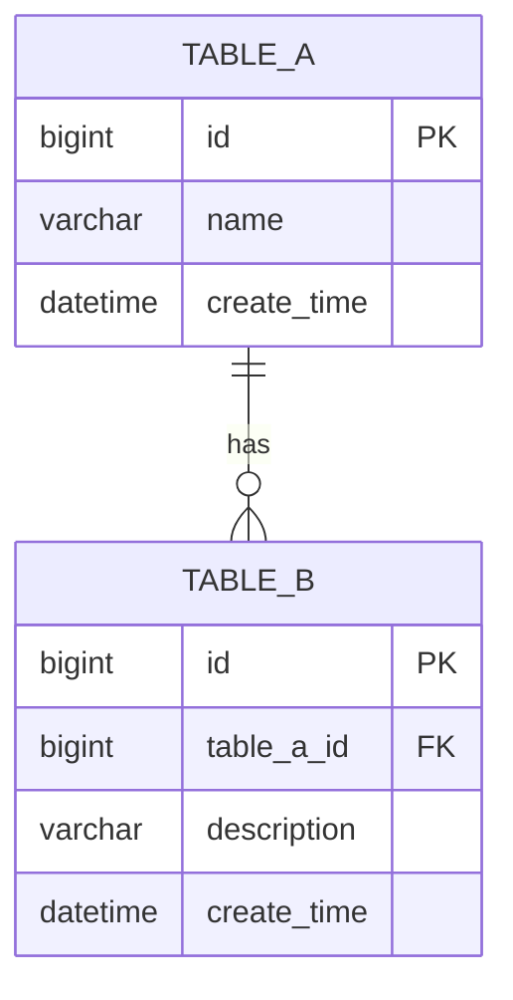
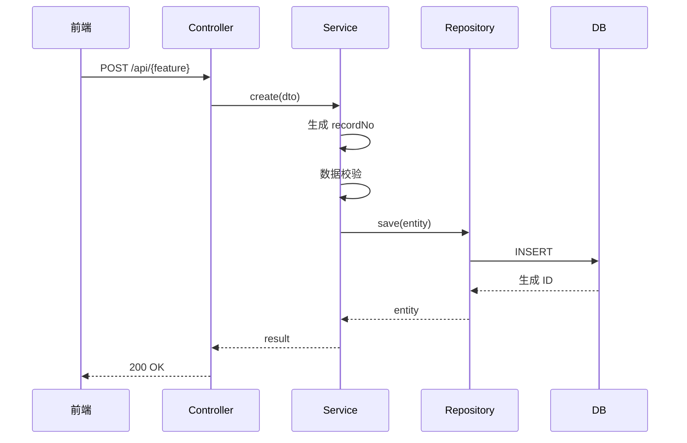
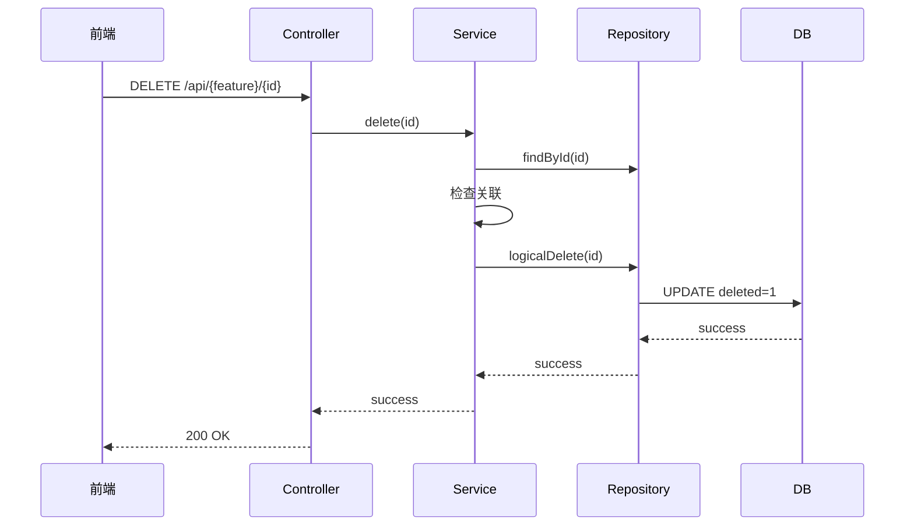

# {FeatureName} 详细设计 - v1.0 完整版

<!--
═════════════════════════════════════════════════════════════════
 写作铁律（P2 实战沉淀·生成时必读；产物可保留本注释，不参与渲染）
═════════════════════════════════════════════════════════════════
【产物契约——机器校验，违者 Gate FAIL】
 1. 文档头「模板版本」必须等于本模板 frontmatter 的 version；写前先核对，跑 Gate 前再核对（skill 自动更新会改版本且可能覆盖模板）。
 2. §9.1 追溯矩阵 8 列按管道列位校验：页面列落「§7.1-{n} 页面名」、数据列落「§2.3 表名」（或裸 —）、接口 §5.3.x、规则 R{n}、测试 TC-*、状态 COMPLETE；与 criteria 冻结分母集合全等。
 3. design.json 引用闭环：acceptance.page/api/rule 必须**精确等于** pages/apis/rules 注册的 anchor（data 必须精确等于 tables[].anchor，如 "§2.3"——带表名的长串会断链；精确表名写在文档矩阵，json 只存定位锚点）；孤儿条目加 unreferenced_reason；空集合必须 zero_results 声明（"不涉及也是证据"）；表字段 ddr ↔ decisions 双向闭环。
 4. 结构化产物失败关闭：先 df_validate 过了再过 Gate；总分模式 design.json 为 feature 级（多模块共用 .devflow/<feature>/）。
【写作规则——评审真正在意的】
 5. 按模块职责组织，不按 PRD 功能编号；PRD↔模块映射只在总文档登记一笔。
 6. 终态叙事：不写"原为/迁出/不再包含"，直接写最终设计结论。
 7. 同服务模块在依赖图里同框（框=服务）；依赖明细表只放 §0.3。
 8. 表结构全字段五列，禁止"关键字段"式省略；§4 每流程 WHEN 伪代码+时序图成对；§5.3 每接口"请求+响应"两张六列表，禁止"契约同 §x.x"式省略。
 9. §7/§2.3 子域用同一套字母命名并**进真实标题**；编号错位的小节标题尾加【子域 X】标注，不重排编号（保护 json 锚点）。
 9a. **表与接口禁止合并/省略**：§2.3 每张表必须独立 `##### 表名（中文名）` + 五列全字段——禁止把多张表合进一个标题（如 "A / B（某某）"）、禁止"配套表：A、B、C——结构同构"式一句话带过、禁止"字段全集以 INDEX-表.md 为准"替代正文展开（INDEX 是对账索引不是设计文档）；§5.3 每个接口必须独立 `##### 5.3.x` 小节 + 请求/响应双六列表——禁止"契约同 §x.x"式省略。在 INDEX-表.md 或实体代码有登记 ≠ 在详设中有设计，两者不互替。
10. 错误码三层引用不重定义：平台通用码（总文档 §5.3）→ 业务码（本文 §3）→ 前端行为（§7.6）。写契约不写实现快照。
【Gate 环境实操】
11. Gate 以 LC_ALL=C 运行：若 PATH 上的 python3 属于含非 ASCII site 配置的 venv 会崩——用系统解释器（如 PATH 前置 /usr/bin）。
12. 占位符检查是子串匹配（TODO/TBD/待补充/REPLACE_WITH/占位/暂定，大小写不敏感）：领域词撞车改英文（占位符→placeholder、待办计数→backlog）。
【已知未决】总分模式 --mode=total 要求总文档逐点 COMPLETE，与"追溯在分文档"分工冲突——不硬凑，登记评审定口径。
═════════════════════════════════════════════════════════════════


> 模板 ID：`详细设计-完整版-模板`
> 模板版本：`3.16.25`

> **文档状态**：✅ 评审通过
> **生成时间**：{YYYY-MM-DD HH:mm:ss}
> **基于版本**：v0.2 摘要版（评审通过日期：{YYYY-MM-DD}）
> **评审结论**：P0=0, P1=0, P2<10

---

## §0 总分架构决策

> **AI 自主决策**：根据功能复杂度、模块独立性、团队规模决定采用总分或单体结构。

### 0.1 架构决策

| 决策项 | 选项 | 本项目选择 | 决策依据 |
|--------|------|----------|----------|
| 文档结构 | 单体 / 总分 | {单体/总分} | {复杂度/独立性/团队} |
| 总文档 | `docs/系统详细设计.md` | 必选/可选 | 模块数≥5 或跨服务依赖强 |
| 分文档 | `docs/detailed-design/<feature>-详细设计.md` | 可选 | 单模块复杂度高或独立性强 |

### 0.2 决策规则

> **总分 vs 单体决策矩阵**

| 条件 | 推荐结构 | 说明 |
|------|----------|------|
| 模块数 ≥ 5 且跨服务 | **总分** | 总文档定义全局架构，分文档专注模块内设计 |
| 单模块复杂度高（如引擎类） | **总分** | 分文档可独立演进，总文档索引 |
| 简单 CRUD 模块 | **单体** | 单文档覆盖全模块 |
| 多团队并行开发 | **总分** | 分文档减少合并冲突 |
| 独立模块无跨域依赖 | **单体或总分** | 视复杂度由 AI 决策 |

### 0.3 总分文档关系

```text
docs/
├── 系统详细设计.md          # 总文档：全局架构、跨域决策、全局模型
└── detailed-design/
    ├── M-01-基础能力-design.md    # 分文档1：独立演进
    ├── M-02-全局配置-design.md    # 分文档2：独立演进
    └── ...
```

**总分模式章节分布：**

| 章节 | 总文档 | 分文档 | 说明 |
|------|--------|--------|------|
| §1 系统架构 | ✅ 全局架构图 | — | 跨服务调用、全局数据流 |
| §2 模块边界 | ✅ 模块职责 + 依赖 | — | 服务归属、接口契约 |
| §3 全局数据模型 | ✅ 跨域实体 | — | 用户/组织/流程等全局模型 |
| §4 模块内数据模型 | — | ✅ 专注本模块 | 本模块表结构、索引 |
| §5 业务规则 | — | ✅ 专注本模块 | 本模块业务规则 |
| §6 关键流程 | — | ✅ 专注本模块 | 本模块核心流程 |
| §7 接口设计 | — | ✅ 专注本模块 | 本模块 REST API |

---

## §1 功能概述

### 1.1 功能名称与范围

| 项 | 内容 |
|---|------|
| 功能名称 | {FeatureName} |
| 模块归属 | {ModuleName} |
| 优先级 | P0/P1/P2 |
| 复杂度 | 低/中/高/极高 |

### 1.2 功能描述

```
{简要描述功能做什么}
```

### 1.3 业务背景

```
{为什么要做这个功能，解决什么问题}
```

### 1.4 假设与约束

```
- 假设1：
- 约束1：
```

---

## §2 数据模型

### 2.1 ER 图



### 2.2 表结构设计

> v3.9.8：表结构为**五列**（字段名/类型/约束/默认值/口径说明），专注新系统设计。
> 老系统来源与迁移转换规则不在本表——迁移场景 B/C 的字段级映射统一在
> `docs/数据映射/<feature>-映射.md`（八列映射表，P2 迁移 Gate `s3_migration_mapping_gate.sh` 检查），
> 详设与映射文档职责分离，避免同一信息两处维护。

#### sys_{feature}_config（配置表）

| 字段名 | 类型 | 约束 | 默认值 | 口径说明 |
|--------|------|------|--------|----------|
| id | bigint | PK, AUTO_INCREMENT | — | 主键 |
| config_key | varchar(64) | NOT NULL, UNIQUE | — | 配置键 |
| config_value | text | NULL | NULL | 配置值 |
| config_type | varchar(32) | NOT NULL | — | 配置类型 |
| description | varchar(256) | NULL | NULL | 描述 |
| sort_order | int | NOT NULL | 0 | 排序 |
| status | tinyint | NOT NULL | 1 | 1=启用，0=停用 |
| version | int | NOT NULL | 0 | 乐观锁版本 |
| deleted | tinyint | NOT NULL | 0 | 逻辑删除标志 |
| create_time | datetime | NOT NULL | CURRENT_TIMESTAMP | 创建时间 |
| create_by | bigint | NULL | NULL | 创建人 |
| update_time | datetime | NULL | NULL | 更新时间 |
| update_by | bigint | NULL | NULL | 更新人 |

**索引：**
- `idx_config_type` (config_type)
- `idx_status` (status)

#### sys_{feature}_record（业务表）

| 字段名 | 类型 | 约束 | 默认值 | 口径说明 |
|--------|------|------|--------|----------|
| id | bigint | PK, AUTO_INCREMENT | — | 主键 |
| record_no | varchar(32) | NOT NULL, UNIQUE | — | 业务记录编号 |
| name | varchar(128) | NOT NULL | — | 名称 |
| status | varchar(32) | NOT NULL | 'ACTIVE' | 状态枚举 |
| version | int | NOT NULL | 0 | 乐观锁 |
| deleted | tinyint | NOT NULL | 0 | 逻辑删除 |
| create_time | datetime | NOT NULL | CURRENT_TIMESTAMP | 创建时间 |
| create_by | bigint | NULL | NULL | 创建人 |
| update_time | datetime | NULL | NULL | 更新时间 |
| update_by | bigint | NULL | NULL | 更新人 |

**索引：**
- `uk_record_no` (record_no) UNIQUE
- `idx_status` (status)
- `idx_create_time` (create_time)

---

### 2.3 设计决策记录（DDR）

> v3.9.7 新增：每个非平凡设计决策必须写明"为什么这么设计"。禁止只给结论不给理由
> （例：字段用 varchar(20) 还是 varchar(30)？索引为什么这么建？为什么不用 JSON 列？）。
> DBA 评审重点核对本节。无决策可记时写"本节无非平凡决策"并说明原因。

| # | 决策点 | 关联字段 | 备选方案 | 选定 | 理由 |
|---|--------|----------|----------|------|------|
| 1 | {字段} 长度 | {表.字段} | varchar(20) / varchar(30) | varchar(20) | {业务口径：编码规则为 18 位定长 + 2 位冗余；参照 GB/T xxx；预留 20% 已足够} |
| 2 | {字段} 类型 | {表.字段} | varchar / text | varchar(64) | {可参与索引；text 不能建普通索引} |
| 3 | 索引策略 | {表.字段,表.字段} | {单列/联合/无} | {联合索引(a,b)} | {查询模式 WHERE a=? AND b=?，区分度 a>b} |
| 4 | 状态存储 | {表.字段} | tinyint 枚举 / 状态机表 | tinyint | {状态数固定 3 个，无扩展诉求} |

> v3.17.1：DDR 与表设计字段**一一对应**——每个非平凡字段的产生都须能回指到某条 DDR；
> 结构化模式（design.json）由 `df_render.py` 自动生成 `ddr-index` + `ddr-matrix`（字段×决策
> 矩阵），`df_validate.py` 双向闭环（字段引用的 DDR 必须存在、DDR 必须被字段引用）。

**评审要求**：DBA 对每行 DDR 追问"理由是否成立"；理由 = "经验/习惯/常用" 不通过，必须有
业务口径、规范依据（引用 §13 规范条目编号）或量化数据支撑。

## §3 接口设计

### 3.1 接口概览

> 表头约定：HTTP 方法必须在第一列（行首），以便 `p4_prd_vs_code.sh` 解析。
> 列序：`方法 | 路径 | 接口名称 | 权限`。
> v3.17.1：概览与 §3.2 详细接口定义**一一对应**——概览每一行必须有对应详细定义小节，
> 详细定义小节不得超出概览（结构化模式由 `df_validate.py` 对文档双向对账）。

| 方法 | 路径 | 接口名称 | 权限 |
|------|------|----------|------|
| GET | /api/{feature}/page | 分页查询 | {feature}:view |
| GET | /api/{feature}/{id} | 详情查询 | {feature}:view |
| POST | /api/{feature} | 新增 | {feature}:add |
| PUT | /api/{feature}/{id} | 更新 | {feature}:edit |
| DELETE | /api/{feature}/{id} | 删除 | {feature}:delete |
| GET | /api/{feature}/export | 导出 | {feature}:export |
| GET | /api/{feature}/template | 导入模板 | {feature}:import |

### 3.2 详细接口定义

#### 3.2.1 分页查询

**请求字段：**

| 字段 | 类型 | 必填 | 校验规则 | 数据来源 | 脱敏 |
|------|------|------|----------|----------|------|
| pageNum | integer | 是 | >=1 | 请求参数 | 否 |
| pageSize | integer | 是 | 1~100 | 请求参数 | 否 |
| name | string | 否 | trim 后 <=128 | 请求参数→name 查询条件 | 否 |
| status | string | 否 | 必须属于状态枚举 | 请求参数→status 查询条件 | 否 |

**响应字段：**

| 字段 | 类型 | 恒出性 | 取值规则 | 数据来源 | 脱敏 |
|------|------|--------|----------|----------|------|
| total | long | 是 | 满足过滤条件的总数 | count 查询 | 否 |
| records[].id | long | 是 | 记录主键 | sys_{feature}_record.id | 否 |
| records[].recordNo | string | 是 | 业务编号 | sys_{feature}_record.record_no | 否 |
| records[].name | string | 是 | 名称 | sys_{feature}_record.name | 否 |
| records[].status | string | 是 | 状态枚举 | sys_{feature}_record.status | 否 |

**请求：**
```http
GET /api/{feature}/page
Content-Type: application/json

{
  "pageNum": 1,
  "pageSize": 10,
  "name": "xxx",
  "status": "ACTIVE"
}
```

**响应：**
```json
{
  "code": 200,
  "message": "success",
  "data": {
    "total": 100,
    "records": [
      {
        "id": 1,
        "recordNo": "RF202401010001",
        "name": "xxx",
        "status": "ACTIVE",
        "createTime": "2024-01-01 10:00:00"
      }
    ]
  }
}
```

#### 3.2.2 新增

**请求字段：**

| 字段 | 类型 | 必填 | 校验规则 | 数据来源 | 脱敏 |
|------|------|------|----------|----------|------|
| name | string | 是 | trim 后 1~128；唯一范围须在模块中明确 | 请求体 | 否 |
| description | string | 否 | 0~256 | 请求体 | 否 |

**响应字段：**

| 字段 | 类型 | 恒出性 | 取值规则 | 数据来源 | 脱敏 |
|------|------|--------|----------|----------|------|
| id | long | 是 | 新增记录主键 | INSERT 返回主键 | 否 |
| recordNo | string | 是 | 按 R1 生成 | sys_{feature}_record.record_no | 否 |

**请求：**
```http
POST /api/{feature}
Content-Type: application/json

{
  "name": "xxx",
  "description": "xxx"
}
```

**响应：**
```json
{
  "code": 200,
  "message": "success",
  "data": {
    "id": 1,
    "recordNo": "RF202401010001"
  }
}
```

---

## §4 权限矩阵

| 角色 | 列表 | 详情 | 新增 | 编辑 | 删除 | 导出 |
|------|------|------|------|------|------|------|
| 管理员 | ✅ | ✅ | ✅ | ✅ | ✅ | ✅ |
| 普通用户 | ✅ | ✅ | ❌ | ❌ | ❌ | ❌ |

---

## §5 业务规则

| 规则编号 | 分类 | 规则描述 | 约束/错误处理 |
|----------|------|----------|--------------|
| R1 | 新增 | `recordNo` 自动生成，格式 `RF + yyyyMMdd + 6位序号`，同日唯一 | 冲突按限定次数重试 |
| R2 | 新增 | `name` trim 后非空，≤128 字符；唯一范围在本模块内明确 | 为空返回 FIELD_VALIDATION_FAILED |
| R3 | 新增 | `status` 缺省 `ACTIVE`，未授权调用方不可指定其他初始状态 | 越权返回 403 |
| R4 | 更新 | 已删除记录不允许更新 | 返回确定业务错误码 |
| R5 | 更新 | `recordNo` 等不可变字段禁止修改 | 请求中出现即拒绝，不静默忽略 |
| R6 | 更新 | 携带版本号执行乐观锁；成功后写 `update_time`/`update_by` | 版本冲突返回 VERSION_CONFLICT |
| R7 | 删除 | 逻辑删除，原子设置 `deleted=1` 并递增版本号 | — |
| R8 | 删除 | 存在有效关联数据时拒绝删除 | 错误中返回关联类型，不泄露敏感内容 |
| R9 | 删除 | 删除后 `recordNo` 永不复用 | — |

> **填写要求**：每条规则一行，编号连续；描述须具体到字段级（禁止"合理校验"等模糊表述）；约束列必须给出错误码或处理动作。

---

## §6 关键流程

> **强制要求**：每一个关键流程必须同时包含 WHEN 准伪代码和 Mermaid 时序图，二者缺一即视为详设不完整。不允许以"流程简单""与已有流程类似"等理由跳过时序图。

### 6.1 新增流程

```text
WHEN 新增记录 (command, operator):                              [R1][R2][R3]
  1. 校验 command 字段级约束；失败返回 FIELD_VALIDATION_FAILED
  2. 校验 operator 具备 {feature}:add 权限；失败返回 403
  3. TX 开始
  4.   生成 recordNo；唯一冲突按限定次数重试                     [R1]
  5.   INSERT sys_{feature}_record(status=ACTIVE, version=0)      [R3]
  6.   同事务写业务 Outbox/审计事实（如本模块要求）
  7. TX 提交
  8. 返回 id、recordNo
  9. 任一步异常 → 回滚；不得返回成功占位
```



### 6.2 删除流程

```text
WHEN 删除记录 (id, version, operator):                          [R4][R7][R8][R9]
  1. 按 id 读取未删除记录；不存在返回 NOT_FOUND
  2. 校验 operator 具备 {feature}:delete 权限；失败返回 403
  3. 查询有效关联；存在则返回 RECORD_REFERENCED                  [R8]
  4. TX 开始
  5.   UPDATE sys_{feature}_record SET deleted=1, version=version+1
       WHERE id=:id AND version=:version AND deleted=0           [R7]
  6.   受影响行数 != 1 → 回滚并返回 VERSION_CONFLICT
  7. TX 提交
```



---

## §7 前端页面

> **内容口径**：本节写**设计契约**（组件职责边界、权限分层、错误行为、异步约定），不写实现快照（composables/API 函数逐一映射会漂移，留给代码与自动索引）；组件列必须锚定前端工程的真实路径；按模块子域组织，不按需求编号组织。

### 7.1 页面清单

| # | 子域/分组 | 页面 | 路径 | 组件（真实路径） | 类型 | 权限 |
|---|------|------|------|------|------|------|
| 1 | {子域} | {列表页} | /{module} | views/{module}/index.vue | 列表+详情抽屉 | {module}:view |
| 2 | {子域} | {编辑页} | /{module}/edit/{id} | views/{module}/edit.vue | 表单页 | {module}:edit |

> 标注存量复用与新增页；无独立页面的子域要显式说明原因（如"该子域为服务间链路，无用户页面"）。

### 7.2 页面与接口映射

| 页面 | 调用接口（§5.x.x） | API 封装 | 交互要点 | 测试用例 |
|------|------|------|------|
| {页面} | §5.3.1 / §5.3.2 | api/{domain}.ts | {幂等键/降级/确认流等关键交互} | TC-{MODULE}-001 |

### 7.3 关键页面交互设计

> 按**页组**写小节（统一框架类页面合并为一节），每个页组说明：**布局**（区/Tab/树+表）、**查询区**（筛选项）、**表格关键列**、**行/批量操作与权限点**、**弹窗/抽屉入口**、**状态矩阵**（不许只写理想态，至少覆盖五态：理想/部分/加载/错误/空；建议表格形式：状态|触发|展示|交互/恢复）、**降级**（部分失败是否整体降级、降级是否写缓存）。

#### 7.3.1 {页组名}

- **布局**：{结构}
- **查询区**：{筛选项与校验}
- **表格关键列**：{列与状态展示约定}
- **操作**：{行操作/批量操作，逐项标注权限点}
- **三态与降级**：{部分失败是否整体降级、降级是否写缓存}

### 7.4 弹窗/抽屉映射表

> 锚定 **页面+交互名**（不锚定需求编号）；每个交互一行：组件 → 接口 → 关键状态；写操作类交互建议加"关联验收点"列（挂 §9.1 验收点 ID，闭环前端交互与验收）。

| 页面·交互 | 组件 | 接口（§5.x.x） | 关键状态/确认流 |
|------|------|------|------|
| {页面}·{删除确认} | {XxxDeleteConfirmDialog.vue} | §5.3.x DELETE | {二次确认文案/409 引用拦截跳转} |

### 7.5 权限与数据范围前端契约

- **两级分层**：路由级 `meta.permCode`（入口控制，路由守卫拦截）＋按钮级权限码 `v-if`（UX 控制）；两者与后端 `@PreAuthorize` 同源。
- **有效授权公式**：{如：功能权限码 ∩ 数据范围 ∩ 业务范围}——前端据此控制可见性，后端全链路重校验。
- **原则**：按钮隐藏不是安全控制；深链路直达、直接调 API、导出下载都必须由后端重新鉴权；越权对象不以 404 泄露存在性。

### 7.6 异步与错误交互契约

- **errorCode → 前端行为表**（错误码语义引用 §5.3 定义，此处只写交互行为，不重复定义）：

| errorCode | 前端行为 |
|------|------|
| {VERSION_CONFLICT} | {保留用户草稿，展示最新版本摘要，允许刷新对比，不自动覆盖} |
| {OPERATIONS_UNAVAILABLE} | {保留请求上下文提示可重试，不得乐观显示成功} |

- **异步任务规约**：受理类操作保存 executionId/requestId，刷新页面后可恢复查询；202 只显示"已受理"，终态后才显示成功；轮询采用指数退避，页面不可见时降频；**超时与取消**（timeout/cancel）场景必须显式声明处理（超时提示+可重试，取消不留半状态）。
- **异常提示约定**：错误页/异常提示包含四要素——异常代码（有 HTTP/业务码时展示）、简明描述、建议操作、可选配图；空状态属特定异常态，引导类空态给新建入口。
- **降级约定**：聚合类数据部分失败时对应项置空并显式标记降级，降级数据不写缓存。

### 7.7 路由、状态与 API 封装约定

- 路由：静态路由表 + 全量懒加载；`meta.permCode` 权限码守卫拦截；{项目特有禁令，如某前缀被网关反代则页面路由禁用}。
- 状态：业务页不建全局 store（全局仅身份/菜单/权限等基础 store）；列表数据统一走三态数据加载封装，搜索竞态用 latest-only 守卫。
- API 封装：按领域划分 api 目录下领域文件；高风险写操作自动携带幂等键；错误静默（silentError）按场景显式声明。

### 7.8 复用组件与技术栈

| 组件/组合式 | 位置 | 复用范围 |
|------|------|------|
| {SharedComponent} | {真实路径} | {复用页面} |

| 项 | 技术 | 版本 |
|---|------|------|
| 框架 | {Vue/React} | {Version} |
| UI 库 | {Element Plus/Ant Design} | {Version} |
| 构建 | {Vite/Webpack} | {Version} |

> 构建注意：重型依赖（设计器/图表/编辑器）必须动态 import + 分 chunk，列出本模块禁静态引入的包。

**性能设计**（有列表/大表单/图表的模块必填；纯展示型页面可整表省略并注明原因）：

| 性能项 | 目标 | 设计措施 | 度量方式 |
|------|------|------|------|
| 首屏加载 | {目标} | {代码分割/骨架屏/缓存} | {LCP/FCP} |
| 接口请求 | {目标} | {并发/缓存/合并/取消/超时} | {接口耗时} |
| 渲染交互 | {目标} | {虚拟列表/节流防抖} | {FPS/交互耗时} |

**工程横切评估表**（逐项声明涉及/不涉及——"不涉及"也是证据，须给理由）：

| 横切项 | 涉及 | 说明 |
|------|------|------|
| 多语言 | {涉及/不涉及} | {词条/复用/长文案处理，或"全站中文硬编码，i18n 未启用"} |
| 埋点上报 | {涉及/不涉及} | {事件/时机/字段，或"本期无埋点需求"} |
| 暗色模式 | {涉及/不涉及} | {主题变量依赖} |
| 响应适配 | {涉及/不涉及} | {断点/窄屏策略} |
| 浏览器兼容 | {涉及/不涉及} | {最低版本约束} |

### 7.9 菜单 Seed

`sys_menu`（{CATALOG} + {N} 个 MENU）与 `sys_menu_operation`、`sys_permission_group`、`sys_user_effective_perm`、`setval` 五段齐全，seed 位于 {service} 四方言 `V*__seed_{module}_menus.sql`；逐行清单以 seed 脚本/事实源索引为准，不在本详设重复维护（避免漂移）。

---

## §8 数据库迁移

### 8.0 数据迁移场景判型

| 场景 | 判定 | 新库数据字典 | 新老字段映射 | 历史数据迁移 |
|------|------|--------------|--------------|
| A 全新功能 | 无老系统对应数据 | 必做 | 不做；数据模型来源列填"新增" | 不做 |
| B 单一老系统替换 | 继承一个老系统历史数据 | 必做 | 必做且覆盖100%字段 | 必做 |
| C 多老系统适配 | 同类数据来自两个及以上老系统 | 必做 | 每个来源系统独立映射 | 由独立迁移模块和适配器实施 |

### 8.1 Flyway 脚本清单

```
backend/<service>/src/main/resources/db/migration/
├── h2/org/
│   └── V1.0.xx__create_{feature}_tables.sql
├── postgresql/org/
│   └── V1.0.xx__create_{feature}_tables.sql
├── oracle/org/
│   └── V1.0.xx__create_{feature}_tables.sql
└── kingbase/org/
    └── V1.0.xx__create_{feature}_tables.sql
```

### 8.2 初始数据

```
backend/<service>/src/main/resources/db/migration/{dialect}/<module>/
└── V1.0.xx__seed_{feature}_config.sql
└── V1.0.xx__seed_{feature}_menus.sql
```

---

## §9 验收标准

### 9.1 功能验收

- [ ] 冻结 PRD 原子验收点已全部进入 §0.5，设计覆盖率 = 100%
- [ ] 每个验收点均可追溯到页面/任务、接口、数据字段、规则或准伪代码、测试用例
- [ ] 列表分页查询正常
- [ ] 新增功能正常
- [ ] 编辑功能正常
- [ ] 删除功能正常（逻辑删除）
- [ ] 权限控制正常

### 9.2 非功能验收

- [ ] API 响应时间 < 500ms
- [ ] 单测覆盖率 ≥ 80%
- [ ] 无 P0 缺陷
- [ ] 首轮代码准确率 ≥ 80%；未通过项进入修正循环，但不得删除验收点

---

## §10 依赖项

### 10.1 内部依赖

| 模块 | 依赖内容 |
|------|----------|
| org-service | 提供基础 CRUD |
| workflow-service | 流程编排 |

### 10.2 外部依赖

| 服务 | 依赖内容 |
|------|----------|
| PostgreSQL | 数据存储 |
| Redis | 缓存 |

---

## §11 需求追溯与覆盖率基线

<!-- anchor: acceptance-traceability -->

> **追溯源**：`docs/requirements/<feature>-acceptance-criteria.md`（P0 FROZEN）
>
> **追溯链**：P0 验收点 → §11 本节 → P5 测试用例 → P6 测试报告
>
> **拆分粒度**：一个验收点 = 一个行为 = 一个测试用例

### 11.1 验收点追溯矩阵

| 验收点ID | PRD原文锚点 | 页面/任务 | 接口契约 | 数据字段 | 规则/准伪代码 | 测试用例 | 设计状态 |
|----------|-------------|-----------|----------|----------|---------------|----------|----------|
| `M-{xx}-F{y}-A{z}` | `{PRD_PATH}#锚点` | §6.x | §2.x | §1.x | §4 R1 / §5.x | `TC-{Module}-{nnn}` | COMPLETE |

### 11.2 追溯覆盖率检查

| 检查项 | 命令 | 通过条件 |
|--------|------|----------|
| 验收点总数 | `grep -cE 'M-[0-9]{2}-F[0-9]{2}-A[0-9]{2}' <criteria>` | = P0 冻结数 |
| COMPLETE 状态 | `grep -c 'COMPLETE'` | = 验收点总数（100%） |
| 孤儿验收点 | `grep -cE 'PENDING\|WIP'` | = 0 |

```
设计覆盖率 = COMPLETE 原子验收点数 / 冻结原子验收点总数 = 100%
首轮代码准确率 = 首轮通过测试与 Review 的原子验收点数 / 冻结原子验收点总数 >= 80%
```

禁止使用篇幅、表格数量或接口数量替代验收点口径；编码开始后不得通过删除失败验收点提高准确率。

---

## §12 组件复用与公共抽取

> v3.9.7 新增：**先找轮子，再造轮子**。成熟组件可直接复用的禁止自己实现；
> 本模块沉淀出的可复用能力必须显性登记，供后续模块消费——防止同一个工具类在 N 个模块里被写 N 遍。

### 12.1 成熟组件复用清单

> 每个技术诉求先回答：业界/公司内有没有成熟组件？有 → 直接用（写明版本与引入方式）；没有 → 才进"自研"列并说明原因。

| 技术诉求 | 复用组件 | 版本 | 引入方式 | 替代了什么自研 |
|----------|----------|------|----------|----------------|
| {如：参数校验} | hibernate-validator | {8.x} | spring-boot-starter-validation | {自写校验工具类} |
| {如：JSON 处理} | jackson | {2.x} | 随 Boot 引入 | {手写序列化} |
| {如：分页} | mybatis-plus 分页插件 | {3.5.x} | {坐标} | {自写 limit 拼接} |
| {诉求} | 无成熟组件（说明调研结论） | — | — | 自研：{类名}，原因：{...} |

### 12.2 公共服务与公共组件抽取登记

> 判断标准：≥2 个模块/页面需要同一能力 → 必须抽取为公共件并在此登记；本模块消费已有公共件的也在本表登记（消费方视角）。

| 公共件名称 | 类型（服务/组件/工具类/常量枚举） | 产出 or 消费 | 位置/坐标 | 消费方 | 抽取理由 |
|------------|----------------------------------|--------------|-----------|--------|----------|
| {如：统一响应体} | 组件 | 消费（已有） | {common-web} | 本模块 | — |
| {如：公告导出} | 服务 | 产出（本模块新抽取） | {export-service} | 本模块、后续 M-02 | 导出逻辑与公告/待办/日程 3 处重复 |

---

## §13 规范遵循

> v3.9.7 新增：本设计遵循的命名/开发/注释规范。默认基线为《阿里巴巴 Java 开发手册》（最新版），
> 可按项目实际替换为其他成熟规范（如 Google Style、公司规范），但必须显式声明，禁止"无规范"状态。

### 13.1 规范基线声明

| 规范域 | 采用规范 | 版本/链接 | 偏离项（若有） |
|--------|----------|-----------|----------------|
| 命名规范 | 阿里巴巴 Java 开发手册 | {版本} | 无 |
| 开发规范 | 阿里巴巴 Java 开发手册 | {版本} | 无 |
| 注释规范 | 阿里巴巴 Java 开发手册 + Javadoc | {版本} | 无 |
| 数据库规范 | 阿里巴巴 Java 开发手册（MySQL 章） | {版本} | {如：主键策略偏离，见 DDR #n} |

### 13.2 本设计的规范落点

| 规范条目 | 本设计落点 |
|----------|------------|
| {如：强制——表名/字段名必须小写，禁止驼峰} | §2.2 全部表名 `{table}_name` 已遵循 |
| {如：推荐——字段注释完整} | §2.2 口径说明列即建表注释来源 |
| {如：强制——POJO 布尔属性禁止 is 前缀} | §2.2 status 用 tinyint 非布尔 |

---

## §14 变更历史

| 版本 | 日期 | 修改人 | 修改内容 |
|------|------|--------|----------|
| v0.1 | {YYYY-MM-DD} | AI | 目录版 |
| v0.2 | {YYYY-MM-DD} | AI | 摘要版 |
| v1.0 | {YYYY-MM-DD} | AI | 完整版，通过评审 |

> 演进约束：仅设计 PRD 已要求或已有两个以上当前消费者的扩展点；不得以"未来可能"为由新增表、接口、中间件或抽象层。

---

## 评审记录

| 版本 | 评审日期 | 评审结论 | P0 | P1 | P2 | 评审人 |
|------|----------|----------|-----|-----|-----|--------|
| v0.1 | | | | | | |
| v0.2 | | | | | | |
| v1.0 | | 通过 | 0 | 0 | <10 | |

---

> ✅ **文档状态**：评审通过，可进入编码阶段
