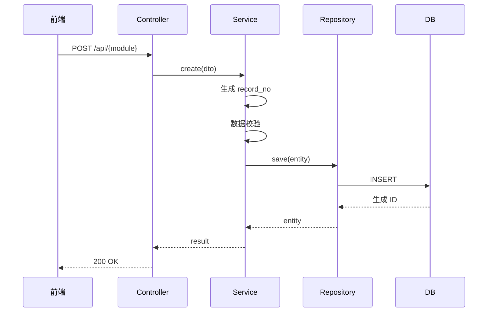
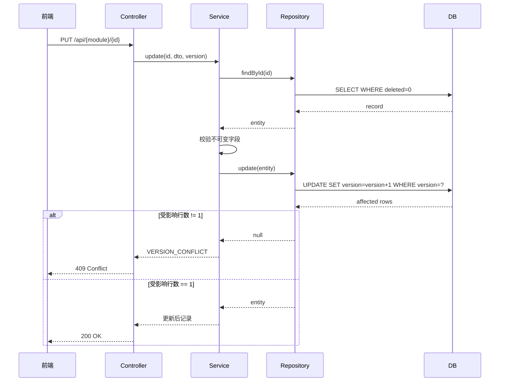
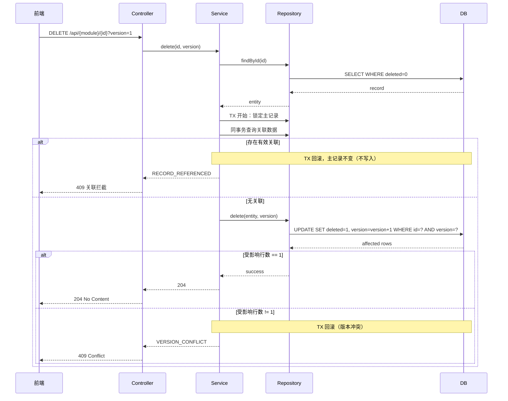

# {ModuleName} 详细设计 - 分文档 v1.0

<!--
═════════════════════════════════════════════════════════════════
 写作铁律（P2 实战沉淀·生成时必读；交付产物前必须整块删除本注释——块内含占位符检查关键词，保留会被 Gate 命中）
═════════════════════════════════════════════════════════════════
【产物契约——机器校验，违者 Gate FAIL】
 1. 文档头「模板版本」必须把 `{{template_version}}` 替换为本模板 frontmatter 的 version（见本文件第 3 行 version 字段），与模板逐字相等后 Gate 才放行；skill 升版会更新 frontmatter，写前与跑 Gate 前各核对一次。
 2. 验收点追溯矩阵（正本锚点 `<!-- anchor: acceptance-traceability -->`，本模板展示编号 §9.1）8 列按管道列位校验：页面列落「§7.1-{n} 页面名」、数据列落「§2.3 表名」（或裸 —）、接口列落接口详细定义小节（§5.3.x）、规则 R{n}、测试 TC-*、状态 COMPLETE；与 criteria 冻结分母集合全等。章节编号仅用于展示与 design.json 定位，语义锚点是评审与 /plan、/build 的定位正本。
 3. design.json 引用闭环：acceptance.page/api/rule 必须**精确等于** pages/apis/rules 注册的 anchor（data 必须精确等于 tables[].anchor，如 "§2.3"——带表名的长串会断链；精确表名写在文档矩阵，json 只存定位锚点）；孤儿条目加 unreferenced_reason；空集合必须 zero_results 声明（"不涉及也是证据"）；表字段 ddr ↔ decisions 双向闭环。
 4. 结构化产物失败关闭：先 df_validate 过了再过 Gate；总分模式 design.json 为 feature 级（多模块共用 .devflow/<feature>/）。
【写作规则——评审真正在意的】
 5. 按模块职责组织，不按 PRD 功能编号；PRD↔模块映射只在总文档登记一笔。
 6. 终态叙事：不写"原为/迁出/不再包含"，直接写最终设计结论。
 7. 同服务模块在依赖图里同框（框=服务）；依赖明细表只放 §0.3。
 8. 表结构全字段五列，禁止"关键字段"式省略（§2.3）；每个关键流程 WHEN 伪代码+时序图成对（§4）；每个接口"请求+响应"两张六列表（§5.3），禁止"契约同 §x.x"式省略。
<!-- local-patch:design-quality v1 begin (2026-09-17) — 治理服务-v2 事故教训：补注即错位 -->
 9. §7 页面与 §2 数据模型的子域用同一套字母命名并**进真实标题**；接口详细定义小节必须**物理置于其声明子域块内**（先定子域→编号映射再动笔）；存量错位小节物理移入正确子域块、同步 design.json 锚点并重跑 Gate——**禁止【子域 X】补注存续**（补注即错位：正文挂错子域块、靠标题补注掩饰，评审与实现双受损）。
<!-- local-patch:design-quality v1 end -->
 9a. **表与接口禁止合并/省略**：§2.3 每张表必须独立 `#### 表名（中文名）` 标题 + 五列全字段——禁止把多张表合进一个标题（如 "A / B（某某）"）、禁止"配套表：A、B、C——结构同构"式一句话带过、禁止"字段全集以 INDEX-表.md 为准"替代正文展开（INDEX 是对账索引不是设计文档）；§5.3 每个接口必须独立 `#### 5.3.x` 小节 + 请求/响应双六列表——禁止"契约同 §x.x"式省略。在 INDEX-表.md 或实体代码有登记 ≠ 在详设中有设计，两者不互替。
<!-- local-patch:design-quality v1 begin (2026-09-17) -->
 9b. **交叉引用与覆盖闭环**：正文数字引用（§5.3.N）必须指向真实小节（重编号须全文同步）；§3 每条 R 规则必须被 §4 至少一个流程的 `[Rn]` 标注引用（确属横切约束的须显式登记例外）；§7.2 页面映射须消费全部接口详细定义节（纯内部端点在项目 lint 规则白名单登记）。项目存在 `scripts/check_design_doc_quality.py` 时，P2 与 P2a 必跑（规则见 `docs/design-quality-rules.json`，exit≠0 即 BLOCKED）。
<!-- local-patch:design-quality v1 end -->
10. 错误码三层引用不重定义：平台通用码（总文档 §5.3）→ 业务码（本文业务规则 §3 与接口定义 §5.3，仅一处定义）→ 前端行为（§7.6）。写契约不写实现快照。
【Gate 环境实操】
11. Gate 以 LC_ALL=C 运行：若 PATH 上的 python3 属于含非 ASCII site 配置的 venv 会崩——用系统解释器（如 PATH 前置 /usr/bin）。
12. 占位符检查是子串匹配（TODO/TBD/待补充/REPLACE_WITH/占位/暂定，大小写不敏感）：领域词撞车改英文（占位符→placeholder、待办计数→backlog）；`{{...}}` 模板变量未替换同样视为未完成。
【总分设计包（v3.24.0/A05）】总分模式必须登记 design-package.json（docs[].path/mode/acceptance_ids）——分文档按自己的验收子集对账，子集并集=冻结分母，缺文档或并集不全等即 Gate FAIL；总文档追溯矩阵由渲染块按 feature 级 JSON 生成，逐点明细仍在分文档。
═════════════════════════════════════════════════════════════════
-->


> 模板 ID：`详细设计-总分分文档-模板`
> 模板版本：`{{template_version}}`（必须替换为本模板 frontmatter 的 version 后再过 Gate）

> **文档类型**：模块详细设计（分文档）
> **所属总文档**：{ProjectName}详细设计.md
> **模块名称**：{ModuleName}
> **归属服务**：{service-name}
> **文档状态**：⏳ DRAFT（初始态；推进：⏳ DRAFT → 🔄 评审中 → ✅ 评审通过）
> **生成时间**：{YYYY-MM-DD HH:mm:ss}

> **结构化渲染块（v3.24.0/A07）**：本文含 13 个 `<!-- df:begin:KEY -->` 锚点块，由
> `df_pipeline.py design` 从 feature 级 design.json 确定性重写（总分模式 JSON 为 feature 级，
> 多模块共用 `.devflow/<feature>/`）——复制本模板后直接走管线，不得手工删块。

---

## §0 模块定位

### 0.1 模块概览

| 项 | 内容 |
|---|------|
| 模块编码 | M-0X |
| 模块名称 | {ModuleName} |
| 归属服务 | {service-name} |
| 端口 | :808X |
| 数据库 | {db_name} |
| 优先级 | P0 / P1 / P2 |
| 复杂度 | 低 / 中 / 高 / 极高 |

### 0.2 核心职责

```
{模块核心职责描述}
```

### 0.3 上下游依赖

> **画法约定**：同一服务内的模块画在**同一个 subgraph 框**中（一个服务一个框，框内列兄弟模块）；跨服务的模块各自成框。依赖明细统一用本节表格登记，其他章节不重复列表。

```mermaid
graph LR
    subgraph SVC["{service-name}（本服务，一个框）"]
        ME[{ModuleName}]
        SIB[{同服务兄弟模块}]
    end

    subgraph UP["上游（跨服务）"]
        UP1[{上游服务/模块1}]
    end

    subgraph DN["下游（跨服务）"]
        DN1[{下游服务/模块1}]
    end

    UP1 --> SVC
    ME -->|进程内调用| SIB
    SVC --> DN1
```

| 依赖方向 | 对象 | 依赖内容 |
|----------|------|----------|
| 服务内依赖 | {兄弟模块} | {进程内调用内容} |
| 依赖 | common | 共享技术库 |
| 依赖（跨服务） | {上游服务} | {业务数据/接口} |
| 被依赖（跨服务） | {下游服务} | {业务数据/接口} |

### 0.4 总分归属

> **总分模式说明**：本模块归属于 `{ProjectName}详细设计.md` 总文档

| 项 | 内容 |
|---|------|
| 归属总文档 | `{ProjectName}详细设计.md` |
| 总文档章节 | §X.X {章节名} |
| 模块独立性 | 高 / 中 / 低（影响分文档可单独演进程度）|

### 0.5 与总文档的章节归属边界

| 章节 | 总文档 | 本文档 | 说明 |
|------|--------|--------|------|
| §1 系统架构 | ✅ 全局架构 | — | 总文档定义 |
| §2 模块边界 | ✅ 模块职责 | ✅ 本模块详情 | — |
| §3 全局数据模型 | ✅ 跨域实体 | — | 总文档定义 |
| §4 本模块数据模型 | — | ✅ 本章 | 本文档核心 |
| §5 本模块业务规则 | — | ✅ 本章 | 本文档核心 |
| §6 本模块关键流程 | — | ✅ 本章 | 本文档核心 |
| §7 本模块接口设计 | — | ✅ 本章 | 本文档核心 |

---

## §1 模块功能概述

<!-- df:begin:summary -->
（由 design.json 自动汇总：验收点覆盖、表/接口/页面/规则/决策/操作计数）
<!-- df:end:summary -->

### 1.1 功能范围

| # | 功能点 | 功能描述 | 优先级 |
|---|--------|----------|--------|
| 1 | {Feature1} | {功能描述} | P0/P1/P2 |
| 2 | {Feature2} | {功能描述} | P0/P1/P2 |

### 1.2 业务背景

```
{业务背景描述}
```

### 1.3 假设与约束

```
- 假设1：
- 约束1：
```

---

## §2 数据模型

<!-- anchor: data-model -->

### 2.1 代码分层

> **分层架构**：根据项目技术规范定义

```
{service-name}/
├── controller/           # Web层：HTTP 请求/响应、参数校验
├── service/             # 服务层：业务逻辑、事务管理
│   └── impl/
├── repository/          # 数据访问层：Mapper / DataAccess
├── entity/              # 实体层：数据库表映射
├── dto/                 # 数据传输对象：按领域组织
├── vo/                  # 视图对象：API 响应包装
└── config/              # 配置层：框架配置
```

### 2.2 ER 图

```mermaid
erDiagram
    {module}_CONFIG {
        bigint id PK
        varchar config_key
        text config_value
        datetime create_time
    }
    {module}_RECORD {
        bigint id PK
        varchar record_no
        varchar name
        varchar status
        int version
        tinyint deleted
        datetime create_time
    }
    {module}_CONFIG ||--o{ {module}_RECORD : "refers to"
```

### 2.3 表结构设计

<!-- df:begin:table-index -->
（由 design.json 自动生成表索引：锚点|表名|字段数）
<!-- df:end:table-index -->

#### 关键字规避规则 ⚠️

> **强制要求**：表名、字段名必须规避目标数据库关键字（覆盖所有支持的数据库）

**通用 P0 关键字（所有数据库必须规避）**：

```
user, username, group, order, status, name, type, desc, level, comment,
key, index, table, column, date, time, timestamp, primary, foreign, references,
default, unique, check, boolean, integer, text, varchar, char
```

**各数据库高风险关键字**：

| 数据库 | 高风险关键字 |
|--------|-------------|
| PostgreSQL/MySQL/KingBase | `user`, `group`, `order`, `status`, `name`, `type`, `desc`, `level`, `comment`, `key`, `date`, `time`, `timestamp` |
| Oracle | `user`, `group`, `order`, `status`, `name`, `type`, `desc`, `level`, `comment`, `key`, `date`, `time`, `timestamp`, `varchar2`, `rowid` |
| MySQL | `user`, `group`, `order`, `status`, `name`, `type`, `desc`, `key`, `file`, `index`, `table` |

**规避策略**：

| 策略 | 示例 | 适用场景 |
|------|------|----------|
| **前缀法** | `user` → `sys_user`，`order` → `biz_order` | 字段名 |
| **后缀法** | `status` → `status_cd`，`type` → `record_type` | 枚举类字段 |
| **下划线法** | `name` → `user_name`，`date` → `create_date` | 通用场景 |

**检查要求**：
1. 设计阶段必须逐表、逐字段检查关键字冲突
2. 如目标多数据库：需覆盖所有支持的数据库
3. 如有冲突，立即修改后再继续

#### {module}_config（配置表）

| 字段名 | 类型 | 约束 | 默认值 | 口径说明 |
|--------|------|------|--------|----------|
| id | bigint | PK, AUTO_INCREMENT | — | 主键 |
| config_key | varchar(64) | NOT NULL, UNIQUE | — | 配置键 |
| config_value | text | NULL | NULL | 配置值 |
| config_type | varchar(32) | NOT NULL | — | 配置类型 |
| description | varchar(256) | NULL | NULL | 描述 |
| sort_order | int | NOT NULL | 0 | 排序 |
| status | tinyint | NOT NULL | 1 | 1=启用，0=停用 |
| version | int | NOT NULL | 0 | 乐观锁版本 |
| deleted | tinyint | NOT NULL | 0 | 逻辑删除标志 |
| create_time | datetime | NOT NULL | CURRENT_TIMESTAMP | 创建时间 |
| create_by | bigint | NULL | NULL | 创建人 |
| update_time | datetime | NULL | NULL | 更新时间 |
| update_by | bigint | NULL | NULL | 更新人 |

**索引：**
- `idx_config_type` (config_type)
- `idx_status` (status)

#### {module}_record（业务表）

| 字段名 | 类型 | 约束 | 默认值 | 口径说明 |
|--------|------|------|--------|----------|
| id | bigint | PK, AUTO_INCREMENT | — | 主键 |
| record_no | varchar(32) | NOT NULL, UNIQUE | — | 业务编号 |
| name | varchar(128) | NOT NULL | — | 名称 |
| status | varchar(32) | NOT NULL | 'ACTIVE' | 状态 |
| version | int | NOT NULL | 0 | 乐观锁版本 |
| deleted | tinyint | NOT NULL | 0 | 逻辑删除 |
| create_time | datetime | NOT NULL | CURRENT_TIMESTAMP | 创建时间 |
| create_by | bigint | NULL | NULL | 创建人 |
| update_time | datetime | NULL | NULL | 更新时间 |
| update_by | bigint | NULL | NULL | 更新人 |

**索引：**
- `uk_record_no` (record_no) UNIQUE
- `idx_status` (status)
- `idx_create_time` (create_time)

### 2.4 数据库迁移

> **Flyway 规范**：根据项目技术规范定义

```
backend/{service}/src/main/resources/db/migration/
├── h2/{service}/
│   └── V1.0.xx__create_{module}_tables.sql
├── postgresql/{service}/
│   └── V1.0.xx__create_{module}_tables.sql
├── oracle/{service}/
│   └── V1.0.xx__create_{module}_tables.sql
└── kingbase/{service}/
    └── V1.0.xx__create_{module}_tables.sql
```

---

## §3 业务规则

<!-- anchor: business-rules -->

<!-- df:begin:rule-index -->
（由 design.json 自动生成规则索引：规则|§锚点|摘要）
<!-- df:end:rule-index -->

| 规则编号 | 分类 | 规则描述 | 约束/错误处理 |
|----------|------|----------|--------------|
| R1 | 新增 | `{field}` 自动生成，格式 `{Prefix} + yyyyMMdd + 6位序号`，同日唯一 | 冲突按限定次数重试 |
| R2 | 新增 | `{field}` trim 后非空，≤128 字符；唯一范围在本模块内明确 | 为空返回校验错误 |
| R3 | 新增 | `{field}` 缺省为默认值，未授权不可指定 | 越权返回 403 |
| R4 | 更新 | 已删除记录不允许更新 | 返回确定业务错误码 |
| R5 | 更新 | 不可变字段禁止修改 | 请求中出现即拒绝 |
| R6 | 更新 | 携带版本号执行乐观锁 | 版本冲突返回 VERSION_CONFLICT |
| R7 | 删除 | 逻辑删除，原子设置 `deleted=1` 并递增版本号 | — |
| R8 | 删除 | 存在有效关联数据时拒绝删除 | 返回关联类型，不泄露敏感内容 |
| R9 | 删除 | 删除后 `record_no` 永不复用 | — |

> **计算规则**（如有）

| 编号 | 公式 | 说明 |
|------|------|------|
| C1 | `{field}` = `{formula}` | — |

> **填写要求**：编号连续；描述具体到字段级；约束列必须给出错误码或处理动作。

---

## §4 关键流程

<!-- anchor: business-operations -->

> **强制要求**：每一个关键流程必须同时包含 WHEN 准伪代码和 Mermaid 时序图。
>
> **业务操作契约（v3.24.0/A01）**：本节流程必须与 design.json `business_operations[]` 一一对应——
> 操作以业务命名（非 CRUD 枚举），覆盖触发者、前置校验、源/目标状态、事务与并发、结果与失败、
> 关联对象处置；冻结验收点的每项操作都必须有落点（Gate 拦截覆盖缺口）。

<!-- df:begin:biz-ops -->
（由 design.json 自动生成业务操作契约索引：操作|触发者/触发|源状态→目标状态|事务/并发|结果/失败|验收点|§锚点）
<!-- df:end:biz-ops -->

### 4.1 新增流程

```text
WHEN 新增记录 (command, operator):                              [R1][R2][R3]
  1. 校验 command 字段级约束；失败返回 FIELD_VALIDATION_FAILED
  2. 校验 operator 具备 {module}:add 权限；失败返回 403
  3. TX 开始
  4.   生成 record_no；唯一冲突按限定次数重试                     [R1]
  5.   INSERT {module}_record(status=ACTIVE, version=0)
  6.   同事务写业务 Outbox（如本模块要求）
  7. TX 提交
  8. 返回 id、record_no
  9. 任一步异常 → 回滚；不得向调用方返回伪成功响应
```



### 4.2 更新流程

```text
WHEN 更新记录 (id, command, version, operator):                  [R4][R5][R6]
  1. 按 id 读取未删除记录；不存在返回 NOT_FOUND                   [R4]
  2. 校验 operator 具备 {module}:edit 权限；失败返回 403
  3. 校验不可变字段未被修改；出现则返回 IMMUTABLE_FIELD_VIOLATION [R5]
  4. TX 开始
  5.   UPDATE {module}_record SET ..., version=version+1
       WHERE id=:id AND version=:version AND deleted=0           [R6]
  6.   受影响行数 != 1 → 回滚并返回 VERSION_CONFLICT
  7. TX 提交
  8. 返回更新后记录
```



### 4.3 删除流程

> **并发口径（必须按真实基线决策）**：关联检查与主记录更新必须同事务执行；仅靠主记录
> version 条件不能证明关联关系在检查后未被新增——写明锁粒度或关联表复合约束（见 14.1）。

```text
WHEN 删除记录 (id, version, operator):                          [R4][R7][R8][R9]
  1. 按 id 读取未删除记录；不存在返回 NOT_FOUND                   [R4]
  2. 校验 operator 具备 {module}:delete 权限；失败返回 403
  3. TX 开始（关联检查与删除同事务）
  4.   锁定主记录；查询有效关联；存在则回滚并返回 RECORD_REFERENCED [R8]
  5.   UPDATE {module}_record SET deleted=1, version=version+1
        WHERE id=:id AND version=:version AND deleted=0           [R7]
  6.   受影响行数 != 1 → 回滚并返回 VERSION_CONFLICT
  7. TX 提交
```



---

## §5 接口设计

<!-- anchor: api-contracts -->

### 5.1 DTO/VO 命名规范

> **命名约定**：根据项目技术规范定义

| 后缀 | 语义 | 示例 |
|------|------|------|
| `Request` | HTTP 请求模型 | `XxxCreateRequest` |
| `Response` | HTTP 响应模型 | `XxxDetailResponse` |
| `Dto` | 服务内部传输 | `XxxDto` |
| `Vo` | 视图展示对象 | `XxxVo` |

### 5.2 接口概览

<!-- df:begin:api-index -->
（由 design.json 自动生成接口概览：方法|路径|接口名称|权限|概览锚点|详细定义|请求字段|响应字段）
<!-- df:end:api-index -->

> v3.17.1/3.17.2：HTTP 方法必须在第一列（行首），以便 `p4_prd_vs_code.sh` 解析；
> 概览与 §5.3 详细接口定义**一一对应**（多行/少行均被 `df_validate.py --doc` 拦截）。

| 方法 | 路径 | 接口名称 | 权限 |
|------|------|----------|------|
| GET | /api/{module}/page | 分页查询 | {module}:view |
| GET | /api/{module}/{id} | 详情查询 | {module}:view |
| POST | /api/{module} | 新增 | {module}:add |
| PUT | /api/{module}/{id} | 更新 | {module}:edit |
| DELETE | /api/{module}/{id} | 删除 | {module}:delete |
| GET | /api/{module}/export | 导出 | {module}:export |

### 5.3 详细接口定义

> 每个接口必须独立 `#### 5.3.x` 小节 + 请求/响应**双六列表**（请求：字段|类型|必填|校验规则|数据来源|脱敏；
> 响应：字段|类型|恒出性|取值规则|数据来源|脱敏）——禁止四列/三列缩水示例，禁止"契约同 §x.x"式省略。

#### 5.3.1 分页查询

**请求字段：**

| 字段 | 类型 | 必填 | 校验规则 | 数据来源 | 脱敏 |
|------|------|------|----------|----------|------|
| pageNum | integer | 是 | >=1 | 请求参数 | 否 |
| pageSize | integer | 是 | 1~100 | 请求参数 | 否 |
| name | string | 否 | trim 后 <=128 | 请求参数→name 查询条件 | 否 |
| status | string | 否 | 必须属于状态枚举 | 请求参数→status 查询条件 | 否 |

**响应字段：**

| 字段 | 类型 | 恒出性 | 取值规则 | 数据来源 | 脱敏 |
|------|------|--------|----------|----------|------|
| total | long | 是 | 满足过滤条件的总数 | count 查询 | 否 |
| records[].id | long | 是 | 记录主键 | {module}_record.id | 否 |
| records[].recordNo | string | 是 | 业务编号 | {module}_record.record_no | 否 |
| records[].name | string | 是 | 名称 | {module}_record.name | 否 |
| records[].status | string | 是 | 状态枚举 | {module}_record.status | 否 |
| records[].createTime | datetime | 是 | 创建时间 | {module}_record.create_time | 否 |

**请求：**
```http
GET /api/{module}/page?pageNum=1&pageSize=10
```

**响应：**
```json
{
  "code": 200,
  "message": "success",
  "data": {
    "total": 100,
    "records": []
  }
}
```

#### 5.3.2 新增

**请求字段：**

| 字段 | 类型 | 必填 | 校验规则 | 数据来源 | 脱敏 |
|------|------|------|----------|----------|------|
| name | string | 是 | trim 后 1~128；唯一范围在本模块内明确 | 请求体 | 否 |
| description | string | 否 | 0~256 | 请求体 | 否 |

**响应字段：**

| 字段 | 类型 | 恒出性 | 取值规则 | 数据来源 | 脱敏 |
|------|------|--------|----------|----------|------|
| id | long | 是 | 新增记录主键 | INSERT 返回主键 | 否 |
| recordNo | string | 是 | 按 R1 生成 | {module}_record.record_no | 否 |

**请求：**
```http
POST /api/{module}
Content-Type: application/json

{
  "name": "xxx",
  "description": "xxx"
}
```

**响应：**
```json
{
  "code": 200,
  "message": "success",
  "data": {
    "id": 1,
    "recordNo": "{Prefix}20240101000001"
  }
}
```

### 5.4 跨服务调用

> **调用规范**：根据项目技术规范定义

| 调用方向 | 接口 | 方式 | 超时 |
|----------|------|------|------|
| 调用 {上游服务} | GET /api/{upstream}/xxx | {RestClient/HTTP/Feign} | {X}s / {Y}s |

---

## §6 权限矩阵

<!-- df:begin:permission-matrix -->
（由 design.json 自动生成：对象|§锚点|所需权限）
<!-- df:end:permission-matrix -->

| 角色 | 列表 | 详情 | 新增 | 编辑 | 删除 | 导出 |
|------|------|------|------|------|------|------|
| 管理员 | ✅ | ✅ | ✅ | ✅ | ✅ | ✅ |
| 普通用户 | ✅ | ✅ | ❌ | ❌ | ❌ | ❌ |

---

## §7 前端页面

> **内容口径**：本节写**设计契约**（组件职责边界、权限分层、错误行为、异步约定），不写实现快照（composables/API 函数逐一映射会漂移，留给代码与自动索引）；组件列必须锚定前端工程的真实路径；按模块子域组织，不按需求编号组织。

### 7.1 页面清单

<!-- df:begin:client-scope -->
（由 design.json 自动生成客户端范围与旅程：旅程|§页面锚点|证据形态）
<!-- df:end:client-scope -->

| # | 子域/分组 | 页面 | 路径 | 组件（真实路径） | 类型 | 权限 |
|---|------|------|------|------|------|------|
| 1 | {子域} | {列表页} | /{module} | views/{module}/index.vue | 列表+详情抽屉 | {module}:view |
| 2 | {子域} | {编辑页} | /{module}/edit/{id} | views/{module}/edit.vue | 表单页 | {module}:edit |

> 标注存量复用与新增页；无独立页面的子域要显式说明原因（如"该子域为服务间链路，无用户页面"）。

### 7.2 页面与接口映射

| 页面 | 调用接口（§5.3.x） | API 封装 | 交互要点 |
|------|------|------|------|
| {页面} | §5.3.1 / §5.3.2 | api/{domain}.ts | {幂等键/降级/确认流等关键交互} |

### 7.3 关键页面交互设计

> 按**页组**写小节（统一框架类页面合并为一节），每个页组说明：**布局**（区/Tab/树+表）、**查询区**（筛选项）、**表格关键列**、**行/批量操作与权限点**、**弹窗/抽屉入口**、**状态矩阵**（不许只写理想态，至少覆盖五态：理想/部分/加载/错误/空；建议表格形式：状态|触发|展示|交互/恢复）、**降级**（部分失败是否整体降级、降级是否写缓存）。

#### 7.3.1 {页组名}

- **布局**：{结构}
- **查询区**：{筛选项与校验}
- **表格关键列**：{列与状态展示约定}
- **操作**：{行操作/批量操作，逐项标注权限点}
- **三态与降级**：{部分失败是否整体降级、降级是否写缓存}

### 7.4 弹窗/抽屉映射表

> 锚定 **页面+交互名**（不锚定需求编号）；每个交互一行：组件 → 接口 → 关键状态；写操作类交互建议加"关联验收点"列（挂 §9.1 验收点 ID，闭环前端交互与验收）。

| 页面·交互 | 组件 | 接口（§5.3.x） | 关键状态/确认流 |
|------|------|------|------|
| {页面}·{删除确认} | {XxxDeleteConfirmDialog.vue} | §5.3.x DELETE | {二次确认文案/409 引用拦截跳转} |

### 7.5 权限与数据范围前端契约

- **两级分层**：路由级 `meta.permCode`（入口控制，路由守卫拦截）＋按钮级权限码 `v-if`（UX 控制）；两者与后端 `@PreAuthorize` 同源。
- **有效授权公式**：{如：功能权限码 ∩ 数据范围 ∩ 业务范围}——前端据此控制可见性，后端全链路重校验。
- **原则**：按钮隐藏不是安全控制；深链路直达、直接调 API、导出下载都必须由后端重新鉴权；越权对象不以 404 泄露存在性。

### 7.6 异步与错误交互契约

- **errorCode → 前端行为表**（错误码语义引用 §5.3 定义，此处只写交互行为，不重复定义）：

| errorCode | 前端行为 |
|------|------|
| {VERSION_CONFLICT} | {保留用户草稿，展示最新版本摘要，允许刷新对比，不自动覆盖} |
| {OPERATIONS_UNAVAILABLE} | {保留请求上下文提示可重试，不得乐观显示成功} |

- **异步任务规约**：受理类操作保存 executionId/requestId，刷新页面后可恢复查询；202 只显示"已受理"，终态后才显示成功；轮询采用指数退避，页面不可见时降频；**超时与取消**（timeout/cancel）场景必须显式声明处理（超时提示+可重试，取消不留半状态）。
- **异常提示约定**：错误页/异常提示包含四要素——异常代码（有 HTTP/业务码时展示）、简明描述、建议操作、可选配图；空状态属特定异常态，引导类空态给新建入口。
- **降级约定**：聚合类数据部分失败时对应项置空并显式标记降级，降级数据不写缓存。

### 7.7 路由、状态与 API 封装约定

- 路由：静态路由表 + 全量懒加载；`meta.permCode` 权限码守卫拦截；{项目特有禁令，如某前缀被网关反代则页面路由禁用}。
- 状态：业务页不建全局 store（全局仅身份/菜单/权限等基础 store）；列表数据统一走三态数据加载封装，搜索竞态用 latest-only 守卫。
- API 封装：按领域划分 api 目录下领域文件；高风险写操作自动携带幂等键；错误静默（silentError）按场景显式声明。

### 7.8 复用组件与技术栈

| 组件/组合式 | 位置 | 复用范围 |
|------|------|------|
| {SharedComponent} | {真实路径} | {复用页面} |

| 项 | 技术 | 版本 |
|---|------|------|
| 框架 | {Vue/React} | {Version} |
| UI 库 | {Element Plus/Ant Design} | {Version} |
| 构建 | {Vite/Webpack} | {Version} |

> 构建注意：重型依赖（设计器/图表/编辑器）必须动态 import + 分 chunk，列出本模块禁静态引入的包。

**性能设计**（有列表/大表单/图表的模块必填；纯展示型页面可整表省略并注明原因）：

| 性能项 | 目标 | 设计措施 | 度量方式 |
|------|------|------|------|
| 首屏加载 | {目标} | {代码分割/骨架屏/缓存} | {LCP/FCP} |
| 接口请求 | {目标} | {并发/缓存/合并/取消/超时} | {接口耗时} |
| 渲染交互 | {目标} | {虚拟列表/节流防抖} | {FPS/交互耗时} |

**工程横切评估表**（逐项声明涉及/不涉及——"不涉及"也是证据，须给理由）：

| 横切项 | 涉及 | 说明 |
|------|------|------|
| 多语言 | {涉及/不涉及} | {词条/复用/长文案处理，或"全站中文硬编码，i18n 未启用"} |
| 埋点上报 | {涉及/不涉及} | {事件/时机/字段，或"本期无埋点需求"} |
| 暗色模式 | {涉及/不涉及} | {主题变量依赖} |
| 响应适配 | {涉及/不涉及} | {断点/窄屏策略} |
| 浏览器兼容 | {涉及/不涉及} | {最低版本约束} |

### 7.9 菜单 Seed

`sys_menu`（{CATALOG} + {N} 个 MENU）与 `sys_menu_operation`、`sys_permission_group`、`sys_user_effective_perm`、`setval` 五段齐全，seed 位于 {service} 四方言 `V*__seed_{module}_menus.sql`；逐行清单以 seed 脚本/事实源索引为准，不在本详设重复维护（避免漂移）。

---

## §8 验收标准

### 8.1 功能验收

- [ ] 冻结 PRD 原子验收点已全部设计
- [ ] 分页查询正常
- [ ] 新增功能正常
- [ ] 编辑功能正常
- [ ] 删除功能正常（逻辑删除）
- [ ] 权限控制正常
- [ ] 时序图已绘制（每个关键流程）

### 8.2 非功能验收

| 指标 | 目标值 | 说明 |
|------|--------|------|
| API 响应时间 | < {X}ms | P95 |
| 单测覆盖率 | ≥ {Y}% | 核心业务 |
| P0 缺陷 | = 0 | 上线前 |

---

## §9 需求追溯

<!-- anchor: acceptance-traceability -->

> **追溯原则**：本节必须 100% 覆盖 P0 阶段冻结的原子验收点。追溯源文件：`docs/需求/<feature>-验收点.md`

### 9.1 验收点追溯矩阵

<!-- df:begin:trace-matrix -->
（由 design.json 自动生成 8 列追溯矩阵：ID|PRD 锚点|页面/任务|接口|数据|规则|测试用例|状态——与 criteria 冻结分母集合全等）
<!-- df:end:trace-matrix -->

> **逐列落点精度**：页面列须落到**具体页面**（`§7.1-{序号} {页面名}`，与 §7.1 清单序号一致，纯后端行为写 —）；数据列须落到**具体表**（`§2.3 {表名}`，跨表写主表并可加"等"；无本地落表写 —）。接口列须为 §5.3.x 具体小节。

### 9.2 追溯覆盖率检查

| 检查项 | 命令 | 通过条件 |
|--------|------|----------|
| 验收点总数 | `grep -cE 'M-[0-9]{2}-F[0-9]{2}-A[0-9]{2}' docs/需求/<feature>-验收点.md` | = P0 冻结数 |
| 已设计数 | `grep -c '✅ 已设计'` | = 验收点总数（100%） |
| 孤儿验收点（无对应设计） | `grep -c '❌ 待补'` | = 0 |
| 孤儿设计（无对应验收点） | 详设章节对比 P0 清单 | = 0 |

### 9.3 验收点拆分规则

> **拆分粒度**：一个验收点 = 一个行为 = 一个测试用例

| 规则 | 说明 | 示例 |
|------|------|------|
| **单一行为** | 一个验收点只描述一个可观察行为 | ✅ "新增记录成功返回 ID"<br>❌ "新增和编辑记录" |
| **可验证** | 必须能用 API/UI 自动化验证 | ✅ "返回 200 状态码"<br>❌ "用户体验好" |
| **可失败** | 必须能明确判断成功或失败 | ✅ "字段为空时返回 400"<br>❌ "字段处理正确" |
| **ID 格式** | `M-{模块号}-F{功能号}-A{验收点号}` | `M-01-F01-A01` |

### 9.4 验收点存档位置

| 阶段 | 产物 | 存放位置 |
|------|------|----------|
| P0 澄清 | 原子验收点清单（冻结） | `docs/需求/<feature>-验收点.md` |
| P2 详设 | §9 追溯矩阵 | 本文档 |
| P5 测试 | 测试用例 | `docs/测试用例/<feature>-测试用例.md` |
| P6 执行 | 测试报告 | `docs/测试/<feature>-*-report.md` |

### 9.5 零结果声明

<!-- df:begin:zero-results -->
（由 design.json 自动生成：为空的内容|原因——不涉及的表/接口/资源/操作必须显式声明，空集合也是证据）
<!-- df:end:zero-results -->

---

## §10 变更历史

| 版本 | 日期 | 修改人 | 修改内容 |
|------|------|--------|----------|
| v1.0 | {YYYY-MM-DD} | | 初稿 |

---

## 总文档索引

> 本模块归属：*{ProjectName}详细设计.md*
>
> 相关模块：
> - M-01-{ModuleName1}-详细设计.md
> - M-02-{ModuleName2}-详细设计.md
> - M-03-{ModuleName3}-详细设计.md

---

> ⏳ **文档状态**：草稿（待专家团评审）

---

## §11 组件复用与公共抽取

<!-- anchor: component-reuse -->
<!-- anchor: common-extraction -->

| 类型 | 名称 | 复用/抽取理由 | 责任边界 |
|------|------|---------------|----------|
| 成熟组件复用 | {Component} | 已满足稳定能力，避免重复实现 | {Owner} |
| 公共服务与公共组件 | {SharedService} | 被多个模块调用，统一契约与治理 | {Owner} |

## §12 规范遵循

<!-- anchor: standards-compliance -->

- 命名规范：{项目规范/阿里巴巴 Java 开发手册等}
- 开发规范：{异常、日志、测试、依赖约束}
- 注释规范：{公开接口、复杂规则、设计偏离说明}

## §13 设计决策记录（DDR）

<!-- anchor: design-decisions -->

<!-- df:begin:ddr-index -->
（由 design.json 自动生成：编号|决策点|备选方案|选定|理由）
<!-- df:end:ddr-index -->

<!-- df:begin:ddr-matrix -->
（由 design.json 自动生成字段×决策矩阵：表|字段|关联 DDR）
<!-- df:end:ddr-matrix -->

| 决策 | 关联字段 | 备选方案 | 选定方案 | 设计理由与量化依据 |
|------|----------|----------|----------|--------------------|
| {Decision} | {表.字段} | {Option A/B} | {Selected} | {容量、性能、兼容性或维护成本依据} |

> v3.17.1：DDR 与表设计字段**一一对应**（结构化模式由 `df_render.py` 生成 `ddr-index` +
> `ddr-matrix`，`df_validate.py` 双向闭环：悬空引用与孤儿决策均拦截）。

---

## §14 异常处理、安全与性能设计

> 三个视角缺一不可：异常回答"失败时会发生什么"，安全回答"谁能碰什么"，性能回答"多大量级下多快"。本章节内容须与 §3 规则表、§5 接口错误码、§8.2 非功能验收互相引用，不重复定义。

### 14.1 异常处理（错误语义与事务边界）

- **错误码分层**：平台通用码（§总文档 5.3）→ 本模块业务码（§3 规则表"约束/错误处理"列）→ 前端行为映射（§7.6）。本节只登记**跨接口的异常语义**：失败恢复、补偿、死信、重试策略。
- **事务边界**：本地事务覆盖范围；跨服务写走幂等/Outbox；事务内禁远程调用。**审计失败是否回滚业务按需求与审计策略显式决策**：审计强一致场景（敏感操作须审计成功方可提交）→ 审计与业务同事务；最终一致场景（允许异步补投）→ 写明补投机制与保留期——不设条件的默认结论不可接受。
- **失败恢复**：哪些失败可重试（幂等键）、哪些进死信（人工处置）、哪些自动补偿；不可逆操作（发布/作废/清除）的确认与审计要求。

### 14.2 安全设计

- **认证**：入口认证方式（网关 JWT/2FA）、服务间认证（内部端点角色与过滤器 fail-closed）、回调令牌（如有）。
- **授权**：权限码体系（指向 §6）、数据范围过滤实现层、按钮隐藏非安全控制原则在后端的落点。
- **敏感数据**：密钥/凭据只存引用不存本体；日志与快照脱敏口径；导出与下载的敏感字段控制。
- **审计**：哪些操作必须投审计（对应 §6 权限矩阵的写操作全集）。

### 14.3 性能设计

- **容量假设**：核心表的量级假设（行数/增长速率），据此推导索引与分页策略。
- **热点路径**：Top 3~5 高频查询的实现策略（索引/缓存/聚合下推/冷热分层），与 §2.3 索引设计互引。
- **缓存**：缓存键/TTL/失效触发/一致性约束（登记进项目缓存登记表）。
- **基线**：核心接口 P95/P99 目标（与 §8.2 一致），超标时的降级路径。

### 14.4 外部集成、配置与资源补偿

<!-- df:begin:integrations-configs -->
（由 design.json 自动生成外部集成规格与配置消费规格：集成|方向|端点|超时|幂等|失败路径|降级；配置键|值格式|生效消费点|失败路径|置信级）
<!-- df:end:integrations-configs -->

<!-- df:begin:resource-operations -->
（由 design.json 自动生成资源×反向操作补偿矩阵：资源|类别|各反向操作的释放时机）
<!-- df:end:resource-operations -->

> 每个被正向占用的资源，在取消/回滚/超时/重试时都有明确处置；「永不释放」「不涉及」必须写明理由。

---

## §15 实现交接（Implementation Handoff）

<!-- anchor: implementation-handoff -->

> 本模块的施工图：写清"现有代码在哪、改动落哪、什么不能变"。基线来自 P2 的现有代码基线调查；
> 绿地模块（无既有代码）基线表写"新增"，证据列为计划新增路径。

### 15.1 现有实现基线

| 对象 | 当前实现 | 证据（文件/符号） | 处理 |
|------|----------|-------------------|------|
| {入口，如 查询接口} | {如 XxxController#list} | `backend/.../XxxController.java` | 修改 |
| {核心逻辑} | {如 XxxService#page} | `backend/.../XxxService.java` | 复用并扩展 |
| {公共能力，如分页} | {如 PageQuery} | `common/.../PageQuery.java` | 直接复用 |
| {相关页面} | {如 views/xxx/index.vue} | `frontend/.../index.vue` | 修改 |

### 15.2 预计代码变更

| 文件/符号 | ADD/MODIFY/DELETE | 设计依据（锚点/规则） | 验收点 |
|-----------|-------------------|----------------------|--------|
| `XxxController#list` | MODIFY | anchor: api-contracts §5.3.x | M-{xx}-F{y}-A{z} |
| `XxxService#page` | MODIFY | anchor: business-rules R{n} | M-{xx}-F{y}-A{z} |
| `XxxMapper.xml#selectPage` | MODIFY | anchor: data-model §2.3 {表名} | M-{xx}-F{y}-A{z} |
| `XxxServiceTest` | ADD | 验证 R{n} | M-{xx}-F{y}-A{z} |

### 15.3 不变量

- 原有接口响应结构不得变化（本设计明确变更的除外）
- 原有调用方无需修改
- 未指定的既有行为保持不变
- 不升级依赖、不顺手重构无关代码
- {本模块特有的不变量}
