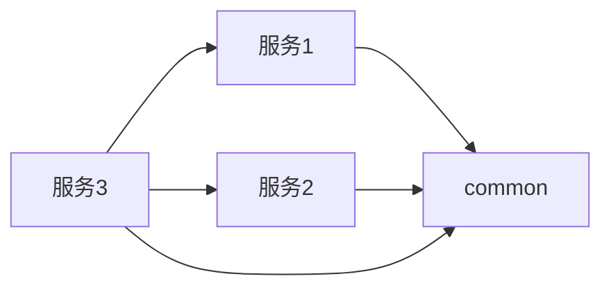
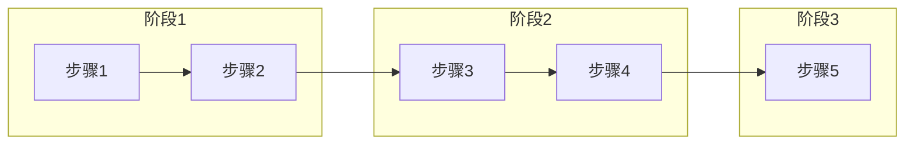

# {ProjectName} 详细设计 - 总文档 v1.0

<!--
═════════════════════════════════════════════════════════════════
 写作铁律（P2 实战沉淀·生成时必读；产物可保留本注释，不参与渲染）
═════════════════════════════════════════════════════════════════
【产物契约——机器校验，违者 Gate FAIL】
 1. 文档头「模板版本」必须等于本模板 frontmatter 的 version；写前先核对，跑 Gate 前再核对（skill 自动更新会改版本且可能覆盖模板）。
 2. §9.1 追溯矩阵 8 列按管道列位校验：页面列落「§7.1-{n} 页面名」、数据列落「§2.3 表名」（或裸 —）、接口 §5.3.x、规则 R{n}、测试 TC-*、状态 COMPLETE；与 criteria 冻结分母集合全等。
 3. design.json 引用闭环：acceptance.page/api/rule 必须**精确等于** pages/apis/rules 注册的 anchor（data 必须精确等于 tables[].anchor，如 "§2.3"——带表名的长串会断链；精确表名写在文档矩阵，json 只存定位锚点）；孤儿条目加 unreferenced_reason；空集合必须 zero_results 声明（"不涉及也是证据"）；表字段 ddr ↔ decisions 双向闭环。
 4. 结构化产物失败关闭：先 df_validate 过了再过 Gate；总分模式 design.json 为 feature 级（多模块共用 .devflow/<feature>/）。
【写作规则——评审真正在意的】
 5. 按模块职责组织，不按 PRD 功能编号；PRD↔模块映射只在总文档登记一笔。
 6. 终态叙事：不写"原为/迁出/不再包含"，直接写最终设计结论。
 7. 同服务模块在依赖图里同框（框=服务）；依赖明细表只放 §0.3。
 8. 表结构全字段五列，禁止"关键字段"式省略；§4 每流程 WHEN 伪代码+时序图成对；§5.3 每接口"请求+响应"两张六列表，禁止"契约同 §x.x"式省略。
 9. §7/§2.3 子域用同一套字母命名并**进真实标题**；编号错位的小节标题尾加【子域 X】标注，不重排编号（保护 json 锚点）。
 9a. **表与接口禁止合并/省略**：§2.3 每张表必须独立 `##### 表名（中文名）` + 五列全字段——禁止把多张表合进一个标题（如 "A / B（某某）"）、禁止"配套表：A、B、C——结构同构"式一句话带过、禁止"字段全集以 INDEX-表.md 为准"替代正文展开（INDEX 是对账索引不是设计文档）；§5.3 每个接口必须独立 `##### 5.3.x` 小节 + 请求/响应双六列表——禁止"契约同 §x.x"式省略。在 INDEX-表.md 或实体代码有登记 ≠ 在详设中有设计，两者不互替。
10. 错误码三层引用不重定义：平台通用码（总文档 §5.3）→ 业务码（本文 §3）→ 前端行为（§7.6）。写契约不写实现快照。
【Gate 环境实操】
11. Gate 以 LC_ALL=C 运行：若 PATH 上的 python3 属于含非 ASCII site 配置的 venv 会崩——用系统解释器（如 PATH 前置 /usr/bin）。
12. 占位符检查是子串匹配（TODO/TBD/待补充/REPLACE_WITH/占位/暂定，大小写不敏感）：领域词撞车改英文（占位符→placeholder、待办计数→backlog）。
【已知未决】总分模式 --mode=total 要求总文档逐点 COMPLETE，与"追溯在分文档"分工冲突——不硬凑，登记评审定口径。
═════════════════════════════════════════════════════════════════


> **文档类型**：系统详细设计（总文档）
> **项目名称**：{ProjectName}
> **文档状态**：✅ 评审通过
> **生成时间**：{YYYY-MM-DD HH:mm:ss}
> 模板 ID：`详细设计-总分总文档-模板`
> 模板版本：`3.20.2`

> **关联分文档**：见 §0.3

---

## §0 总分架构决策

### 0.1 架构决策

| 决策项 | 选择 | 依据 |
|--------|------|------|
| 文档结构 | **总分模式** | {大型复杂项目/模块数≥5/跨服务依赖强} |
| 模块数量 | {N} 个 | {按业务域划分} |
| 团队规模 | {M} 人 | {多团队并行开发} |
| 并行模式 | {是/否} | {分文档独立演进，减少合并冲突} |

### 0.2 决策规则

> **总分 vs 单体决策矩阵**

| 条件 | 推荐结构 | 本项目 |
|------|----------|--------|
| 模块数 ≥ 5 且跨服务 | **总分** | {✅/❌} |
| 单模块复杂度高（如引擎类） | **总分** | {✅/❌} |
| 简单 CRUD 模块 | 单体 | {✅/❌} |
| 多团队并行开发 | **总分** | {✅/❌} |

### 0.3 总分文档关系

```text
docs/
├── {ProjectName}详细设计.md          # 总文档：全局架构、跨域决策、全局模型
└── 详细设计/
    ├── M-01-{ModuleName1}-详细设计.md        # 分文档1：独立演进
    ├── M-02-{ModuleName2}-详细设计.md        # 分文档2：独立演进
    ├── M-03-{ModuleName3}-详细设计.md        # 分文档3：独立演进
    └── ...
```

### 0.4 分文档清单

| # | 分文档 | 负责人 | 状态 | 评审日期 |
|---|--------|--------|------|----------|
| 1 | M-01-{ModuleName1}-详细设计.md | | ✅ | |
| 2 | M-02-{ModuleName2}-详细设计.md | | ✅ | |
| 3 | M-03-{ModuleName3}-详细设计.md | | ✅ | |

---

## §1 系统架构

### 1.1 技术栈

> **技术选型标准**：遵循 `docs/技术选型.md` 或项目技术规范

#### 1.1.1 前端技术栈

| 选型 | 版本 | 说明 |
|------|------|------|
| {Framework1} | {Version1} | {说明} |
| {Framework2} | {Version2} | {说明} |
| {Framework3} | {Version3} | {说明} |

#### 1.1.2 后端技术栈

| 选型 | 版本 | 说明 |
|------|------|------|
| {Framework1} | {Version1} | {说明} |
| {Framework2} | {Version2} | {说明} |
| {Framework3} | {Version3} | {说明} |

#### 1.1.3 数据库

| 数据库 | 驱动版本 | 说明 |
|--------|----------|------|
| {DB1} | {Version} | {说明} |
| {DB2} | {Version} | {说明} |

### 1.2 系统架构图

> **对应性铁律**：架构图中的服务节点必须与 §2.1 服务体系**一一对应**（含端口）；common 等非部署单元只在 §2.1 登记，不入图。

```mermaid
graph TB
    subgraph 前端层
        WEB[Web管理端]
        APP[移动App]
    end

    subgraph 网关层
        GW[Gateway]
    end

    subgraph 服务层
        SVC1[{ServiceName1}]
        SVC2[{ServiceName2}]
        SVC3[{ServiceName3}]
        BASE[common - 共享库]
    end

    subgraph 数据层
        DB[(数据库)]
        CACHE[(缓存)]
        MQ[(消息队列)]
    end

    WEB --> GW
    APP --> GW
    GW --> SVC1
    GW --> SVC2
    GW --> SVC3
    SVC1 --> BASE
    SVC2 --> BASE
    SVC3 --> BASE
    SVC1 --> DB
    SVC2 --> DB
    SVC3 --> CACHE
    SVC1 --> MQ
    SVC2 --> MQ
```

### 1.3 代码分层规范

> **分层架构**：根据项目技术规范定义

```
{service-name}/
├── controller/           # Web层 (REST Controllers)
│                        # 职责：HTTP 请求/响应处理、参数校验、参数转换
├── service/             # 服务接口层
│   └── impl/          # 服务实现层
│                        # 职责：业务逻辑处理、事务管理、DTO 与 Domain 转换
├── repository/          # 数据访问层 (Mapper/DataAccess)
│                        # 职责：数据访问、SQL 操作
├── entity/              # 实体层 (数据库表映射)
│                        # 职责：数据库表映射、领域对象
├── dto/                 # 数据传输对象 (按领域组织)
│                        # 职责：层间数据传输、结构化领域模型
├── vo/                  # 视图对象层 (API 响应包装)
│                        # 职责：视图展示对象、API 响应包装
├── config/              # 配置层 (框架配置、Bean 定义)
│                        # 职责：框架配置、Bean 定义
└── {ServiceName}Application.java
```

### 1.4 部署架构

```text
┌─────────────────────────────────────────────────────────────────┐
│                        Docker Host / Kubernetes                   │
├─────────────────────────────────────────────────────────────────┤
│  ┌─────────┐  ┌─────────┐  ┌─────────┐  ┌─────────┐         │
│  │服务1    │  │服务2    │  │服务3    │  │服务4    │         │
│  └─────────┘  └─────────┘  └─────────┘  └─────────┘         │
├─────────────────────────────────────────────────────────────────┤
│  ┌─────────┐  ┌─────────┐  ┌─────────┐                        │
│  │ 网关    │  │数据库    │  │缓存     │                        │
│  └─────────┘  └─────────┘  └─────────┘                        │
└─────────────────────────────────────────────────────────────────┘
```

---

## §2 模块边界

### 2.1 服务体系

> 本表与 §1.2 架构图一一对应；新增服务两处同步。

| 服务 | 端口 | 职责 | 数据库 |
|------|------|------|--------|
| gateway | :8080 | 统一入口，认证/鉴权 | — |
| {service1} | :808X | {职责描述} | {db_name} |
| {service2} | :808X | {职责描述} | {db_name} |
| {service3} | :808X | {职责描述} | {db_name} |
| common | — | 共享技术库，不可部署 | — |

### 2.2 模块职责

| 模块 | 服务名 | 职责 | 对外接口 |
|------|--------|------|----------|
| {ModuleName1} | {service1} | {职责描述} | /api/{module1}/* |
| {ModuleName2} | {service2} | {职责描述} | /api/{module2}/* |
| {ModuleName3} | {service3} | {职责描述} | /api/{module3}/* |

### 2.3 模块依赖关系



### 2.4 服务间调用契约

| 调用方 | 提供方 | 接口 | 调用方式 |
|--------|--------|------|----------|
| {ServiceX} | {ServiceY} | GET /api/{moduleY}/{id} | {HTTP/Feign/gRPC} |
| {ServiceX} | {ServiceY} | POST /api/{moduleY} | {HTTP/Feign/gRPC} |

> **调用规范**：
> - 超时：connect {X}s / read {Y}s（长耗时操作除外）
> - 容错：{熔断器名称} 熔断/重试
> - 幂等：{幂等策略}

---

## §3 全局数据模型

### 3.1 DTO/VO 命名约定

| 后缀 | 语义 | 命名规则 | 示例 |
|------|------|----------|------|
| `Request` / `Response` | HTTP 请求/响应模型 | Controller 入参/出参与跨服务契约 DTO | `XxxRequest`、`XxxResponse` |
| `Dto` | 服务内部传输对象 | Service↔Repository 间、领域内传递 | `XxxDto` |
| `Vo` | 视图展示对象 | 聚合多源数据供前端展示 | `XxxVo` |

> **统一响应**：通用响应/分页类统一引用 `common`：`ApiResponse` / `PageRequest` / `PageResponse` / `ErrorCode`

### 3.2 跨域实体

| 实体 | 说明 | 归属服务 |
|------|------|----------|
| SysOrg | 组织单位 | org-service |
| SysUser | 用户信息 | org-service |
| SysDept | 部门 | org-service |

### 3.3 全局枚举

| 枚举 | 定义 | 使用模块 |
|------|------|----------|
| {EnumName1} | {枚举定义} | {使用模块列表} |
| {EnumName2} | {枚举定义} | {使用模块列表} |

### 3.4 全局字典

| 字典码 | 字典名 | 定义位置 |
|--------|--------|----------|
| {dict_code1} | {字典名1} | common-service |
| {dict_code2} | {字典名2} | common-service |

---

## §4 全局业务规则

### 4.1 通用规则

| 规则ID | 规则描述 | 适用范围 |
|--------|----------|----------|
| GR01 | 所有金额保留2位小数 | 全局 |
| GR02 | 日期时间统一使用{时区} | 全局 |
| GR03 | 逻辑删除标志 deleted=1 | 全局 |
| GR04 | 乐观锁版本号 version | 全局 |
| GR05 | JSON 序列化：LocalDateTime 格式 `{format}` | 全局 |

### 4.2 事务规则

| 规则ID | 规则描述 | 隔离级别 |
|--------|----------|----------|
| T1 | 业务数据与 Outbox 事件在同一本地事务提交 | DEFAULT |
| T2 | 审计写入失败仅 log.warn，不回滚业务 | — |

### 4.3 审计规则

| 规则ID | 规则描述 | 适用范围 |
|--------|----------|----------|
| AR01 | 创建时写入 create_time, create_by | 全局 |
| AR02 | 更新时写入 update_time, update_by | 全局 |
| AR03 | 敏感操作写业务日志 BizLog | 全局 |

---

## §5 全局接口规范

### 5.1 API规范

| 规范项 | 要求 |
|--------|------|
| 协议 | HTTPS |
| 数据格式 | JSON |
| 字符编码 | UTF-8 |
| 分页格式 | `{ total, records[] }` |
| 错误码 | 4xx/5xx + message |

### 5.2 统一响应结构

```java
// 通用响应
ApiResponse<T> {
    code: int      // 状态码
    message: str   // 消息
    data: T       // 数据
    timestamp: str // 时间戳
}

// 分页响应
PageResponse<T> {
    total: long    // 总数
    records: T[]    // 记录列表
}
```

```json
{
  "code": 200,
  "message": "success",
  "data": { },
  "timestamp": "2024-01-01 10:00:00"
}
```

### 5.3 全局错误码

> 必须以表格列全**常见错误码及其语义**：HTTP 层通用码 + 平台级业务码；模块专属码在各分文档 §3/§14 登记，本文档只收跨模块公约数。

| 错误码 | HTTP | 语义 | 处理约定 |
|--------|------|------|----------|
| VALIDATION_FAILED | 400 | 请求参数错误 | 前端表单校验前置拦截 |
| UNAUTHORIZED | 401 | 未认证/令牌失效 | 跳登录 |
| FORBIDDEN | 403 | 已认证但无权限 | 按钮级隐藏 + 后端重校验 |
| NOT_FOUND | 404 | 资源不存在 | 越权对象不以 404 泄露存在性 |
| VERSION_CONFLICT | 409 | 乐观锁/版本冲突 | 保留本地草稿，提示刷新对比 |
| CONFLICT | 409 | 并发状态冲突 | 提示刷新后重试 |
| FIELD_VALIDATION_FAILED | 422 | 字段级校验失败 | 按 fieldPath 定位表单字段 |
| RATE_LIMITED | 429 | 限流 | 退避重试 |
| INTERNAL_ERROR | 500 | 服务器内部错误 | 展示 requestId 供排障 |
| SERVICE_UNAVAILABLE | 503 | 下游不可用/降级 | 保留请求上下文可重试，不乐观显示成功 |

### 5.4 跨服务调用规范

| 规范项 | 要求 |
|--------|------|
| 超时时间 | connect {X}s / read {Y}s（长耗时操作除外） |
| 重试次数 | {重试策略} |
| 熔断 | {熔断器名称} CircuitBreaker |
| 日志 | 记录 traceId |

---

## §6 全局流程概览

### 6.1 主业务流程

> **先图后文**：先画业务流程**活动图**（mermaid flowchart，按阶段分组、含判定点），随后必须配一段解释文字说清主线与关键分支，不许只有图。



### 6.2 流程定义

| 流程ID | 流程名称 | BPMN文件 | 版本 |
|--------|----------|----------|------|
| {FlowId1} | {流程名称1} | {bpmnFile1} | 1.0 |

---

## §7 数据库迁移

### 7.1 Flyway 脚本结构

```
backend/{service}/src/main/resources/db/migration/
├── h2/{service}/
│   └── V1.0.xx__create_{module}_tables.sql
├── postgresql/{service}/
│   └── V1.0.xx__create_{module}_tables.sql
├── oracle/{service}/
│   └── V1.0.xx__create_{module}_tables.sql
└── kingbase/{service}/
    └── V1.0.xx__create_{module}_tables.sql
```

### 7.2 数据库 Profile 切换

| Profile | 数据库 |
|---------|--------|
| dev | H2 |
| oracle | Oracle |
| postgresql | PostgreSQL |
| kingbase | 人大金仓 Kingbase |

---

## §8 依赖项

### 8.1 内部依赖

| 模块 | 依赖内容 | 接口 |
|------|----------|------|
| 所有模块 | common | 共享技术库 |
| {ModuleX} | {ModuleY} | /api/{moduleY}/* |

### 8.2 外部依赖

| 服务 | 依赖内容 | SLA要求 |
|------|----------|---------|
| {ExternalService1} | {依赖内容} | 99.9% |
| {ExternalService2} | {依赖内容} | 99.5% |

---

## §9 验收标准

> **追溯源**：`docs/需求/<feature>-验收点.md`

### 9.1 全局验收点

| 验收点ID | 验收点 | 对应章节 | 优先级 | 状态 |
|----------|--------|----------|--------|------|
| `M-{xx}-F{y}-A{z}` | 模块间调用正常 | §5 | P0 | ✅ |
| `M-{xx}-F{y}-A{z}` | 流程正常流转 | §6 | P0 | ✅ |
| `M-{xx}-F{y}-A{z}` | 跨模块事务一致性 | §4 | P1 | ✅ |

### 9.2 追溯覆盖率

| 指标 | 目标 | 当前 |
|------|------|------|
| 设计覆盖率 | 100% | {N}% |

---

## §9.3 组件复用与公共抽取

| 类型 | 名称 | 复用/抽取理由 | 责任边界 |
|------|------|---------------|----------|
| 成熟组件复用 | {Component} | 已满足稳定能力，避免重复实现 | {Owner} |
| 公共服务与公共组件 | {SharedService} | 被多个模块调用，统一契约与治理 | {Owner} |

## §9.4 规范遵循

- 命名规范：{项目规范/阿里巴巴 Java 开发手册等}
- 开发规范：{异常、日志、测试、依赖约束}
- 注释规范：{公开接口、复杂规则、设计偏离说明}

## §9.5 设计决策记录（DDR）

| 决策 | 关联字段 | 备选方案 | 选定方案 | 设计理由与量化依据 |
|------|----------|----------|----------|--------------------|
| {Decision} | {表.字段} | {Option A/B} | {Selected} | {容量、性能、兼容性或维护成本依据} |

> v3.17.1：DDR 与表设计字段**一一对应**（结构化模式由 `df_render.py` 生成 `ddr-index` +
> `ddr-matrix`，`df_validate.py` 双向闭环：悬空引用与孤儿决策均拦截）。

---

## §10 变更历史

| 版本 | 日期 | 修改人 | 修改内容 |
|------|------|--------|----------|
| v1.0 | {YYYY-MM-DD} | | 初稿 |

---

## 评审记录

| 版本 | 评审日期 | 评审结论 | 评审人 |
|------|----------|----------|--------|
| v1.0 | | 通过 | |

---

> **分文档索引**：
> - `M-01-{ModuleName1}-详细设计.md` - §2.1
> - `M-02-{ModuleName2}-详细设计.md` - §2.2
> - `M-03-{ModuleName3}-详细设计.md` - §2.3
